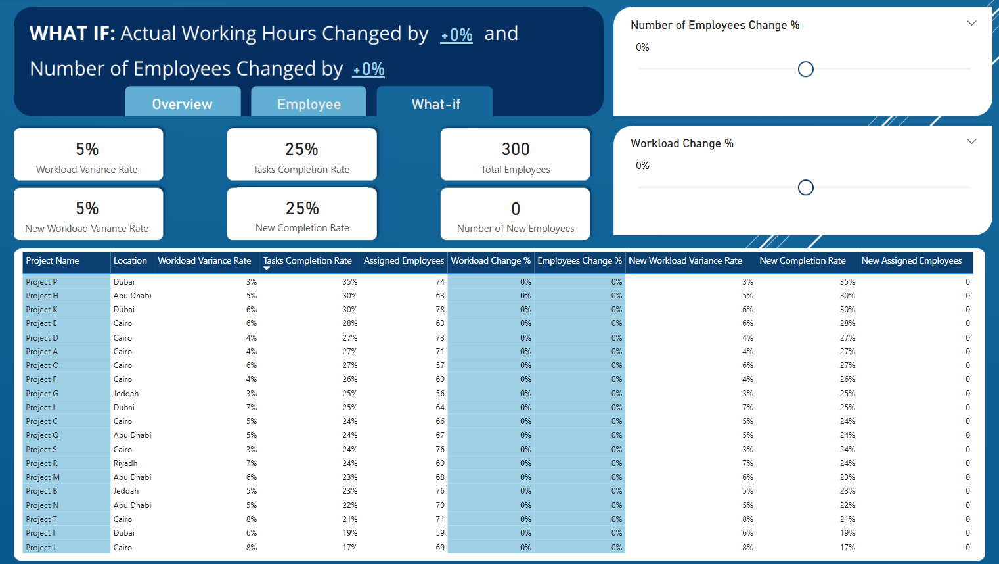

# Overview

**The Problem Presented:**
XYZ company manages thousands of employees spread across dozens of projects in different countries. During the year 2024, the executive management began to notice worrying indicators:
*   High employee turnover rates in some locations
*   Teams suffering from excessive pressure, and others with hardly any tasks
*   Operational costs are constantly rising without a clear explanation
*   Difficulty in predicting the efficiency of human resources in new projects

Management immediately asked the analysis team to intervene. But the challenge is not just about analysis, but about building an intelligent and dynamic system that supports real-time decision-making.

**Required:**
You are now a data analyst within an operational emergency team, and your task is:
*   **Understand the complete picture:**
    Start from raw data scattered among employee files, project details, daily tasks, and attendance and departure records.
*   **Data processing and linking:**
*   **Analysis of the root causes of the problem:**
    *   What is the reason for the high employee turnover?
    *   Why does productivity vary between locations?
    *   How are tasks distributed? Is there a problem with scheduling?
*   **Designing "What-if" scenarios:**
    What would happen if:
    *   Were employees rotated between projects?
    *   Work hours increased or decreased?
    *   Task distribution changed based on efficiency?

*   **Creating an intelligent automation system:**
    Management does not want a one-time analysis, but a living model:
    So that the system is ready to support decision-making at any time, and whenever the data changes, the results and analyses are automatically updated.
    It saves effort and time for the operational teams.
*   **Proposing practical solutions for the year 2025:**
    Present an operational plan based on data and realistic analysis.
    Explain with numbers how resource allocation can be improved and waste reduced.

**Deadline: Sunday, June 1, 2025**

The important things are the methodology, the deep analysis, the ability to present the outputs in a way that reflects your thinking process, and the ability to turn chaos into a clear and executable vision.

# Data Gathering
The dataset is split across four CSV files. Below are the column names and corresponding table names for each file.

- **Attendance(Employee ID, Date, Check In, Check Out)**

- **Employees(Employee ID, Position, Department, Country, Date of Joining, Status, Daily Working Hours)**

- **Projects(Project ID, Project Name, Location, Current Headcount, Required Headcount, Start Date, End Date)**

- **Tasks(Employee ID, Project ID, Task Type, Status, Date, Assigned By)**

# KPIs relevant to our data
- `Average Employee Tenure`:
Calculate the difference between each employee's last attendance date and their joining date, then take the average of those differences across all employees.
- `Turnover Rate`:
This is calculated by dividing the total number of resigned employees by the total number of employees.
- `Active Rate`:
This is calculated by dividing the total number of active employees by the total number of employees.
- `On-leave Rate`:
This is calculated by dividing the total number of on-leave employees by the total number of employees.
- `Open Task Rate`:  
  Total Number of Opened Tasks ÷ Total Number of Tasks

- `Escalated Task Rate`:  
  Total Number of Escalated Tasks ÷ Total Number of Tasks

- `Completion Task Rate`:  
  Total Number of Completed Tasks ÷ Total Number of Tasks

- Calculate the actual daily working hours and compare them to standard working hours to assess if employees work more than usual and whether this correlates with turnover.  
    - Calculate the difference between check-in and check-out times. Then, determine the average number of hours per employee and compare that to the standard working hours. Investigate whether employees who leave the company work more hours than average.
- Calculate the employee shortage rate to track the shortage in the number of employees per project and determine whether that affects the employee turnover rate.

# Exploratory Data Analysis

### Data Assessment and Initial Exploration
* There are 300 employees in our company.
* Most of our employees are technicians, while the fewest are coordinators.
* Most of our employees work in the Field Service department, and the fewest work in the Logistics department.
* Most of our employees work in Egypt, while the fewest work in KSA.
* The first employee joined the company on January 2nd, 2022, and the last employee joined on December 28th, 2023.
* Approximately 33% of employees resigned, 33% are active, and 33% are on leave.
* The maximum standard working hours are 9, and the minimum is 6.
* Most of our employees work more than 8 hours, above the average (7.633).
* The attendance table contains data for the period from 1/1/2024 to 4/30/2024 (4 months).
* The earliest recorded check-in time is 7:30, and the latest (i.e., late) check-in time is 8:30, while the earliest recorded check-out time is 1:30, and the latest (late) check-out time is 6:30.
* There are 20 projects. Most of them are located in Cairo (9 projects).
* The minimum number of current headcount per project is 11, and the maximum is 48. The average number of current headcount is 31.5.
* The minimum number of required headcount per project is 53, and the maximum is 99. The average number of required headcount is 77.9.
* The Tasks table contains data for the period from 1/1/2024 to 4/30/2024 (4 months), the same time period as the Attendance table.

# Data Cleaning
- In the `Attendance` Table
    * Created a new column by calculating the difference between check-out and check-in times and call it **Actual Working Hours**.
    * Created a new table by grouping by the `Employee ID` column and calculating the average working hours and last attendance date per employee.
    * Joined the resulting table with the `Employees` table using an inner join on `Employee ID`.

- In the `Employees` Table
    * Created a new column that measures the difference between `Last Attendance Date` and `Date of Joining` and call it Employee Tenure (Months).
    * Created a new calculated column to represent the workload status. It has 3 categories: `Balanced`, `Overloaded`, and `Underloaded`
    * Created a new calculated column to represent the assignment status (whether an employee is assigned tasks or not).


- In the new created table (`_Measures`)
    * Calculated a new measure called `Workload Variance Rate`. This measures the percentage difference between the average working hours per employee and the standard daily working hours.
        ```
          Workload Variance Rate = 100 × (Avg. Actual Working Hours − Daily Working Hours) ÷ Daily Working Hours
        ```
        
        - Positive values → Overload: Employee works more than the standard (overtime).
            
        - Negative values → Underload: Employee is working less than the standard.
            
        - 0% → Employee is working exactly the standard daily hours.
        
                DAX Formula:
            
         ```dax
                Working Hours Variance = 
                DIVIDE(
                    SUMX(
                        Employees,
                        Employees[Avg. Actual Working Hours] - Employees[Daily Working Hours]
                    ),
                    SUM(Employees[Daily Working Hours])
                )
         ```
        
    * `Total Employees`
      ```dax
      Total Employees = COUNT(Employees[Employee ID])
      ```
    * `Active Employees Rate`
 
      ```dax
                  Active Employees Rate = 
                    DIVIDE(
                        CALCULATE(
                            COUNT(Employees[Employee ID]),
                            Employees[Status] = "Active"
                        ),
                        [Total Employees]
                    )
      ```
 
    * `Resigned Employees Rate`
 
      ```dax
                Resigned Employees Rate = 
                    DIVIDE(
                        CALCULATE(
                            COUNT(Employees[Employee ID]),
                            Employees[Status] = "Resigned"
                        ),
                        [Total Employees]
                    )
      ```
 
    * `On-leave Employees Rate`
 
      ```dax
              On-leave Employees Rate = 
                    DIVIDE(
                        CALCULATE(
                            COUNT(Employees[Employee ID]),
                            Employees[Status] = "On Leave"
                        ),
                        [Total Employees]
                    )
      ```
    * `Task Completion Rate`
 
      ```dax
            Task Completion Rate = 
             DIVIDE(
                CALCULATE(COUNT(Tasks[Employee ID]), FILTER(Tasks, Tasks[Status] = "Closed")),
                [Total Number of Tasks]
             )
      ```
    * `Task Escalation Rate`
 
      ```dax
            Task Escalation Rate = 
             DIVIDE(
                CALCULATE(COUNT(Tasks[Employee ID]), FILTER(Tasks, Tasks[Status] = "Escalated")),
                [Total Number of Tasks]
             )
      ```

    * `Task In Progress Rate`
 
      ```dax
            Task In Progress Rate = 
             DIVIDE(
                CALCULATE(COUNT(Tasks[Employee ID]), FILTER(Tasks, Tasks[Status] = "In Progress")),
                [Total Number of Tasks]
             )
      ```
    * `Open Tasks Rate`
 
      ```dax
            Open Tasks Rate = 
             DIVIDE(
                CALCULATE(COUNT(Tasks[Employee ID]), FILTER(Tasks, Tasks[Status] = "Open")),
                [Total Number of Tasks]
             )
      ```

### What-if Scenario
Let's see what happens if we adjust the working hours and the number of employees by a specific percentage in relation to the completion rate and workload variance rate?

- We created a numeric range parameter from -0.5 to 0.5 to control the change in the working hours called `Workload Change %` and another parameter to control the percentage change in the number of employees called `Number of Employees Change %`.

- Assume each new employee will work 8 hours daily.

- Measures needed for this scenario:
    - ```
      Completion Rate per Hour = [Tasks Completion Rate] / [Total Avg. Actual Working Hours]
      ```
    - ```
      What-if Number of New Employees = [Total Employees] * 'Number of Employees Change %'[Number of Employees Change % Value]
      ```
    - ```
      What-if Total Acutal Working Hours = 
        [Total Avg. Actual Working Hours] * (1 + 'Workload Change %'[Workload Change % Value]) + ([What-if Number of New Employees] * 8)
      ```
    - ```
      what-if Total Daily Working Hours = SUM(Employees[Daily Working Hours]) + ([What-if Number of New Employees] * 8)
      ```
    - ```
      What-if Completion Rate = [Completion Rate per Hour] * [What-if Total Acutal Working Hours]
      ```
    -  ```
        What-if Workload Variance Rate = 
        DIVIDE(
            [What-if Total Acutal Working Hours] - [what-if Total Daily Working Hours]
            ,
            [what-if Total Daily Working Hours]
        )
       ```
  

# Communicating Results

## Overview Page


- There are 300 employees in the company.
    * 33% of them are active.
    * 33% of them are on leave.
    * 34% of them have resigned.
- The employee shortage rate is 60%, which is significant. I believe the company needs to hire more employees.
- The task completion rate stands at 25%.


- Here, we can see the task completion percentage, escalated task percentage, open task percentage, and in-progress task percentage for each project.
- `Project L` has the highest percentage of escalated tasks (36%), while `Project N` has the lowest (18%).
- `Project P` has the highest percentage of completed tasks (35%), whereas `Project J` has the lowest (17%).


- Projects in **Abu Dhabi** have the highest resignation rate.
- Projects in **Riyadh** experience the highest workload variance.
- Projects in **Jeddah** have the lowest workload variance and the lowest resignation rate.
- Projects in **Dubai** have the highest completion rate.


- We can see that projects below the trend line have a high employee shortage rate and a low completion rate.
- The relationship between the completion rate and the workload variance rate is negatively correlated. That is, when the workload variance rate is high, the completion rate is low.
- Projects that have a high employee shortage rate tend to have more workload variance.


- If we hover over one of the bubbles, we get more information about the project.
- For example, this project is **Project P**, and it is located in Dubai. It has the highest completion rate of 35% and a low workload of 3%. The average employee tenure is 13.66 months, and the project started on 7/8/2023 and ended on 9/22/2023.


- We can see that projects above the trend line tend to have a higher employee shortage rate than those below the trend line, and hence a higher resignation rate.
- Resignation rate and workload variance rate are positively correlated. That is, when the workload variance rate increases, the resignation rate also increases.

## Employee Page


- The average employee tenure is approximately 15 months (1 year and 3 months).
- There are 1500 tasks.


- Most of employees are from Egypt.
- Employees who are from Qatar are more likely to resign than employees from other countries.


- Here, we can see that more than half of our employees are overloaded, and they are more likely to resign.
- Only 8 employees work the standard daily working hours.


- `Supervisors` have the highest resignation rate and a low task completion rate, whereas `Coordinators` have the lowest resignation rate.


- The `Field Service` department has the highest resignation rate, whereas the `Admin` department has the lowest.
- The `HR` department has the lowest task completion rate, whereas the `Operations` department has the highest.


- Employees assigned tasks by **John** are more likely to resign.
- Employees assigned tasks by **Ahmed** have a higher workload.


- We can see that there are employees who work more than 40% above the standard daily working hours. They are severely overloaded, and most of them have either resigned or are on leave.
- For instance, the employee with ID EMP0111 works 50% more than the standard daily working hours and has resigned.


- This employee is a supervisor in the Logistics department and is from Egypt. He joined the company on 11/14/2022. As noted on the overview page, supervisors have the highest workload variance.
  


- We can see that there are employees who work 15% or more below the standard daily working hours. Most of these employees are on leave.

## What-if Page
On this page, we can simulate different scenarios to observe changes in the completion rate and workload variance rate when the actual working hours and the number of employees are adjusted by a specific percentage.
This can help the company determine how many employees need to be hired and the workload required to increase the completion rate while maintaining a suitable workload variance rate.



For example, if we reduce the actual working hours by 5% and increase the number of employees by 10%, we will achieve a 1% increase in the completion rate, and the workload variance rate will be 0%.


## Conclusion and recommendations
Workforce challenges require immediate action as they may impact our company's performance and, consequently, its revenue. After analyzing the data, we uncovered several insights that can help the company make informed decisions regarding the hiring process and addressing work overload issues.

The company currently employs 300 individuals, with each employee capable of working on multiple projects. However, only 33% of employees are active, 33% are on leave, and 34% have resigned. This means the majority of employees are not actively contributing. Also, there is a high employee shortage rate of 60%. This shortage has led to significant work overload in certain projects. **Supervisors**, in particular, are more likely to resign compared to other roles. Additionally, employees in the **Field Service** department are also more prone to resignation. Most of the employees are from Egypt, and they are less likely to resign. However, employees from Qatar are more likely to resign compared to those from other countries.

Certain projects, such as Project L and Project I, have a high percentage of escalated tasks. Projects located in **Abu Dhabi** and **Dubai** have the highest resignation rate, while projects in **Riyadh** experience the highest workload variance and resignation rate. Furthermore, employees assigned tasks by **John** are more likely to resign, while those assigned tasks by **Ahmed** tend to have a higher workload.

#### Recommended Actions:
##### Conduct Employee Surveys:
- Survey employees to identify any issues they face within the company and determine what changes they need.
- Focus on employees in Abu Dhabi and Dubai, as these locations have high resignation rates. Additionally, employees from Qatar need more attention as they are more likely to resign.
- Include questions to assess whether employees have concerns about their managers, which may help explain why tasks assigned by John result in higher resignation rates.

##### Reduce Work Overload:
- Manage task schedules more effectively to reduce work overload.
- Assign employees to specific projects rather than having them work on multiple projects. This will allow us to measure the efficiency of human resources per project and also help reduce work overload.
- Hire additional employees to address the high employee shortage rate.
- Use the What-If Scenario tool to determine the optimal number of employees and workload distribution that aligns with the company's budget.

##### Address Escalated Tasks in Project L:
- Assign employees to focus on escalated tasks in Project L, as it has a high proportion of unresolved tasks.

##### Investigate Project J's Low Completion Rate:
- Analyze the reasons behind the low task completion rate in Project J.
- Determine whether this is due to specific challenges or if it is simply because the project is new.

By implementing these actions, the company can improve employee satisfaction, reduce resignation rates, and optimize workload distribution to enhance overall performance.
