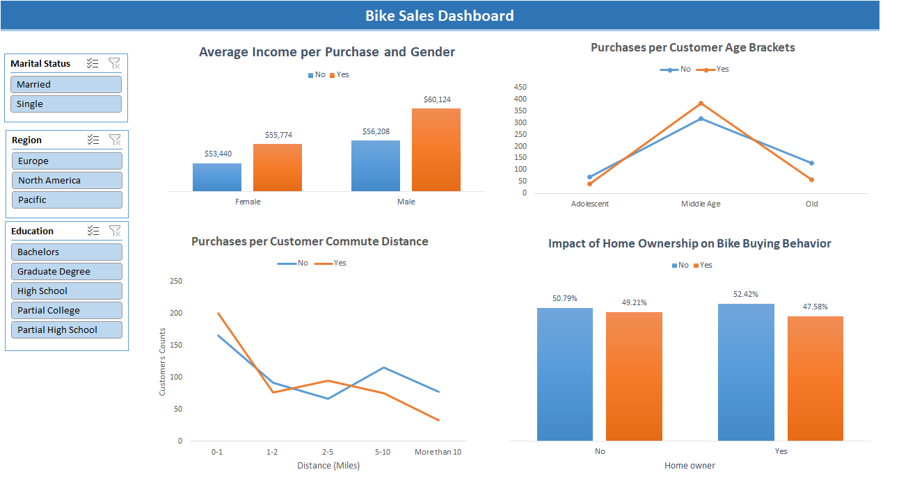
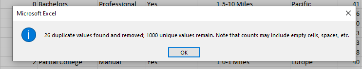
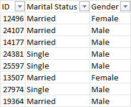
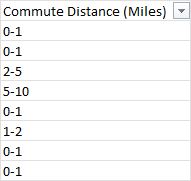
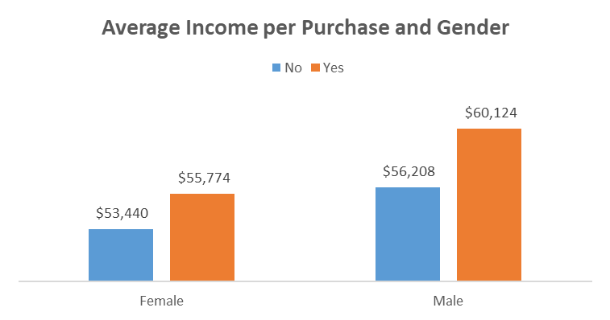
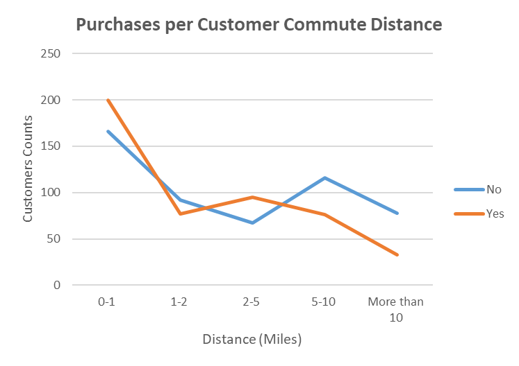
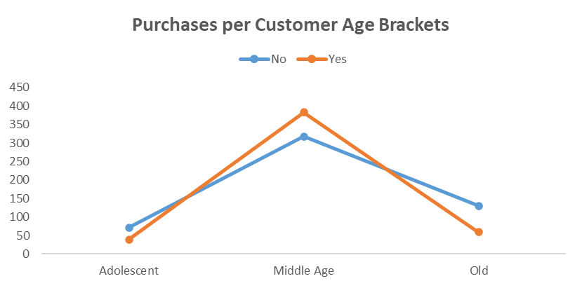
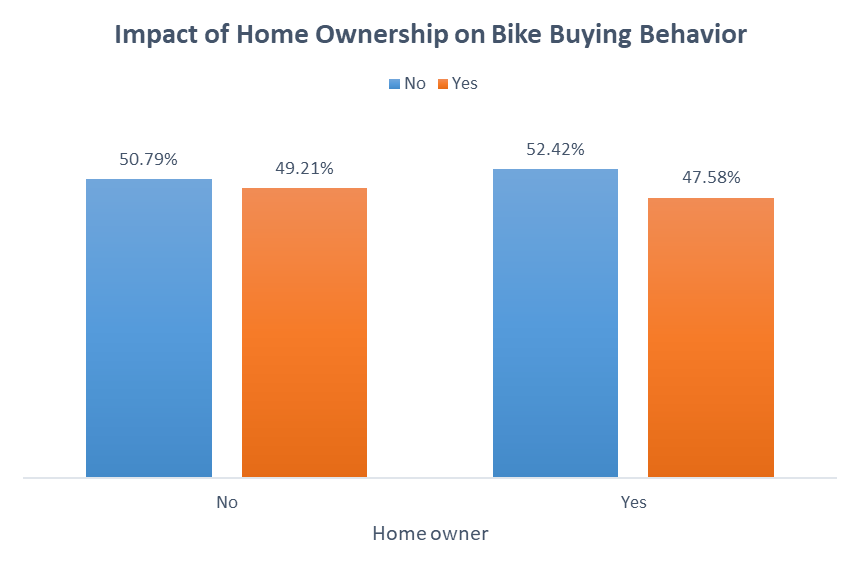

## Bike Sales Analysis


## Overview 
In this project, I will analyze customer data for a company that sells bikes. The goal is to identify key characteristics of buyers and uncover trends that could help the company expand its customer base and increase profitability.  

The dataset consists of **1,026 records** and **13 columns**, capturing demographic, economic, and behavioral attributes of customers.  

### **Dataset Overview**  
Each record represents a customer and includes the following attributes:  
- **ID** – Unique identifier for each customer.  
- **Marital Status** – Single or Married.  
- **Gender** – Male or Female.  
- **Income** – Annual income of the customer.  
- **Children** – Number of children in the household.  
- **Education** – Highest level of education attained.  
- **Occupation** – Type of job or profession.  
- **Home Owner** – Indicates whether the customer owns a home.  
- **Cars** – Number of cars owned.  
- **Commute Distance** – Distance traveled to work.  
- **Region** – Geographic location of the customer.  
- **Age** – Customer’s age.  
- **Purchased Bike** – Indicates whether the customer bought a bike (Yes/No).  

### Data Gathering
The data comes in an Excel sheet. I downloaded and imported it into the Excel workbook that I will use for analysis.

### Data Assessing & Cleaning
- Duplicate Values: The dataset contained 26 duplicate records, which were removed.



- The `Marital Status` and `Gender` columns used single-letter abbreviations. These were replaced with descriptive labels for clarity.



- The `Commute Distance` column included the word Miles in each value. To improve readability, the word was removed, and the column name was updated to "Commute Distance (Miles)" for better clarity.



- Create a new column called `Age Brackets` based on the `Age` column to help analyze age groups more effectively, instead of treating age as quantitative data. I did this using the following formula:
```
  =IF(L2>54,"Old",
IF(L2>=31,"Middle Age",
IF(L2<31,"Adolescent","Invalid")
))
```

### Exploratory Data Analysis
Now, we will start analyzing our data by creating a pivot table
First, we are going to look at the average income for someone who buys or does not buy a bike, as well as their gender.

- We can say that people who buy bikes are more likely to have a higher average income than those who don't.
- Additionally, males tend to have a higher average income than females.



- Customers who commute distances of 0-1 miles and 2-5 miles are more likely to purchase bikes compared to those who travel more than 10 miles or just 1-2 miles.
- It makes sense that shorter commutes increase the likelihood of bike purchases. However, we observe that individuals traveling 1-2 miles are less inclined to buy bikes compared to those traveling 2-5 miles. Therefore, we should focus our efforts on targeting this group to boost bike sales among them.




- The majority of our customer base is in the middle-age group.
- The number of customers in the middle-age group who buy bikes is larger than those who don’t, whereas the opposite is true for the other age groups.



- The majority of the customer base consists of homeowners.  
- **52.42%** of homeowners do not buy bikes, while **47.58%** do.   
- **49.21%** of non-homeowners buy a bike, whereas **47.58%** of homeowners do. This indicates that **non-homeowners are slightly more likely** to purchase a bike than homeowners.  

## Conclusions

- People who buy bikes tend to have a higher average income than those who don’t, regardless of gender.  
- Additionally, males generally have a higher average income than females.  
- Customers who commute **0-1 miles** and **2-5 miles** are more likely to purchase bikes compared to those who travel **more than 10 miles** or just **1-2 miles**.  
- Shorter commutes logically increase the likelihood of bike purchases. However, individuals traveling **1-2 miles** are less inclined to buy bikes than those traveling **2-5 miles**. Therefore, efforts should be made to target this group to boost bike sales.  
- The majority of our customer base falls within the **middle-age group**.  
- Among middle-aged customers, more individuals buy bikes than those who don’t, whereas the opposite trend is observed in other age groups.  
- The majority of the customer base consists of **homeowners**.  
- **52.42%** of homeowners do not buy bikes, while **47.58%** do.  
- **49.21%** of non-homeowners buy a bike, whereas **47.58%** of homeowners do, indicating that non-homeowners are slightly more likely to purchase a bike than homeowners.  
