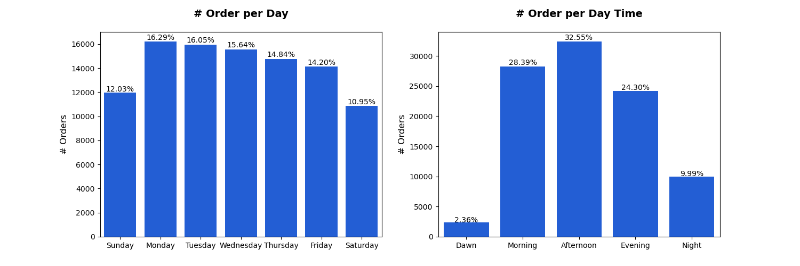
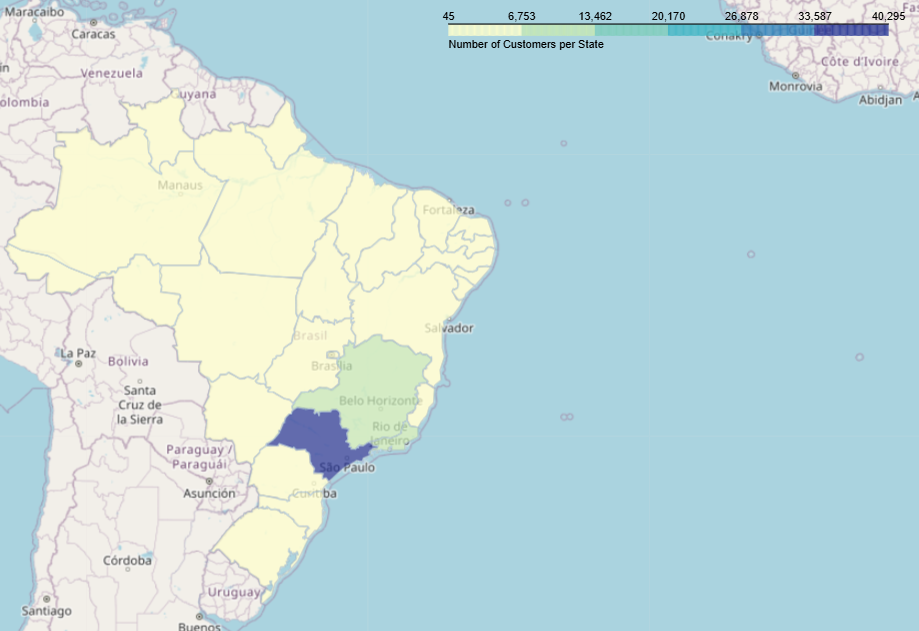

## **Overview** 
In this project, I will analyze the **product performance, customer behavior, and logistics efficiency** for an e-commerce platform, [Olist Store](http://www.olist.com/).  
I will also extend my analysis to identify the marketing funnel performance and sales reps' effectiveness.  

  

---
## About Dataset
This is a Brazilian ecommerce public dataset of orders made at Olist Store. The dataset has information of 100k orders from 2016 to 2018 made at multiple marketplaces in Brazil. Its features allows viewing an order from multiple dimensions: from order status, price, payment and freight performance to customer location, product attributes and finally reviews written by customers. We also released a geolocation dataset that relates Brazilian zip codes to lat/lng coordinates.
### Database Schema

  

  

### Tables Description
### **1. orders**
Stores information about customer orders.

- **order_id**: Unique identifier for each order.
- **customer_id**: ID of the customer who placed the order.
- **order_status**: Current status of the order (e.g., delivered, shipped, canceled).
- **order_purchase_timestamp**: Timestamp when the order was placed.
- **order_approved_at**: Timestamp when the payment was approved.
- **order_delivered_carrier_date**: Date when the order was handed over to the carrier.
- **order_delivered_customer_date**: Date when the customer received the order.
- **order_estimated_delivery_date**: Estimated delivery date of the order.

---

### **2. order_items**
Details of products in each order.

- **order_id**: Identifier of the order.
- **order_item_id**: Sequential number of the item in the order.
- **product_id**: Identifier of the product in the order.
- **seller_id**: Identifier of the seller who provided the product.
- **shipping_limit_date**: Deadline for the seller to ship the product.
- **price**: Price of the product.
- **freight_value**: Cost of shipping the product.

---

### **3. order_reviews**
Customer reviews for orders.

- **review_id**: Unique identifier for each review.
- **order_id**: Identifier of the order being reviewed.
- **review_score**: Rating given by the customer (e.g., 1-5 stars).
- **review_comment_title**: Title of the review (if provided).
- **review_comment_message**: Text message left by the customer as feedback.
- **review_creation_date**: Date the review was submitted.
- **review_answer_timestamp**: Timestamp when the review was responded to.

---

### **4. order_payments**
Payment details for each order.

- **order_id**: Identifier of the order.
- **payment_sequential**: Sequence number for payments related to the order.
- **payment_type**: Payment method used (e.g., credit card, boleto).
- **payment_installments**: Number of installments chosen for the payment.
- **payment_value**: Total payment amount.

---

### **5. customers**
Details of customers who place orders.

- **customer_id**: Unique identifier for each customer.
- **customer_unique_id**: Unique identifier for a customer across multiple orders.
- **customer_zip_code_prefix**: Postal code prefix of the customer.
- **customer_city**: City where the customer is located.
- **customer_state**: State where the customer is located.

---

### **6. sellers**
Details of sellers offering products.

- **seller_id**: Unique identifier for each seller.
- **seller_zip_code_prefix**: Postal code prefix of the seller.
- **seller_city**: City where the seller is located.
- **seller_state**: State where the seller is located.

---

### **7. products**
Information about products available for sale.

- **product_id**: Unique identifier for each product.
- **product_category_name**: Category name of the product.
- **product_name_length**: Length of the product name (in characters).
- **product_description_length**: Length of the product description (in characters).
- **product_photos_qty**: Number of photos available for the product.
- **product_weight_g**: Weight of the product in grams.
- **product_length_cm**: Length of the product in centimeters.
- **product_height_cm**: Height of the product in centimeters.
- **product_width_cm**: Width of the product in centimeters.
- **price**: Price of the product.

---

### **8. product_category_name_translation**
Mapping of product category names to English.

- **product_category_name**: Original category name.
- **product_category_name_english**: Translated category name in English.

---

### **9. geolocation**
Geographical data of customers and sellers.

- **geolocation_zip_code_prefix**: Postal code prefix of the location.
- **geolocation_lat**: Latitude coordinate.
- **geolocation_lng**: Longitude coordinate.
- **geolocation_city**: City name.
- **geolocation_state**: State name.

---

### **10. leads_qualified**
Details of marketing-qualified leads (MQLs).

- **mql_id**: Unique identifier for the marketing-qualified lead.
- **first_contact_date**: Date when the lead was first contacted.
- **landing_page_id**: ID of the landing page where the lead signed up.
- **origin**: Source of the lead (e.g., organic, paid advertisement).

---

### **11. leads_closed**
Details of leads that converted into customers.

- **mql_id**: Identifier of the marketing-qualified lead.
- **seller_id**: Identifier of the seller associated with the lead.
- **sdr_id**: Identifier of the Sales Development Representative (SDR).
- **sr_id**: Identifier of the Sales Representative (SR).
- **won_date**: Date when the lead was converted into a paying customer.
- **business_segment**: Business segment of the lead.
- **lead_type**: Type of lead.
- **lead_behaviour_profile**: Behavioral profile of the lead.
- **has_company**: Indicates if the lead has a registered company (Yes/No).
- **has_gtin**: Indicates if the lead has a Global Trade Item Number (GTIN).
- **average_stock**: Average stock size of the lead's business.
- **business_type**: Type of business.
- **declared_product_catalog_size**: Number of products declared by the lead.
- **declared_monthly_revenue**: Monthly revenue declared by the lead.

### **Asking Questions**
1. What is the proportion of orders that are not delivered?
2. What are the trends in orders over time?
3. What are the best times for customer purchases?
4. What is the proportion of orders delivered on time?
5. Which payment type do customers use the most?
6. Which product category has the highest order rate?
7. Which product category achieves the highest revenue?
8. Which product category has the highest review score?
9. Which states have the largest customer bases?
10. Which marketing funnel attracts the largest number of sellers?
11. Which marketing funnel has the highest conversion rate?
12. What is the average time to close a deal per sales rep?
13. What is the average time to close a deal per origin? 
14. Which lead type brings in the largest number of sellers?

## Data Gathering

The data comes in CSV files. I downloaded 9 files from this link: [Brazilian E-Commerce Public Dataset by Olist](https://www.kaggle.com/datasets/olistbr/brazilian-ecommerce/data), which contain data about customers, orders, products, and sellers. I also downloaded 2 files that contain the marketing funnel data from this link: [Marketing Funnel by Olist](https://www.kaggle.com/datasets/olistbr/marketing-funnel-olist).  

## Data Assessing

I focused only on assessing the columns that will help me in my analysis:  
**`marketing_qualified_leads` Table**
- The `origin` column has 60 null values.
- The `first_contact_date` column datatype is incorrect.
- 
**`orders` Table**
- The `order_delivered_customer_date` column has 2,965 null values.
- Incorrect data types for all date columns.

**`products` Table**
- The `product_category_name` column has 610 null values.
  
**`closed_deals` Table**
- The `lead_type` column has 6 null values.
- The `won_date` column datatype is incorrect.

## Data Cleaning

- **Drop Null Values**  
I will keep null values in `order_delivered_customer_date` because they are related to orders that weren't delivered. The proportion of null values in the rest of the columns is small, so I will drop them.

- **Change the datatype of the necessary date columns to `datetime`.**

## Communicating Results

#### What is the proportion of orders that are not delivered?

- We can see that only 3% of the orders are not delivered.
- 0.63% of the orders are canceled, which is a very small percentage.

#### What are the trends in orders over time?

- In general, the number of orders **has been** increasing over time.  
- On **November 24, 2017**, we received 1176, the highest number of orders per day.  
- In **September and October of 2016 and 2018**, there were days when we received only one order.  

#### What are the best times for customer purchases?

- We can see that the number of orders gradually increases over the year until it starts to decline in September
- Sunday is the start of the week in Brazil. The number of orders is **lowest on Sunday**, peaks on **Monday (highest order count)**, and then gradually decreases until **Saturday (lowest order count)**.  
- Customers tend to order the most in the **afternoon**, followed by the **morning** and **evening**.  

#### What is the proportion of orders delivered on time?

- **89.1% of the orders are delivered on or before the estimated delivery date, while 10.9% are delivered late.**  

#### Which payment type do customers use the most?

- Most customers prefer to use a credit card.

#### Which product categories have the highest order rate?

- `Bed, Bath & Table`, `Health & Beauty`, and `Sports & Leisure` are the most-ordered categories.

#### Which product category achieves the highest revenue?

- **The `Health Beauty` category achieves the highest revenue.**  
- **Despite `Watches Gifts` ranking 7th in the number of orders, it ranks 2nd in total revenue, exceeding 1M.**  

#### Which product category has the highest review score?

- In general, most reviews are positive across all categories.  
- 64.1% of the reviews for the **Perfumery** category have a score of 5, the highest among all categories.  
- Only 40.0% of **Office Furniture** reviews have a score of 5. Additionally, it has the highest proportion of 1-star reviews (17.7%), making it the worst-rated category.  

#### Which states have the largest customer bases?

- If we look at the map, we can see that **São Paulo** has the highest number of customers, with **40,295**. It is followed by **Rio de Janeiro** with **12,377** customers and Minas Gerais with **11,255** customers.

## Marketing Funnel Analysis

#### Which marketing funnel attracts the largest number of sellers?

- 28.92% of qualified leads come from search engines without paid ads, while 19.97% come from paid search engine ads.
- 17% of qualified leads come from social media platforms.

#### Which marketing funnel has the highest conversion rate?

- Leads that came from an unknown source **have** the largest conversion rate.  
- Although **Organic Search** attracts more leads than **Paid Search**, **Paid Search** leads are more likely to convert to sellers and use our platform.  
- Although social media platforms attract a **larger** number of qualified leads than **Direct Traffic** and **Referrals**, **Direct Traffic** and **Referrals** have a higher conversion rate than social media platforms.  

#### What is the average time to close a deal per sales rep?

- More than half of the sales representatives have a median close time of less than 50 days. 
- Some sales representatives took more than 100 days to close a deal.
  

#### What is the average time to close a deal per origin? 

- Deals that come from `Other Publicities`, `Social Media Platforms`, and `Emails` take longer to close than those from other origins.

#### Which lead type brings in the largest number of sellers?

- About 40% of the closed deals are of type `Online Medium`
