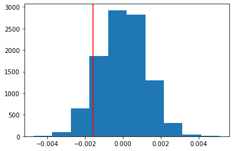

## Analyze A/B Test Results

This project will assure you have mastered the subjects covered in the statistics lessons.  The hope is to have this project be as comprehensive of these topics as possible.  Good luck!

## Table of Contents
- [Introduction](#intro)
- [Part I - Probability](#probability)
- [Part II - A/B Test](#ab_test)
- [Part III - Regression](#regression)


<a id='intro'></a>
### Introduction

A/B tests are very commonly performed by data analysts and data scientists.  It is important that you get some practice working with the difficulties of these 

For this project, you will be working to understand the results of an A/B test run by an e-commerce website.  Your goal is to work through this notebook to help the company understand if they should implement the new page, keep the old page, or perhaps run the experiment longer to make their decision.

**As you work through this notebook, follow along in the classroom and answer the corresponding quiz questions associated with each question.** The labels for each classroom concept are provided for each question.  This will assure you are on the right track as you work through the project, and you can feel more confident in your final submission meeting the criteria.  As a final check, assure you meet all the criteria on the [RUBRIC](https://review.udacity.com/#!/projects/37e27304-ad47-4eb0-a1ab-8c12f60e43d0/rubric).

<a id='probability'></a>
#### Part I - Probability

To get started, let's import our libraries.


```python
import pandas as pd
import numpy as np
import random
import matplotlib.pyplot as plt
%matplotlib inline
#We are setting the seed to assure you get the same answers on quizzes as we set up
random.seed(42)
```

`1.` Now, read in the `ab_data.csv` data. Store it in `df`.  **Use your dataframe to answer the questions in Quiz 1 of the classroom.**

a. Read in the dataset and take a look at the top few rows here:


```python
df = pd.read_csv('ab_data.csv')
df.head()
```


<div>
<style scoped>
    .dataframe tbody tr th:only-of-type {
        vertical-align: middle;
    }

    .dataframe tbody tr th {
        vertical-align: top;
    }

    .dataframe thead th {
        text-align: right;
    }
</style>
<table border="1" class="dataframe">
  <thead>
    <tr style="text-align: right;">
      <th></th>
      <th>user_id</th>
      <th>timestamp</th>
      <th>group</th>
      <th>landing_page</th>
      <th>converted</th>
    </tr>
  </thead>
  <tbody>
    <tr>
      <th>0</th>
      <td>851104</td>
      <td>2017-01-21 22:11:48.556739</td>
      <td>control</td>
      <td>old_page</td>
      <td>0</td>
    </tr>
    <tr>
      <th>1</th>
      <td>804228</td>
      <td>2017-01-12 08:01:45.159739</td>
      <td>control</td>
      <td>old_page</td>
      <td>0</td>
    </tr>
    <tr>
      <th>2</th>
      <td>661590</td>
      <td>2017-01-11 16:55:06.154213</td>
      <td>treatment</td>
      <td>new_page</td>
      <td>0</td>
    </tr>
    <tr>
      <th>3</th>
      <td>853541</td>
      <td>2017-01-08 18:28:03.143765</td>
      <td>treatment</td>
      <td>new_page</td>
      <td>0</td>
    </tr>
    <tr>
      <th>4</th>
      <td>864975</td>
      <td>2017-01-21 01:52:26.210827</td>
      <td>control</td>
      <td>old_page</td>
      <td>1</td>
    </tr>
  </tbody>
</table>
</div>


b. Use the below cell to find the number of rows in the dataset.


```python
df.shape[0]
```


    294478


c. The number of unique users in the dataset.


```python
number_users = df.user_id.nunique()
number_users
```


    290584


d. The proportion of users converted.


```python
df.converted.mean()
```


    0.11965919355605512


e. The number of times the `new_page` and `treatment` don't line up.


```python
df.query("(group != 'treatment' and landing_page =='new_page') or (group == 'treatment' and landing_page !='new_page')").shape[0]
```


    3893


f. Do any of the rows have missing values?


```python
df.isnull().sum()
```


    user_id         0
    timestamp       0
    group           0
    landing_page    0
    converted       0
    dtype: int64


`2.` For the rows where **treatment** is not aligned with **new_page** or **control** is not aligned with **old_page**, we cannot be sure if this row truly received the new or old page.  Use **Quiz 2** in the classroom to provide how we should handle these rows.  

a. Now use the answer to the quiz to create a new dataset that meets the specifications from the quiz.  Store your new dataframe in **df2**.


```python
# Remove these rows
Removed_rows = df.query("(group != 'treatment' and landing_page =='new_page') or (group == 'treatment' and landing_page !='new_page')")
```


```python
df2 = df.drop(index = Removed_rows.index)
df2
```


<div>
<style scoped>
    .dataframe tbody tr th:only-of-type {
        vertical-align: middle;
    }

    .dataframe tbody tr th {
        vertical-align: top;
    }

    .dataframe thead th {
        text-align: right;
    }
</style>
<table border="1" class="dataframe">
  <thead>
    <tr style="text-align: right;">
      <th></th>
      <th>user_id</th>
      <th>timestamp</th>
      <th>group</th>
      <th>landing_page</th>
      <th>converted</th>
    </tr>
  </thead>
  <tbody>
    <tr>
      <th>0</th>
      <td>851104</td>
      <td>2017-01-21 22:11:48.556739</td>
      <td>control</td>
      <td>old_page</td>
      <td>0</td>
    </tr>
    <tr>
      <th>1</th>
      <td>804228</td>
      <td>2017-01-12 08:01:45.159739</td>
      <td>control</td>
      <td>old_page</td>
      <td>0</td>
    </tr>
    <tr>
      <th>2</th>
      <td>661590</td>
      <td>2017-01-11 16:55:06.154213</td>
      <td>treatment</td>
      <td>new_page</td>
      <td>0</td>
    </tr>
    <tr>
      <th>3</th>
      <td>853541</td>
      <td>2017-01-08 18:28:03.143765</td>
      <td>treatment</td>
      <td>new_page</td>
      <td>0</td>
    </tr>
    <tr>
      <th>4</th>
      <td>864975</td>
      <td>2017-01-21 01:52:26.210827</td>
      <td>control</td>
      <td>old_page</td>
      <td>1</td>
    </tr>
    <tr>
      <th>...</th>
      <td>...</td>
      <td>...</td>
      <td>...</td>
      <td>...</td>
      <td>...</td>
    </tr>
    <tr>
      <th>294473</th>
      <td>751197</td>
      <td>2017-01-03 22:28:38.630509</td>
      <td>control</td>
      <td>old_page</td>
      <td>0</td>
    </tr>
    <tr>
      <th>294474</th>
      <td>945152</td>
      <td>2017-01-12 00:51:57.078372</td>
      <td>control</td>
      <td>old_page</td>
      <td>0</td>
    </tr>
    <tr>
      <th>294475</th>
      <td>734608</td>
      <td>2017-01-22 11:45:03.439544</td>
      <td>control</td>
      <td>old_page</td>
      <td>0</td>
    </tr>
    <tr>
      <th>294476</th>
      <td>697314</td>
      <td>2017-01-15 01:20:28.957438</td>
      <td>control</td>
      <td>old_page</td>
      <td>0</td>
    </tr>
    <tr>
      <th>294477</th>
      <td>715931</td>
      <td>2017-01-16 12:40:24.467417</td>
      <td>treatment</td>
      <td>new_page</td>
      <td>0</td>
    </tr>
  </tbody>
</table>
<p>290585 rows × 5 columns</p>
</div>


```python
# Double Check all of the correct rows were removed - this should be 0
df2[((df2['group'] == 'treatment') == (df2['landing_page'] == 'new_page')) == False].shape[0]
```


    0


`3.` Use **df2** and the cells below to answer questions for **Quiz3** in the classroom.


```python
df2
```


<div>
<style scoped>
    .dataframe tbody tr th:only-of-type {
        vertical-align: middle;
    }

    .dataframe tbody tr th {
        vertical-align: top;
    }

    .dataframe thead th {
        text-align: right;
    }
</style>
<table border="1" class="dataframe">
  <thead>
    <tr style="text-align: right;">
      <th></th>
      <th>user_id</th>
      <th>timestamp</th>
      <th>group</th>
      <th>landing_page</th>
      <th>converted</th>
    </tr>
  </thead>
  <tbody>
    <tr>
      <th>0</th>
      <td>851104</td>
      <td>2017-01-21 22:11:48.556739</td>
      <td>control</td>
      <td>old_page</td>
      <td>0</td>
    </tr>
    <tr>
      <th>1</th>
      <td>804228</td>
      <td>2017-01-12 08:01:45.159739</td>
      <td>control</td>
      <td>old_page</td>
      <td>0</td>
    </tr>
    <tr>
      <th>2</th>
      <td>661590</td>
      <td>2017-01-11 16:55:06.154213</td>
      <td>treatment</td>
      <td>new_page</td>
      <td>0</td>
    </tr>
    <tr>
      <th>3</th>
      <td>853541</td>
      <td>2017-01-08 18:28:03.143765</td>
      <td>treatment</td>
      <td>new_page</td>
      <td>0</td>
    </tr>
    <tr>
      <th>4</th>
      <td>864975</td>
      <td>2017-01-21 01:52:26.210827</td>
      <td>control</td>
      <td>old_page</td>
      <td>1</td>
    </tr>
    <tr>
      <th>...</th>
      <td>...</td>
      <td>...</td>
      <td>...</td>
      <td>...</td>
      <td>...</td>
    </tr>
    <tr>
      <th>294473</th>
      <td>751197</td>
      <td>2017-01-03 22:28:38.630509</td>
      <td>control</td>
      <td>old_page</td>
      <td>0</td>
    </tr>
    <tr>
      <th>294474</th>
      <td>945152</td>
      <td>2017-01-12 00:51:57.078372</td>
      <td>control</td>
      <td>old_page</td>
      <td>0</td>
    </tr>
    <tr>
      <th>294475</th>
      <td>734608</td>
      <td>2017-01-22 11:45:03.439544</td>
      <td>control</td>
      <td>old_page</td>
      <td>0</td>
    </tr>
    <tr>
      <th>294476</th>
      <td>697314</td>
      <td>2017-01-15 01:20:28.957438</td>
      <td>control</td>
      <td>old_page</td>
      <td>0</td>
    </tr>
    <tr>
      <th>294477</th>
      <td>715931</td>
      <td>2017-01-16 12:40:24.467417</td>
      <td>treatment</td>
      <td>new_page</td>
      <td>0</td>
    </tr>
  </tbody>
</table>
<p>290585 rows × 5 columns</p>
</div>


a. How many unique **user_id**s are in **df2**?


```python
# number of unique users
number_users = df2.user_id.nunique()
number_users
```


    290584


b. There is one **user_id** repeated in **df2**.  What is it?


```python
# get the non-unique user id
repeated_id = df2[df2.duplicated(subset=['user_id'])== True]['user_id']
repeated_id
```


    2893    773192
    Name: user_id, dtype: int64


c. What is the row information for the repeat **user_id**? 


```python
# row information for the repeat user id
df2[df2.duplicated(subset=['user_id'], keep=False)== True]
```


<div>
<style scoped>
    .dataframe tbody tr th:only-of-type {
        vertical-align: middle;
    }

    .dataframe tbody tr th {
        vertical-align: top;
    }

    .dataframe thead th {
        text-align: right;
    }
</style>
<table border="1" class="dataframe">
  <thead>
    <tr style="text-align: right;">
      <th></th>
      <th>user_id</th>
      <th>timestamp</th>
      <th>group</th>
      <th>landing_page</th>
      <th>converted</th>
    </tr>
  </thead>
  <tbody>
    <tr>
      <th>1899</th>
      <td>773192</td>
      <td>2017-01-09 05:37:58.781806</td>
      <td>treatment</td>
      <td>new_page</td>
      <td>0</td>
    </tr>
    <tr>
      <th>2893</th>
      <td>773192</td>
      <td>2017-01-14 02:55:59.590927</td>
      <td>treatment</td>
      <td>new_page</td>
      <td>0</td>
    </tr>
  </tbody>
</table>
</div>


d. Remove **one** of the rows with a duplicate **user_id**, but keep your dataframe as **df2**.


```python
# Remove the row that has the repeated user id
df2.drop(index = df2[df2.duplicated(subset=['user_id'])== True].index, inplace = True)
```


```python
# Check the row with repeated user id is removed
df2[df2.duplicated(subset=['user_id'])== True]
```


<div>
<style scoped>
    .dataframe tbody tr th:only-of-type {
        vertical-align: middle;
    }

    .dataframe tbody tr th {
        vertical-align: top;
    }

    .dataframe thead th {
        text-align: right;
    }
</style>
<table border="1" class="dataframe">
  <thead>
    <tr style="text-align: right;">
      <th></th>
      <th>user_id</th>
      <th>timestamp</th>
      <th>group</th>
      <th>landing_page</th>
      <th>converted</th>
    </tr>
  </thead>
  <tbody>
  </tbody>
</table>
</div>


`4.` Use **df2** in the below cells to answer the quiz questions related to **Quiz 4** in the classroom.

a. What is the probability of an individual converting regardless of the page they receive?


```python
# Probablitity of an individual converting regardless of the page they receive
df2.converted.mean()
```


    0.11959708724499628


b. Given that an individual was in the `control` group, what is the probability they converted?


```python
df2.query("group == 'control'")['converted'].mean()
```


    0.1203863045004612


c. Given that an individual was in the `treatment` group, what is the probability they converted?


```python
df2.query("group == 'treatment'")['converted'].mean()
```


    0.11880806551510564


d. What is the probability that an individual received the new page?


```python
(df2.landing_page == 'new_page').mean()
```


    0.5000619442226688


e. Consider your results from a. through d. above, and explain below whether you think there is sufficient evidence to say that the new treatment page leads to more conversions.

**Your answer goes here.**

I think there is not sufficient evidence to say the new treatment page leads to more conversions. As you can see, regardless of the received page, the probability of conversion is very low. And if an individual in the control group, the probability of conversion is low. And if an individual in the treatment group, the probability of conversion is low too. The probability of an individual received the new page is 50%, which tells us that only half of the people receive the new page. I think they need more time so that all people receive the new page.

<a id='ab_test'></a>
### Part II - A/B Test

Notice that because of the time stamp associated with each event, you could technically run a hypothesis test continuously as each observation was observed.  

However, then the hard question is do you stop as soon as one page is considered significantly better than another or does it need to happen consistently for a certain amount of time?  How long do you run to render a decision that neither page is better than another?  

These questions are the difficult parts associated with A/B tests in general.  


`1.` For now, consider you need to make the decision just based on all the data provided.  If you want to assume that the old page is better unless the new page proves to be definitely better at a Type I error rate of 5%, what should your null and alternative hypotheses be?  You can state your hypothesis in terms of words or in terms of **$p_{old}$** and **$p_{new}$**, which are the converted rates for the old and new pages.

**Put your answer here.**

$$H_0: p_{new} \le p_{old}$$
$$H_1: p_{new} > p_{old}$$
or
$$H_0: p_{new}-p_{old} \le 0$$
$$H_1: p_{new}-p_{old}>0 $$

`2.` Assume under the null hypothesis, $p_{new}$ and $p_{old}$ both have "true" success rates equal to the **converted** success rate regardless of page - that is $p_{new}$ and $p_{old}$ are equal. Furthermore, assume they are equal to the **converted** rate in **ab_data.csv** regardless of the page. <br><br>

Use a sample size for each page equal to the ones in **ab_data.csv**.  <br><br>

Perform the sampling distribution for the difference in **converted** between the two pages over 10,000 iterations of calculating an estimate from the null.  <br><br>

Use the cells below to provide the necessary parts of this simulation.  If this doesn't make complete sense right now, don't worry - you are going to work through the problems below to complete this problem.  You can use **Quiz 5** in the classroom to make sure you are on the right track.<br><br>

a. What is the **convert rate** for $p_{new}$ under the null? 


```python
# converted rate for the new page equal to the converted success rate regardless of page
p_new = df2.converted.mean()
p_new
```


    0.11959708724499628


b. What is the **convert rate** for $p_{old}$ under the null? <br><br>


```python
# converted rate for the old page equal to the converted success rate regardless of page
p_old = p_new
p_old
```


    0.11959708724499628


c. What is $n_{new}$?


```python
# the sample size of the new page equal to to the ones in ab_data.csv.
n_new = df2.query('landing_page == "new_page"').count()[0]
n_new
```


    145310


d. What is $n_{old}$?


```python
# the sample size of the old page equal to to the ones in ab_data.csv.
n_old = df2.query("landing_page == 'old_page'").count()[0]
n_old
```


    145274


e. Simulate $n_{new}$ transactions with a convert rate of $p_{new}$ under the null.  Store these $n_{new}$ 1's and 0's in **new_page_converted**.


```python
new_page_converted = np.random.choice([0, 1], size = n_new, p = [1-p_new, p_new])
# new_page_converted = np.random.binomial(1,size=n_new, p=p_new)
new_page_converted
```


    array([0, 0, 0, ..., 0, 0, 0])


f. Simulate $n_{old}$ transactions with a convert rate of $p_{old}$ under the null.  Store these $n_{old}$ 1's and 0's in **old_page_converted**.


```python
old_page_converted = np.random.choice([0, 1], size = n_old, p = [1-p_old, p_old])
#   old_page_converted = np.random.binomial(1, size=n_old, p=p_old)
old_page_converted
```


    array([0, 0, 0, ..., 0, 0, 0])


g. Find $p_{new}$ - $p_{old}$ for your simulated values from part (e) and (f).


```python
# computer the mean of the two pages and get the difference between them
new_page_converted.mean() - old_page_converted.mean()
```


    0.0006723491256459269


h. Simulate 10,000 $p_{new}$ - $p_{old}$ values using this same process similarly to the one you calculated in parts **a. through g.** above.  Store all 10,000 values in a numpy array called **p_diffs**.


```python
p_diffs = []
for _ in range(10000):
    new_page_converted = np.random.binomial(1,size=n_new, p=p_new) # bootstrapping
    old_page_converted = np.random.binomial(1, size=n_old, p=p_old) # bootstrapping
    p_diffs.append(new_page_converted.mean() - old_page_converted.mean())
```


```python
p_diffs = np.array(p_diffs)
```

i. Plot a histogram of the **p_diffs**.  Does this plot look like what you expected?  Use the matching problem in the classroom to assure you fully understand what was computed here.


```python
plt.hist(p_diffs); 
# Yes, it looks like I expected, a normal distribution.
```


    

    


j. What proportion of the **p_diffs** are greater than the actual difference observed in **ab_data.csv**?


```python
new_page_converted_obs = df2.converted[df2.landing_page == 'new_page'].mean()
old_page_converted_obs = df2.converted[df2.landing_page == 'old_page'].mean()
obs_diff = new_page_converted_obs - old_page_converted_obs
obs_diff
```


    -0.0015782389853555567


```python
# see where the obs_diff located in the distribution
plt.hist(p_diffs)
plt.axvline(x=obs_diff, color='r');
```


    

    


```python
# P-value
(p_diffs > obs_diff).mean()
```


    0.9002


k. In words, explain what you just computed in part **j.**  What is this value called in scientific studies?  What does this value mean in terms of whether or not there is a difference between the new and old pages?

**Put your answer here.**

- In scientific studies, this value caled P-value
- The definition of a P-value is the probability of observing your statistic(or one more extreme in favor of the alternative) if the null hypothesis is true.
- The P-value is greater than the type I error rate of 5%.
- We do not have statistically significant evidence to suggest the population difference is greater than 0. (Fail to reject the null)

l. We could also use a built-in to achieve similar results.  Though using the built-in might be easier to code, the above portions are a walkthrough of the ideas that are critical to correctly thinking about statistical significance. Fill in the below to calculate the number of conversions for each page, as well as the number of individuals who received each page. Let `n_old` and `n_new` refer the the number of rows associated with the old page and new pages, respectively.


```python
import statsmodels.api as sm

convert_old = len(df2.query("landing_page == 'old_page' and converted == 1"))
convert_new = len(df2.query("landing_page == 'new_page' and converted == 1"))
n_old = len(df2.query('landing_page == "old_page"'))
n_new = len(df2.query('landing_page == "new_page"'))
```


```python
convert_old, convert_new
```


    (17489, 17264)


```python
n_old, n_new
```


    (145274, 145310)


m. Now use `stats.proportions_ztest` to compute your test statistic and p-value.  [Here](https://www.statsmodels.org/stable/generated/statsmodels.stats.proportion.proportions_ztest.html) is a helpful link on using the built in.


```python
z_score, p_value = sm.stats.proportions_ztest([convert_old, convert_new], [n_old, n_new], alternative = 'smaller')
z_score, p_value
```


    (1.3109241984234394, 0.9050583127590245)


n. What do the z-score and p-value you computed in the previous question mean for the conversion rates of the old and new pages?  Do they agree with the findings in parts **j.** and **k.**?

**Put your answer here.**

- The value of the P-value here is quite similar to the one we computed earlier.
- The P-value and the z-score are agreed that we fail to reject the null.
- We are 95% not confident that the new page conversion rate is greater than the old page conversion rate as the P-value is greater than the type I error rate of 5%.

<a id='regression'></a>
### Part III - A regression approach

`1.` In this final part, you will see that the result you acheived in the previous A/B test can also be acheived by performing regression.<br><br>

a. Since each row is either a conversion or no conversion, what type of regression should you be performing in this case?

**Put your answer here.**

I'll use the logistic regression techniques since the response variable has only two outcomes(categorical variable).

b. The goal is to use **statsmodels** to fit the regression model you specified in part **a.** to see if there is a significant difference in conversion based on which page a customer receives.  However, you first need to create a column for the intercept, and create a dummy variable column for which page each user received.  Add an **intercept** column, as well as an **ab_page** column, which is 1 when an individual receives the **treatment** and 0 if **control**.


```python
df2.head(1)
```


<div>
<style scoped>
    .dataframe tbody tr th:only-of-type {
        vertical-align: middle;
    }

    .dataframe tbody tr th {
        vertical-align: top;
    }

    .dataframe thead th {
        text-align: right;
    }
</style>
<table border="1" class="dataframe">
  <thead>
    <tr style="text-align: right;">
      <th></th>
      <th>user_id</th>
      <th>timestamp</th>
      <th>group</th>
      <th>landing_page</th>
      <th>converted</th>
    </tr>
  </thead>
  <tbody>
    <tr>
      <th>0</th>
      <td>851104</td>
      <td>2017-01-21 22:11:48.556739</td>
      <td>control</td>
      <td>old_page</td>
      <td>0</td>
    </tr>
  </tbody>
</table>
</div>


```python
# treatment --> 1, control --> 0, we will use the treatment column
pd.get_dummies(df2.group)
```


<div>
<style scoped>
    .dataframe tbody tr th:only-of-type {
        vertical-align: middle;
    }

    .dataframe tbody tr th {
        vertical-align: top;
    }

    .dataframe thead th {
        text-align: right;
    }
</style>
<table border="1" class="dataframe">
  <thead>
    <tr style="text-align: right;">
      <th></th>
      <th>control</th>
      <th>treatment</th>
    </tr>
  </thead>
  <tbody>
    <tr>
      <th>0</th>
      <td>1</td>
      <td>0</td>
    </tr>
    <tr>
      <th>1</th>
      <td>1</td>
      <td>0</td>
    </tr>
    <tr>
      <th>2</th>
      <td>0</td>
      <td>1</td>
    </tr>
    <tr>
      <th>3</th>
      <td>0</td>
      <td>1</td>
    </tr>
    <tr>
      <th>4</th>
      <td>1</td>
      <td>0</td>
    </tr>
    <tr>
      <th>...</th>
      <td>...</td>
      <td>...</td>
    </tr>
    <tr>
      <th>294473</th>
      <td>1</td>
      <td>0</td>
    </tr>
    <tr>
      <th>294474</th>
      <td>1</td>
      <td>0</td>
    </tr>
    <tr>
      <th>294475</th>
      <td>1</td>
      <td>0</td>
    </tr>
    <tr>
      <th>294476</th>
      <td>1</td>
      <td>0</td>
    </tr>
    <tr>
      <th>294477</th>
      <td>0</td>
      <td>1</td>
    </tr>
  </tbody>
</table>
<p>290584 rows × 2 columns</p>
</div>


```python
# Create a dummy variable, and drop control column
df2['ab_page'] = pd.get_dummies(df2.group).drop(columns=['control'])
```


```python
# intercept column
df2['intercept'] = 1
```


```python
df2.head()
```


<div>
<style scoped>
    .dataframe tbody tr th:only-of-type {
        vertical-align: middle;
    }

    .dataframe tbody tr th {
        vertical-align: top;
    }

    .dataframe thead th {
        text-align: right;
    }
</style>
<table border="1" class="dataframe">
  <thead>
    <tr style="text-align: right;">
      <th></th>
      <th>user_id</th>
      <th>timestamp</th>
      <th>group</th>
      <th>landing_page</th>
      <th>converted</th>
      <th>ab_page</th>
      <th>intercept</th>
    </tr>
  </thead>
  <tbody>
    <tr>
      <th>0</th>
      <td>851104</td>
      <td>2017-01-21 22:11:48.556739</td>
      <td>control</td>
      <td>old_page</td>
      <td>0</td>
      <td>0</td>
      <td>1</td>
    </tr>
    <tr>
      <th>1</th>
      <td>804228</td>
      <td>2017-01-12 08:01:45.159739</td>
      <td>control</td>
      <td>old_page</td>
      <td>0</td>
      <td>0</td>
      <td>1</td>
    </tr>
    <tr>
      <th>2</th>
      <td>661590</td>
      <td>2017-01-11 16:55:06.154213</td>
      <td>treatment</td>
      <td>new_page</td>
      <td>0</td>
      <td>1</td>
      <td>1</td>
    </tr>
    <tr>
      <th>3</th>
      <td>853541</td>
      <td>2017-01-08 18:28:03.143765</td>
      <td>treatment</td>
      <td>new_page</td>
      <td>0</td>
      <td>1</td>
      <td>1</td>
    </tr>
    <tr>
      <th>4</th>
      <td>864975</td>
      <td>2017-01-21 01:52:26.210827</td>
      <td>control</td>
      <td>old_page</td>
      <td>1</td>
      <td>0</td>
      <td>1</td>
    </tr>
  </tbody>
</table>
</div>


c. Use **statsmodels** to import your regression model.  Instantiate the model, and fit the model using the two columns you created in part **b.** to predict whether or not an individual converts.


```python
y = df2['converted']
X = df2[['intercept', 'ab_page']]
```


```python
log_model = sm.Logit(y, X)
results = log_model.fit()
```

    Optimization terminated successfully.
             Current function value: 0.366118
             Iterations 6
    

d. Provide the summary of your model below, and use it as necessary to answer the following questions.


```python
results.summary()
```


<table class="simpletable">
<caption>Logit Regression Results</caption>
<tr>
  <th>Dep. Variable:</th>       <td>converted</td>    <th>  No. Observations:  </th>   <td>290584</td>   
</tr>
<tr>
  <th>Model:</th>                 <td>Logit</td>      <th>  Df Residuals:      </th>   <td>290582</td>   
</tr>
<tr>
  <th>Method:</th>                 <td>MLE</td>       <th>  Df Model:          </th>   <td>     1</td>   
</tr>
<tr>
  <th>Date:</th>            <td>Mon, 05 Jul 2021</td> <th>  Pseudo R-squ.:     </th>  <td>8.077e-06</td> 
</tr>
<tr>
  <th>Time:</th>                <td>11:14:23</td>     <th>  Log-Likelihood:    </th> <td>-1.0639e+05</td>
</tr>
<tr>
  <th>converged:</th>             <td>True</td>       <th>  LL-Null:           </th> <td>-1.0639e+05</td>
</tr>
<tr>
  <th>Covariance Type:</th>     <td>nonrobust</td>    <th>  LLR p-value:       </th>   <td>0.1899</td>   
</tr>
</table>
<table class="simpletable">
<tr>
      <td></td>         <th>coef</th>     <th>std err</th>      <th>z</th>      <th>P>|z|</th>  <th>[0.025</th>    <th>0.975]</th>  
</tr>
<tr>
  <th>intercept</th> <td>   -1.9888</td> <td>    0.008</td> <td> -246.669</td> <td> 0.000</td> <td>   -2.005</td> <td>   -1.973</td>
</tr>
<tr>
  <th>ab_page</th>   <td>   -0.0150</td> <td>    0.011</td> <td>   -1.311</td> <td> 0.190</td> <td>   -0.037</td> <td>    0.007</td>
</tr>
</table>


```python
ab_page_coef = results.params[1]
1/np.exp(ab_page_coef)
```


    1.0151020136964686


This means that the new page is 1.015 less likely to be converted than the old page.

e. What is the p-value associated with **ab_page**? Why does it differ from the value you found in **Part II**?<br><br>  **Hint**: What are the null and alternative hypotheses associated with your regression model, and how do they compare to the null and alternative hypotheses in the **Part II**?

**Put your answer here.**

- `ab_page` P-value = 0.190
- The P-value associated with `ab_page` is greater than the I type error of 0.05. Thus the coefficient is not statistically significant.
- Here, the P-value tells us whether or not a particular variable is useful for predicting the response.
- The value differs in this part from part II because, in part II, it's a one-tailed test, but in this part, it's a two-tailed test.
- **Null and Alternative Hypothesis**
    - In part II
        $$H_0: p_{new} \le p_{old}$$
        $$H_1: p_{new} > p_{old}$$
        or
        $$H_0: p_{new}-p_{old} \le 0$$
        $$H_1: p_{new}-p_{old}>0 $$
        A one-tailed test
    
    where **$p_{old}$** and **$p_{new}$**, which are the converted rates for the old and new pages.
    - In this part
    
        - **Null**: The coefficient is equal to zero
        - **Alternative**: The coefficient is not equal to zero
        - A two-tailed test
    

- From this part, we got that the new page is 1.015 less likely to be converted than the old page. In both parts, we failed to reject the null.

f. Now, you are considering other things that might influence whether or not an individual converts.  Discuss why it is a good idea to consider other factors to add into your regression model.  Are there any disadvantages to adding additional terms into your regression model?

**Put your answer here.**

- Because maybe there are factors that can help us best predict the conversion rate.
- Disadvantage: Adding more terms makes the model more complex.

g. Now along with testing if the conversion rate changes for different pages, also add an effect based on which country a user lives. You will need to read in the **countries.csv** dataset and merge together your datasets on the approporiate rows.  [Here](https://pandas.pydata.org/pandas-docs/stable/generated/pandas.DataFrame.join.html) are the docs for joining tables. 

Does it appear that country had an impact on conversion?  Don't forget to create dummy variables for these country columns - **Hint: You will need two columns for the three dummy variables.** Provide the statistical output as well as a written response to answer this question.


```python
countries_df = pd.read_csv('./countries.csv')
df_new = countries_df.set_index('user_id').join(df2.set_index('user_id'), how='inner')
```


```python
df_new.head()
```


<div>
<style scoped>
    .dataframe tbody tr th:only-of-type {
        vertical-align: middle;
    }

    .dataframe tbody tr th {
        vertical-align: top;
    }

    .dataframe thead th {
        text-align: right;
    }
</style>
<table border="1" class="dataframe">
  <thead>
    <tr style="text-align: right;">
      <th></th>
      <th>country</th>
      <th>timestamp</th>
      <th>group</th>
      <th>landing_page</th>
      <th>converted</th>
      <th>ab_page</th>
      <th>intercept</th>
    </tr>
    <tr>
      <th>user_id</th>
      <th></th>
      <th></th>
      <th></th>
      <th></th>
      <th></th>
      <th></th>
      <th></th>
    </tr>
  </thead>
  <tbody>
    <tr>
      <th>834778</th>
      <td>UK</td>
      <td>2017-01-14 23:08:43.304998</td>
      <td>control</td>
      <td>old_page</td>
      <td>0</td>
      <td>0</td>
      <td>1</td>
    </tr>
    <tr>
      <th>928468</th>
      <td>US</td>
      <td>2017-01-23 14:44:16.387854</td>
      <td>treatment</td>
      <td>new_page</td>
      <td>0</td>
      <td>1</td>
      <td>1</td>
    </tr>
    <tr>
      <th>822059</th>
      <td>UK</td>
      <td>2017-01-16 14:04:14.719771</td>
      <td>treatment</td>
      <td>new_page</td>
      <td>1</td>
      <td>1</td>
      <td>1</td>
    </tr>
    <tr>
      <th>711597</th>
      <td>UK</td>
      <td>2017-01-22 03:14:24.763511</td>
      <td>control</td>
      <td>old_page</td>
      <td>0</td>
      <td>0</td>
      <td>1</td>
    </tr>
    <tr>
      <th>710616</th>
      <td>UK</td>
      <td>2017-01-16 13:14:44.000513</td>
      <td>treatment</td>
      <td>new_page</td>
      <td>0</td>
      <td>1</td>
      <td>1</td>
    </tr>
  </tbody>
</table>
</div>


```python
df_new.country.unique()
```


    array(['UK', 'US', 'CA'], dtype=object)


```python
### Create the necessary dummy variables
df_new[['CA', 'UK','US']]= pd.get_dummies(df_new['country'])
df_new.head(1)
```


<div>
<style scoped>
    .dataframe tbody tr th:only-of-type {
        vertical-align: middle;
    }

    .dataframe tbody tr th {
        vertical-align: top;
    }

    .dataframe thead th {
        text-align: right;
    }
</style>
<table border="1" class="dataframe">
  <thead>
    <tr style="text-align: right;">
      <th></th>
      <th>country</th>
      <th>timestamp</th>
      <th>group</th>
      <th>landing_page</th>
      <th>converted</th>
      <th>ab_page</th>
      <th>intercept</th>
      <th>CA</th>
      <th>UK</th>
      <th>US</th>
    </tr>
    <tr>
      <th>user_id</th>
      <th></th>
      <th></th>
      <th></th>
      <th></th>
      <th></th>
      <th></th>
      <th></th>
      <th></th>
      <th></th>
      <th></th>
    </tr>
  </thead>
  <tbody>
    <tr>
      <th>834778</th>
      <td>UK</td>
      <td>2017-01-14 23:08:43.304998</td>
      <td>control</td>
      <td>old_page</td>
      <td>0</td>
      <td>0</td>
      <td>1</td>
      <td>0</td>
      <td>1</td>
      <td>0</td>
    </tr>
  </tbody>
</table>
</div>


```python
df_new['intercept'] = 1
y = df_new['converted']
X = df_new[['intercept', 'CA', 'US', 'ab_page']]
```


```python
log_model = sm.Logit(y, X)
results = log_model.fit()
results.summary2()
```

    Optimization terminated successfully.
             Current function value: 0.366113
             Iterations 6
    


<table class="simpletable">
<tr>
        <td>Model:</td>              <td>Logit</td>      <td>Pseudo R-squared:</td>    <td>0.000</td>   
</tr>
<tr>
  <td>Dependent Variable:</td>     <td>converted</td>          <td>AIC:</td>        <td>212781.1253</td>
</tr>
<tr>
         <td>Date:</td>        <td>2021-07-05 11:14</td>       <td>BIC:</td>        <td>212823.4439</td>
</tr>
<tr>
   <td>No. Observations:</td>       <td>290584</td>       <td>Log-Likelihood:</td>  <td>-1.0639e+05</td>
</tr>
<tr>
       <td>Df Model:</td>              <td>3</td>            <td>LL-Null:</td>      <td>-1.0639e+05</td>
</tr>
<tr>
     <td>Df Residuals:</td>         <td>290580</td>        <td>LLR p-value:</td>      <td>0.17599</td>  
</tr>
<tr>
      <td>Converged:</td>           <td>1.0000</td>           <td>Scale:</td>         <td>1.0000</td>   
</tr>
<tr>
    <td>No. Iterations:</td>        <td>6.0000</td>              <td></td>               <td></td>      
</tr>
</table>
<table class="simpletable">
<tr>
      <td></td>       <th>Coef.</th>  <th>Std.Err.</th>     <th>z</th>      <th>P>|z|</th> <th>[0.025</th>  <th>0.975]</th> 
</tr>
<tr>
  <th>intercept</th> <td>-1.9794</td>  <td>0.0127</td>  <td>-155.4145</td> <td>0.0000</td> <td>-2.0044</td> <td>-1.9544</td>
</tr>
<tr>
  <th>CA</th>        <td>-0.0506</td>  <td>0.0284</td>   <td>-1.7835</td>  <td>0.0745</td> <td>-0.1063</td> <td>0.0050</td> 
</tr>
<tr>
  <th>US</th>        <td>-0.0099</td>  <td>0.0133</td>   <td>-0.7433</td>  <td>0.4573</td> <td>-0.0359</td> <td>0.0162</td> 
</tr>
<tr>
  <th>ab_page</th>   <td>-0.0149</td>  <td>0.0114</td>   <td>-1.3069</td>  <td>0.1912</td> <td>-0.0374</td> <td>0.0075</td> 
</tr>
</table>


- It seems that the country does not affect the conversion rate. CA and US are not statistically significant.

h. Though you have now looked at the individual factors of country and page on conversion, we would now like to look at an interaction between page and country to see if there significant effects on conversion.  Create the necessary additional columns, and fit the new model.  

Provide the summary results, and your conclusions based on the results.


```python
# make an interaction column between country and page
df_new['interaction_page_US'] = df_new.ab_page * df_new.US
df_new['interaction_page_CA'] = df_new.ab_page * df_new.CA
```


```python
### Fit Your Linear Model And Obtain the Results
y = df_new['converted']
X = df_new[['intercept', 'ab_page', 'CA', 'US', 'interaction_page_US', 'interaction_page_CA']]
log_model = sm.Logit(y, X)
results = log_model.fit()
results.summary()
```

    Optimization terminated successfully.
             Current function value: 0.366109
             Iterations 6
    


<table class="simpletable">
<caption>Logit Regression Results</caption>
<tr>
  <th>Dep. Variable:</th>       <td>converted</td>    <th>  No. Observations:  </th>   <td>290584</td>   
</tr>
<tr>
  <th>Model:</th>                 <td>Logit</td>      <th>  Df Residuals:      </th>   <td>290578</td>   
</tr>
<tr>
  <th>Method:</th>                 <td>MLE</td>       <th>  Df Model:          </th>   <td>     5</td>   
</tr>
<tr>
  <th>Date:</th>            <td>Mon, 05 Jul 2021</td> <th>  Pseudo R-squ.:     </th>  <td>3.482e-05</td> 
</tr>
<tr>
  <th>Time:</th>                <td>11:14:30</td>     <th>  Log-Likelihood:    </th> <td>-1.0639e+05</td>
</tr>
<tr>
  <th>converged:</th>             <td>True</td>       <th>  LL-Null:           </th> <td>-1.0639e+05</td>
</tr>
<tr>
  <th>Covariance Type:</th>     <td>nonrobust</td>    <th>  LLR p-value:       </th>   <td>0.1920</td>   
</tr>
</table>
<table class="simpletable">
<tr>
           <td></td>              <th>coef</th>     <th>std err</th>      <th>z</th>      <th>P>|z|</th>  <th>[0.025</th>    <th>0.975]</th>  
</tr>
<tr>
  <th>intercept</th>           <td>   -1.9922</td> <td>    0.016</td> <td> -123.457</td> <td> 0.000</td> <td>   -2.024</td> <td>   -1.961</td>
</tr>
<tr>
  <th>ab_page</th>             <td>    0.0108</td> <td>    0.023</td> <td>    0.475</td> <td> 0.635</td> <td>   -0.034</td> <td>    0.056</td>
</tr>
<tr>
  <th>CA</th>                  <td>   -0.0118</td> <td>    0.040</td> <td>   -0.296</td> <td> 0.767</td> <td>   -0.090</td> <td>    0.066</td>
</tr>
<tr>
  <th>US</th>                  <td>    0.0057</td> <td>    0.019</td> <td>    0.306</td> <td> 0.760</td> <td>   -0.031</td> <td>    0.043</td>
</tr>
<tr>
  <th>interaction_page_US</th> <td>   -0.0314</td> <td>    0.027</td> <td>   -1.181</td> <td> 0.238</td> <td>   -0.084</td> <td>    0.021</td>
</tr>
<tr>
  <th>interaction_page_CA</th> <td>   -0.0783</td> <td>    0.057</td> <td>   -1.378</td> <td> 0.168</td> <td>   -0.190</td> <td>    0.033</td>
</tr>
</table>


- All coefficients are not statistically significant, hence they don't affect the conversion rate. 

<a id='conclusions'></a>
## Conclusions

***Do you think there is sufficient evidence to say that the new treatment page leads to more conversions?***
- **From the perspective of the probability:**
    - I think there is not sufficient evidence to say the new treatment page leads to more conversions. As you can see,   regardless of the received page, the probability of conversion is very low. And if an individual in the control group, the probability of conversion is low. And if an individual in the treatment group, the probability of conversion is low too. The probability of an individual received the new page is 50%, which tells us that only half of the people receive the new page. I think they need more time so that all people receive the new page.
- **From the perspective of A/B testing:**
    - The P-value is greater than the type I error rate of 5%.
    - We do not have statistically significant evidence to suggest the population difference is greater than 0. (Fail to reject the null)
    - The P-value and the z-score tell us that we fail to reject the null.
    - We are 95% not confident that the new page conversion rate is greater than the old page conversion rate as the P-value is greater than the type I error rate of 5%.
- **From the perspective of regression**
    - Using only landing page, we got that the new page is 1.015 less likely to be converted than the old page. We failed to reject the null.
    - Using the countries and landing page, it seems that the country does not affect the conversion rate. CA and US are not statistically significant.
    - Using the interaction between the country and ab_page, all the coefficients are not statistically significant. 
> ***From the results above, we don't have enough evidence that the new page conversion rate is better than the old page conversion rate.***
