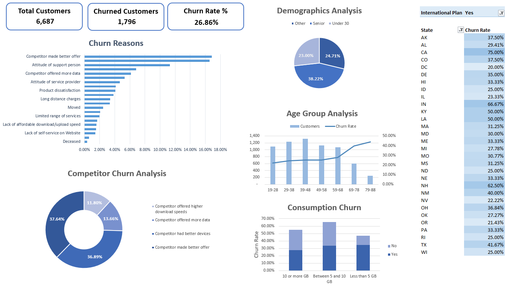
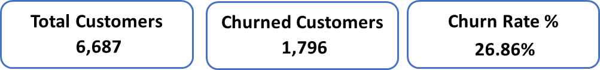
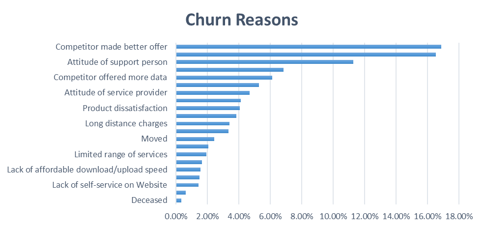
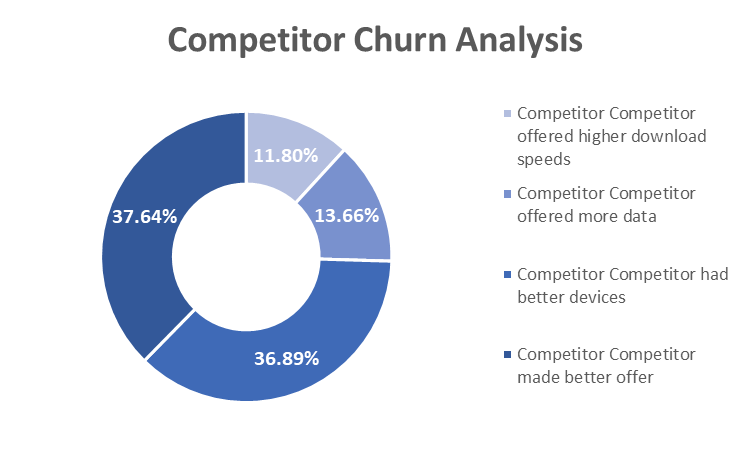
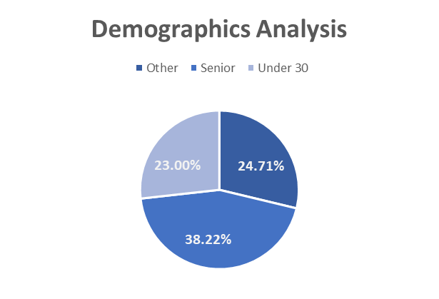
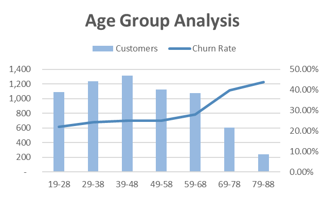
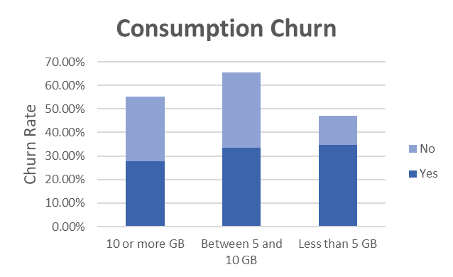
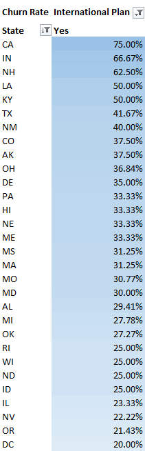

# Customers Churn Dashboard

# Overview
We will be analyzing a fictitious churn dataset from a Telecom provider called Databel to know why customers are churning.
The Databel dataset consists of 29 columns with one row per customer. We'll be analyzing a snapshot of the database at a specific time, meaning there is no time dimension.
If you want to know more about the data check out the `Metadata Sheet - Customer Churn` file. 
There are two sheets:
- Databel - Customer
- Databel - Aggreate: The aggregate views are based on data in Databel - Customer.

#### **Skills Used**  
- Creating calculated columns.  
- Transforming and cleaning data.  
- Performing exploratory data analysis (EDA).  
- Building pivot tables and creating data visualizations.  

  
### Data Wrangling & EDA Steps
- First, I extracted the data into a view table and checked for duplicate values; there were none.
- Then, we created a new column called `Churned` from the `Churn Label` column using an IF statement, assigning 1 for "Yes" and 0 for "No."
- We created a blank PivotTable of the Customers table, placed it in a new Worksheet, and renamed it "Customer Pivots".
    - We calculated the total number of customers and the number of churned customers.
    - Then, we calculated the churn rate by dividing the number of churned customers by the total number of customers.
- We found that 26.86% of the customers churned which is fairly high.

##### Investigating churn reasons
- After that, we started to investigate why customers churned
    - We created a new pivot table to analyze the total number of churned customers by Churn Reason.
    - We calculated the churned customers by reason as a percentage of the total churned customers
    - We created a bar chart to visualize the results
    - We found that the top 3 reasons for customer churn reasons are:
        - Competitor made better offer
        - Competitor had better devices
        - Attitude of support person

- We will now analyze which churn category contributes the most to overall churn.
    - We can see that the category driving the highest % of churn is Competitor.
        - We found that 37.64% of customers who churned due to competitor reasons did so because the competitor made a better offer.
          
##### Analyzing demographics
- We started to analyze demographic fields to extract more insights to help us identify why customers churn.
- We created a new column called `Demographics` that categorizes customers into the following categories: `Under 30`, `Senior` and `Other`
- We created a calculated field `Churn Rate %` that divides churned customers by total customers
- When we analyzed churn by `Demographics`, we found that nearly 40% of the customers categorized as Seniors churned from the company.
- We are going to split the Age column into brackets with a split of 10
We created a chart for churn rate and total customers by age group and found that group 79-88 has the lowest number of customers but the highest churn rate. This may be expected as customers in this age range may pass away.

##### Investigating how the Unlimited Data Plan influences the churn rate.
- Databel hypothesizes that people not on an unlimited data plan are more likely to churn. Let's investigate how the Unlimited Data Plan influences the churn rate.
    -  We created a pivot table to analyze the total number of customers and the churn rate by unlimited data plan
    -  It appears that customers who are on an unlimited plan are more likely to churn
    -  To see if it is related to a certain amount of mobile data (GB) being used, we are going to create a new column called `Grouped Consumption` that classifies the average monthly GB download in the following groups:
        - Less than 5 GB
        - Between 5 and 10 GB
        - 10 or more GB
    - We analyzed the churn rate by consumption group, we found that customers who consume the lowest amount of data are actually the most likely to churn at almost 35%

##### Analyzing the relationship between customers' international activity and churn
- The analysis requirement given by Databel includes a request to analyze the relationship between customers' international activity and churn. They are curious about the behavior of customers who call internationally, and if paying for an international plan influences their loyalty.
    - Let's analyze the churn rate by state and whether a customer is on an international plan
    - CA has customers on an international plan with a particularly high percentage of churners.

##### Investigating customer account length and contract type
- Databel also wants to improve its customer service since there have been some reported issues. Your job is to investigate two important topics related to customers: the contract type, and how many months a person is a customer.
    - We analyzed the churn rate by  customer account length
    - It appears that the churn rate does decrease over time. Let's investigate how this decrease behaves through the different types of contracts.
    - We can see that Month-to-Month contracts have the biggest churn, as expected. Customers between the 3 and 4 year mark are much more likely to churn on a One-Year contract than a Two-Year Contract. Sales and marketing can use this information to provide offers that would get customers to sign up for two-year deals.

## **Draw Conclusions**

The total number of customers that Databel has served is **6,687**, and the total number of customers who churned is **1,796**, resulting in a churn rate of approximately **27%**.  

### What are the top reasons for customer churn?

- We found that the top 3 reasons for customer churn are:  
  1. Competitors made better offers.  
  2. Competitors had better devices.  
  3. Attitude of the support person.  

### Which churn category has the highest churn rate?

- We found that the category driving the highest percentage of churn is **Competitor**.  
- Specifically, **37.64%** of customers who churned due to competitor-related reasons did so because the competitor made a better offer.  
- Interestingly, the least common reason for customers leaving Databel is competitors offering higher download speeds. This suggests that customers are not necessarily leaving for better service but are instead influenced by other key factors.  

### Which demographic has the highest churn rate?

- We found that nearly 40% of the customers categorized as Seniors churned from the company.

### Which age group has the highest churn rate?

- We found that the **79-88 age group** has the lowest number of customers but the highest churn rate. This may be expected, as customers in this age range are more likely to pass away.  
- Customers in the **19-28 age group** have the lowest churn rate compared to all other groups.  

### How does the Unlimited Data Plan influence the churn rate?

- It appears that customers on an unlimited plan are more likely to churn.  
- We found that the churn rate for customers on an unlimited plan who consume less than **5 GB** of data is **34.69%**.  
- Customers who consume the lowest amount of data are the most likely to churn, with a churn rate of nearly **35%**.  

### Churn rate by state and whether a customer is on an international plan

- CA has customers on an international plan with a particularly high percentage of churners.
