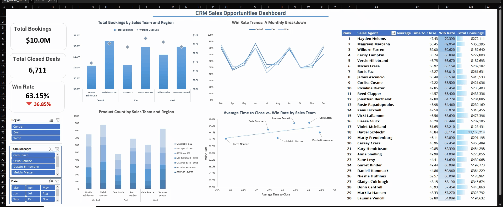

# Overview
In this analysis, I investigated data from a computer hardware company to evaluate the performance of its sales teams and agents. By examining key metrics such as total bookings, average deal size, win rate, and time to close, we can uncover actionable insights to enhance sales performance, minimize lost opportunities, and increase profitability.												
																														



## **Data Gathering**

- We downloaded the dataset from [Maven Analytics](https://mavenanalytics.io/data-playground?accessType=open&dataStructure=Multiple%20tables&order=date_added%2Cdesc&tags=Business&tags=Retail), and it is provided in CSV file format.  
- We extracted the data and imported it into an Excel sheet for analysis.

### **Datasets Description**
The data we have consists of 4 tables: accounts, products, sales_pipeline, and sales_teams tables

#### **Accounts Table**
| Field             | Description                          |
|-------------------|--------------------------------------|
| account           | Company name                         |
| sector            | Industry                             |
| year_established  | Year Established                     |
| revenue           | Annual revenue (in millions of USD)  |
| employees         | Number of employees                  |
| office_location   | Headquarters                         |
| subsidiary_of     | Parent company                       |

---

#### **Products Table**
| Field         | Description                  |
|---------------|------------------------------|
| product       | Product name                 |
| series        | Product series               |
| sales_price   | Suggested retail price       |

---

#### **Sales Teams Table**
| Field           | Description                  |
|-----------------|------------------------------|
| sales_agent     | Sales agent                  |
| manager         | Respective sales manager     |
| regional_office | Regional office              |

---

#### **Sales Pipeline Table**
| Field           | Description                                                                 |
|-----------------|-----------------------------------------------------------------------------|
| opportunity_id  | Unique identifier                                                           |
| sales_agent     | Sales agent                                                                 |
| product         | Product name                                                                |
| account         | Company name                                                                |
| deal_stage      | Sales pipeline stage (Prospecting > Engaging > Won / Lost)                  |
| engage_date     | Date in which the "Engaging" deal stage was initiated                       |
| close_date      | Date in which the deal was "Won" or "Lost"                                  |
| close_value     | Revenue from the deal                                                       |

---
### **Data Model**
I worked on identifying the relationships between the tables and came up with this diagram.


---

### **Business Goal**  
#### 1. How is each sales team performing compared to the rest?  
#### 2. Are any sales agents lagging behind?  
#### 3. Can you identify any quarter-over-quarter trends?  

---

### **KPIs**  
1. **Total Bookings**: The sum of all closed deals.  
   - In our dataset, it is the sum of the values in the `close_value` column.  
   - We will use this metric to measure the success of sales teams and sales agents.  
   - Which region has a high loss of deals?  

2. **Average Deal Size**: The average size (in dollars) of all won deals.  
   - In our dataset, it is the sum of the values in the `close_value` column for won deals divided by the number of deals.  
   - This metric will help us identify the type of customers and deals we should focus on.  

3. **Average Time to Close**: The average number of days it takes a member of the sales team to close a deal, from the prospect stage to a closed deal.  
   - We will calculate this metric based on the `engage_date`, as we don’t have the date when the Prospecting stage was initiated.  
   - We will use this metric to investigate how many days, on average, each sales team took to close a deal.  

4. **Win Rate**: The percentage of successful sales from created opportunities and/or new prospects over a specific period of time.  
   - It is calculated as the number of Closed-won deals divided by the total number of deals.  
   - We will use it to determine which sales agents are performing the best and which are lagging.  


This analysis is performed for deals closed between **March 1, 2017**, and **December 31, 2017**.  
### **Analysis Questions**  
- What is the total bookings for each sales team per region?
- What are the trends in win rate over time?
- Which region has a high loss of deals?
- What is the average time to close a deal per sales team?
- What is the total bookings for each sales agent?  
- What is the average time to close a deal per sales agent?
- Which sales agent has the top performance?    

## **Data Assessing**  
- For this step, we will use **Power Query**.  

#### **`Accounts` Table**  
- The `subsidiary_of` column has missing values, but we will keep it since we will not use it.  
- No duplicates rows

#### **`Products` Table**  
- There are no missing values.  
- No duplicate rows

#### **`Sales Teams` Table**  
- No missing values
- No duplicate rows

#### **`Sales Pipeline` Table**  
- There are 8,800 opportunities in our dataset.
- There are no duplicate rows
- There are missing values in the `account`, `engage_date`, `close_date`, and `close_value` columns. These missing values correspond to opportunities still in the engaging or prospecting stages.
- We will focus solely on evaluating performance based on closed deals, so we will filter the data to include only lost and won deals.
- If we lose a deal, the `close_value` is 0.


  
However, before we begin, we will use **Power Pivot** to establish relationships between the tables and calculate our KPIs.

## **Data Cleaning**
1. Filter the Data to Include Only Lost and Won Deals
2. Create a New Column for the Number of Days to Close a Deal. We calculate the days to close a deal by finding the difference between `close_date` and `engage_date`.


    - **Power Query Formula**
        ```
        = Table.AddColumn(#"Filtered Rows", "time to close", each Duration.Days([close_date] - [engage_date]))
        ```
3. Modify `GTXPro` in sales_pipeline table to `GTX Pro` as in product table so that the data is consistent

## **Exploratory Data Analysis**
- We sell products to **85 companies** across **10 sectors**.  
- Most of our customers have office locations in the **United States**.  
- The company sells **7 products**.  
- There are **35 sales agents**.  
- There are **6 sales teams**.  
- There are **3 regional offices**, each with **2 sales teams**.  
- Every sales manager manages a team of **6 sales agents**, except for **Dustin Brinkmann**, who manages a team of **5 sales agents**.


									


- The mean close value is **2,361**, and the median close value is **1,117**, indicating the presence of outliers that skew the distribution to the right.  
- **75%** of the opportunities have a close value of less than **5,000**.  
- **50%** of the opportunities have a close value of less than **1,117**.  
- The total bookings amount to **10,005,534**.  
- The mode is **54**, which is significantly smaller than the median and mean, suggesting that a large number of deals have a small close value.  


- The company won 63.15% of the opportunities but lost 36.85%, a significant loss rate requiring further investigation.


## Drawing Conclusions
Now, we will address the main questions.


- Our company has total bookings of approximately $10M and 6,711 closed deals, with a win rate of 63.15%. This indicates a loss rate of about 37% for deals.

### What is the total bookings for each sales team per region?


- Every region has a sales team that outperforms the others. Since this pattern appears in every region, it’s possible that each team focuses on deals for specific products based on price. We need to investigate this more.
- The total bookings for **Melvin Marxen's sales team** are the largest, reflecting their ability to close a high number of deals.  
- **Rocco Neubert's sales team** has the highest average deal size, reflecting their ability to close riskier deals, even though they do not have the largest total bookings.


- In each region, the team that generates higher revenue than the other tends to close more deals involving high-value products, while the other team tends to close more deals involving low-value products.  
- **Celia Rouche's sales team** is the only team that sold the **GTK 500**, the most expensive product. This is what drives their average deal size to a higher value.  
- **Dustin Brinkmann's sales team** has the lowest average deal size, as it appears they sell more low-value products than high-value products.  

### What are the trends in win rate over time?


- There is a noticeable monthly trend in the win rate, as it increases every two months across all regions. Specifically:  
  - It increases in **March** and decreases in **April** and **May**.  
  - It increases in **June** and decreases in **July** and **August**.  
  - It increases in **September** and decreases in **October** and **November**.  
  - It then increases again in **December**.


- We need to investigate further to determine the cause of these fluctuations. Is it due to seasonal trends, marketing campaigns, or other factors? Understanding the reasons behind the increase in win rate will help us replicate this success during the months when the win rate decreases.

#### What is the average time to close a deal per sales team?


- Dustin Brinkmann's team takes the longest time to close deals but has a lower win rate compared to other teams, such as Cara Losch's team and Summer Sewald's team, which perform above the trendline. This suggests that spending more time on deals does not necessarily translate into higher win rates for this team, indicating potential inefficiencies in their sales process.


- Melvin Marxen's team has a low win rate despite selling the largest number of products and generating the highest total bookings. Improving this team’s win rate could significantly drive more profit for the company, as they are already closing a high volume of deals.


- Across regional offices, teams that take more time to close deals tend to have a higher win rate. This suggests that spending additional time on deals may lead to better outcomes, but the relationship varies by team and region.

#### Which sales agent has the top performance?  


- **Hayden Neloms** is the sales agent with the highest win rate of **70.39%**. He is managed by **Celia Rouche** in the **West** region.

- **Darcel Schlecht** is the sales agent with the highest total bookings, amounting to **$1,153,214**. He is managed by **Melvin Marxen** in the **Central** region. His total bookings are significantly higher compared to those of other sales agents.

- **Lajuana Vencill** is the sales agent with the lowest win rate of **54.98%**, which is significantly low. She is managed by **Dustin Brinkmann** in the **Central** region. We need to train him and help him do better.

- There are sales agents with win rates below the overall average. We need to analyze the strategies used by sales agents with high win rates and share these strategies with those who have lower win rates.

- If we examine the win rates of sales agents at the end of a quarter (e.g., March), we find that the win rates are very high for most agents, with about half achieving win rates above **80%**. In contrast, at the beginning of a quarter, most sales agents have win rates below **50%**, which is too low. Sales agents who perform poorly at the beginning of a quarter tend to perform better by the end of the quarter. This may depend on the time it takes them to close deals.


### Recommendations

### **Central Region**

#### **Dustin Brinkmann's Sales Team**  
- This team closed 1,186 deals with a 62.98% win rate. However, its total bookings are significantly lower compared to Melvin Marxen's team in the same region and other teams in other regions. The team tends to close deals involving low-value products. For example, it sells **MG Special** more than any other product, but its value is only $55. Training is needed to help this team develop the skills to close riskier, higher-value deals.  
- **Lajuana Vencill** has the lowest win rate in the team at 54.98%. Additional training should be provided to this sales agent, and we need to investigate why they lose about half of their deals.  
 
#### **Melvin Marxen's Sales Team**  
- This team closed 1,418 deals with a 62.2% win rate, achieving the highest total bookings. It turns out that **Darcel Schlecht** is the top contributor to this high figure, with a total closed deals value of $1,153,214, which is significantly high. We need to investigate how he achieved this success so we can help other sales agents adopt similar strategies.  
- This team has also sold the highest number of products. They tend to sell high-value products more frequently than low-value ones.  
- Despite the team's high total bookings, it has a relatively low win rate and a high average time to close a deal compared to other teams. **Gladys Colclough** has the lowest win rate in the team, even though his total bookings are higher than those of some of his teammates.  
- This team contributes the most to the company's revenue. If we provide them with training and resources, they could help the company generate even more revenue.  

### **East Region**
#### **Cara Losch's Sales Team**
- This team closed 745 deals with a 64.43% win rate, the highest among all teams. Although its total bookings are similar to Dustin Brinkmann's, its average deal size is higher, which indicates it closes riskier deals. For example, Cara Losch's team sold GTX Pro, which costs $4,821, while Dustin Brinkmann's team did not sell any. This contributes to the higher average deal size for Cara Losch.
- We need to train this team to close more deals since it has the lowest number of sold products.

#### **Rocco Neubert's Sales Team**
- This team closed 1,113 deals and has higher total bookings than Cara Losch's team but the lowest win rate among all teams. It also has the highest average deal size, reflecting its ability to close high-value deals. This suggests the team may target riskier deals, which could explain the lower win rate.
- Donn Cantrell has the lowest win rate in the group but maintains high total bookings.

### **West Region**
#### **Celia Rouche's Sales Team**
- This team closed 962 deals with a 63.41% win rate, which is lower than Summer Sewald's team. It also has lower total bookings than Summer Sewald's team but a higher average deal size. This is because it is the only team that sold the most expensive product, GTK 500, which costs $26,768.
- **Hayden Neloms** has the highest win rate among all sales teams. We need to analyze the strategies he applies so we can train other agents to follow them.
- Despite having the sales agent with the highest win rate, this team also includes **Markita Hansen**, who has the second-lowest win rate among all agents.

#### **Summer Sewald's Sales Team**
- This team closed 1,287 deals with a 64.34% win rate, the second-highest among all teams. It has good total bookings and a good average deal size. The lowest win rate in the team is 61.69%, attributed to **Zane Levy**. We need to train Zane Levy to include more high-value products in his deals and to improve his overall win rate.
