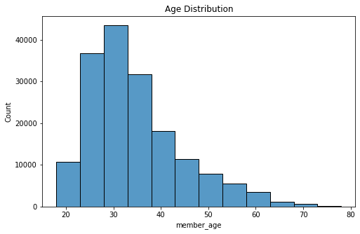
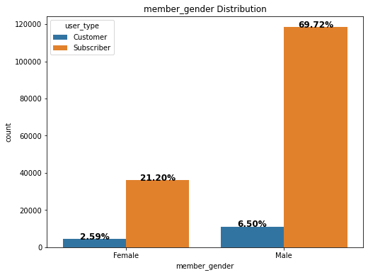
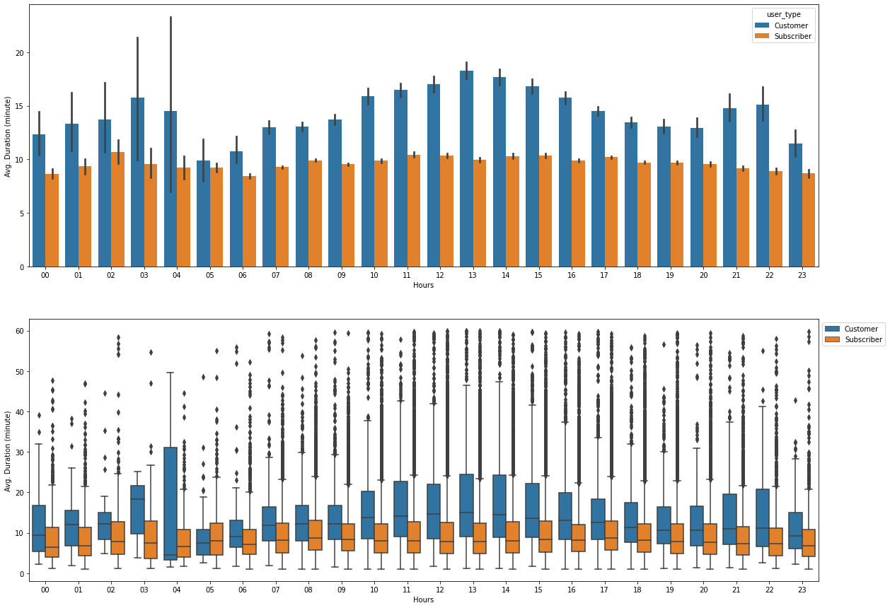
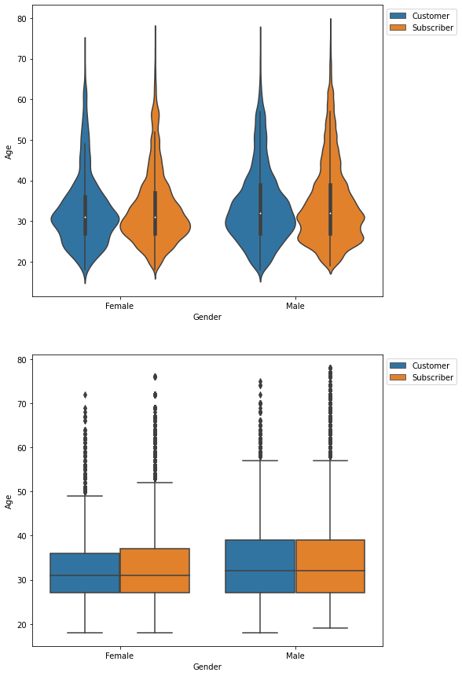

# Ford GoBike System Data Exploration

## Preliminary Wrangling

This data set includes information about individual rides made
in a bike-sharing system covering the greater San Francisco
Bay area.


```python
# import all packages
import pandas as pd
import numpy as np
import matplotlib.pyplot as plt
import seaborn as sb
%matplotlib  inline
```


```python
# loading data
gobike = pd.read_csv('201902-fordgobike-tripdata.csv')

# A quick look at the data
gobike.head()
```


<div>
<style scoped>
    .dataframe tbody tr th:only-of-type {
        vertical-align: middle;
    }

    .dataframe tbody tr th {
        vertical-align: top;
    }

    .dataframe thead th {
        text-align: right;
    }
</style>
<table border="1" class="dataframe">
  <thead>
    <tr style="text-align: right;">
      <th></th>
      <th>duration_sec</th>
      <th>start_time</th>
      <th>end_time</th>
      <th>start_station_id</th>
      <th>start_station_name</th>
      <th>start_station_latitude</th>
      <th>start_station_longitude</th>
      <th>end_station_id</th>
      <th>end_station_name</th>
      <th>end_station_latitude</th>
      <th>end_station_longitude</th>
      <th>bike_id</th>
      <th>user_type</th>
      <th>member_birth_year</th>
      <th>member_gender</th>
      <th>bike_share_for_all_trip</th>
    </tr>
  </thead>
  <tbody>
    <tr>
      <th>0</th>
      <td>52185</td>
      <td>2019-02-28 17:32:10.1450</td>
      <td>2019-03-01 08:01:55.9750</td>
      <td>21.0</td>
      <td>Montgomery St BART Station (Market St at 2nd St)</td>
      <td>37.789625</td>
      <td>-122.400811</td>
      <td>13.0</td>
      <td>Commercial St at Montgomery St</td>
      <td>37.794231</td>
      <td>-122.402923</td>
      <td>4902</td>
      <td>Customer</td>
      <td>1984.0</td>
      <td>Male</td>
      <td>No</td>
    </tr>
    <tr>
      <th>1</th>
      <td>42521</td>
      <td>2019-02-28 18:53:21.7890</td>
      <td>2019-03-01 06:42:03.0560</td>
      <td>23.0</td>
      <td>The Embarcadero at Steuart St</td>
      <td>37.791464</td>
      <td>-122.391034</td>
      <td>81.0</td>
      <td>Berry St at 4th St</td>
      <td>37.775880</td>
      <td>-122.393170</td>
      <td>2535</td>
      <td>Customer</td>
      <td>NaN</td>
      <td>NaN</td>
      <td>No</td>
    </tr>
    <tr>
      <th>2</th>
      <td>61854</td>
      <td>2019-02-28 12:13:13.2180</td>
      <td>2019-03-01 05:24:08.1460</td>
      <td>86.0</td>
      <td>Market St at Dolores St</td>
      <td>37.769305</td>
      <td>-122.426826</td>
      <td>3.0</td>
      <td>Powell St BART Station (Market St at 4th St)</td>
      <td>37.786375</td>
      <td>-122.404904</td>
      <td>5905</td>
      <td>Customer</td>
      <td>1972.0</td>
      <td>Male</td>
      <td>No</td>
    </tr>
    <tr>
      <th>3</th>
      <td>36490</td>
      <td>2019-02-28 17:54:26.0100</td>
      <td>2019-03-01 04:02:36.8420</td>
      <td>375.0</td>
      <td>Grove St at Masonic Ave</td>
      <td>37.774836</td>
      <td>-122.446546</td>
      <td>70.0</td>
      <td>Central Ave at Fell St</td>
      <td>37.773311</td>
      <td>-122.444293</td>
      <td>6638</td>
      <td>Subscriber</td>
      <td>1989.0</td>
      <td>Other</td>
      <td>No</td>
    </tr>
    <tr>
      <th>4</th>
      <td>1585</td>
      <td>2019-02-28 23:54:18.5490</td>
      <td>2019-03-01 00:20:44.0740</td>
      <td>7.0</td>
      <td>Frank H Ogawa Plaza</td>
      <td>37.804562</td>
      <td>-122.271738</td>
      <td>222.0</td>
      <td>10th Ave at E 15th St</td>
      <td>37.792714</td>
      <td>-122.248780</td>
      <td>4898</td>
      <td>Subscriber</td>
      <td>1974.0</td>
      <td>Male</td>
      <td>Yes</td>
    </tr>
  </tbody>
</table>
</div>


```python
# look at the sturcture of the data set
gobike.info()
```

    <class 'pandas.core.frame.DataFrame'>
    RangeIndex: 183412 entries, 0 to 183411
    Data columns (total 16 columns):
     #   Column                   Non-Null Count   Dtype  
    ---  ------                   --------------   -----  
     0   duration_sec             183412 non-null  int64  
     1   start_time               183412 non-null  object 
     2   end_time                 183412 non-null  object 
     3   start_station_id         183215 non-null  float64
     4   start_station_name       183215 non-null  object 
     5   start_station_latitude   183412 non-null  float64
     6   start_station_longitude  183412 non-null  float64
     7   end_station_id           183215 non-null  float64
     8   end_station_name         183215 non-null  object 
     9   end_station_latitude     183412 non-null  float64
     10  end_station_longitude    183412 non-null  float64
     11  bike_id                  183412 non-null  int64  
     12  user_type                183412 non-null  object 
     13  member_birth_year        175147 non-null  float64
     14  member_gender            175147 non-null  object 
     15  bike_share_for_all_trip  183412 non-null  object 
    dtypes: float64(7), int64(2), object(7)
    memory usage: 22.4+ MB
    

- This data set has 16 columns and 183412 rows
- There are missing values
- Wrong data types format


```python
# summary statistics
gobike.describe()
```


<div>
<style scoped>
    .dataframe tbody tr th:only-of-type {
        vertical-align: middle;
    }

    .dataframe tbody tr th {
        vertical-align: top;
    }

    .dataframe thead th {
        text-align: right;
    }
</style>
<table border="1" class="dataframe">
  <thead>
    <tr style="text-align: right;">
      <th></th>
      <th>duration_sec</th>
      <th>start_station_id</th>
      <th>start_station_latitude</th>
      <th>start_station_longitude</th>
      <th>end_station_id</th>
      <th>end_station_latitude</th>
      <th>end_station_longitude</th>
      <th>bike_id</th>
      <th>member_birth_year</th>
    </tr>
  </thead>
  <tbody>
    <tr>
      <th>count</th>
      <td>183412.000000</td>
      <td>183215.000000</td>
      <td>183412.000000</td>
      <td>183412.000000</td>
      <td>183215.000000</td>
      <td>183412.000000</td>
      <td>183412.000000</td>
      <td>183412.000000</td>
      <td>175147.000000</td>
    </tr>
    <tr>
      <th>mean</th>
      <td>726.078435</td>
      <td>138.590427</td>
      <td>37.771223</td>
      <td>-122.352664</td>
      <td>136.249123</td>
      <td>37.771427</td>
      <td>-122.352250</td>
      <td>4472.906375</td>
      <td>1984.806437</td>
    </tr>
    <tr>
      <th>std</th>
      <td>1794.389780</td>
      <td>111.778864</td>
      <td>0.099581</td>
      <td>0.117097</td>
      <td>111.515131</td>
      <td>0.099490</td>
      <td>0.116673</td>
      <td>1664.383394</td>
      <td>10.116689</td>
    </tr>
    <tr>
      <th>min</th>
      <td>61.000000</td>
      <td>3.000000</td>
      <td>37.317298</td>
      <td>-122.453704</td>
      <td>3.000000</td>
      <td>37.317298</td>
      <td>-122.453704</td>
      <td>11.000000</td>
      <td>1878.000000</td>
    </tr>
    <tr>
      <th>25%</th>
      <td>325.000000</td>
      <td>47.000000</td>
      <td>37.770083</td>
      <td>-122.412408</td>
      <td>44.000000</td>
      <td>37.770407</td>
      <td>-122.411726</td>
      <td>3777.000000</td>
      <td>1980.000000</td>
    </tr>
    <tr>
      <th>50%</th>
      <td>514.000000</td>
      <td>104.000000</td>
      <td>37.780760</td>
      <td>-122.398285</td>
      <td>100.000000</td>
      <td>37.781010</td>
      <td>-122.398279</td>
      <td>4958.000000</td>
      <td>1987.000000</td>
    </tr>
    <tr>
      <th>75%</th>
      <td>796.000000</td>
      <td>239.000000</td>
      <td>37.797280</td>
      <td>-122.286533</td>
      <td>235.000000</td>
      <td>37.797320</td>
      <td>-122.288045</td>
      <td>5502.000000</td>
      <td>1992.000000</td>
    </tr>
    <tr>
      <th>max</th>
      <td>85444.000000</td>
      <td>398.000000</td>
      <td>37.880222</td>
      <td>-121.874119</td>
      <td>398.000000</td>
      <td>37.880222</td>
      <td>-121.874119</td>
      <td>6645.000000</td>
      <td>2001.000000</td>
    </tr>
  </tbody>
</table>
</div>


```python
# Check nan values
gobike.isnull().sum()
# Comparing the number of missing values to the number of data points, we can drop the rows that contain missing values.
```


    duration_sec                  0
    start_time                    0
    end_time                      0
    start_station_id            197
    start_station_name          197
    start_station_latitude        0
    start_station_longitude       0
    end_station_id              197
    end_station_name            197
    end_station_latitude          0
    end_station_longitude         0
    bike_id                       0
    user_type                     0
    member_birth_year          8265
    member_gender              8265
    bike_share_for_all_trip       0
    dtype: int64


```python
# Are there any duplicate rows?
gobike.duplicated().sum()
```


    0


### Cleaning Data 


```python
# Drop useless columns
useless_columns = ['start_station_id', 'end_station_id', 'bike_id']
gobike.drop(columns = useless_columns, inplace = True)
# check 
gobike.columns
```


    Index(['duration_sec', 'start_time', 'end_time', 'start_station_name',
           'start_station_latitude', 'start_station_longitude', 'end_station_name',
           'end_station_latitude', 'end_station_longitude', 'user_type',
           'member_birth_year', 'member_gender', 'bike_share_for_all_trip'],
          dtype='object')


```python
# Drop the rows that contain missing values 
gobike.dropna(inplace = True)

# check
gobike.isnull().sum().sum()
```


    0


```python
gobike.member_gender.unique()
```


    array(['Male', 'Other', 'Female'], dtype=object)


```python
# drop columns that has member_gender == 'Other'
gobike = gobike[gobike.member_gender != 'Other']
# check
gobike.member_gender.unique()
```


    array(['Male', 'Female'], dtype=object)


```python
# Calculating members age. This data is from 2019, so I will calculate the age based on that year.
gobike['member_age'] = 2019 - gobike['member_birth_year']
```


```python
plt.boxplot(gobike.member_age);
```


    

    


```python
# Drop columns that have user age greater than 60
gobike = gobike[gobike.member_age < 80]
plt.boxplot(gobike.member_age);
```


    

    


```python
# Correcting data types format

# converting start_time and end_time into DateTime.
gobike.start_time = pd.to_datetime(gobike['start_time'])
gobike.end_time = pd.to_datetime(gobike['end_time'])

# converting user_type and member_gender into category
gobike.user_type = gobike.user_type.astype('category')
gobike.member_gender = gobike.member_gender.astype('category')

# check 
gobike.dtypes
```


    duration_sec                        int64
    start_time                 datetime64[ns]
    end_time                   datetime64[ns]
    start_station_name                 object
    start_station_latitude            float64
    start_station_longitude           float64
    end_station_name                   object
    end_station_latitude              float64
    end_station_longitude             float64
    user_type                        category
    member_birth_year                 float64
    member_gender                    category
    bike_share_for_all_trip            object
    member_age                        float64
    dtype: object


```python
# get start hour, start day, start month columns 
gobike['start_timeofday'] = gobike.start_time.dt.strftime('%H')
gobike['start_dayofweek'] = gobike.start_time.dt.strftime('%A')
gobike['start_month'] = gobike.start_time.dt.strftime('%B')
```


```python
# Converting duration by seconds into duration by minutes.
gobike['duration_minute'] = gobike['duration_sec']/60 
# continuous variable
```


```python
print(gobike.info())
gobike.head()
```

    <class 'pandas.core.frame.DataFrame'>
    Int64Index: 171105 entries, 0 to 183411
    Data columns (total 18 columns):
     #   Column                   Non-Null Count   Dtype         
    ---  ------                   --------------   -----         
     0   duration_sec             171105 non-null  int64         
     1   start_time               171105 non-null  datetime64[ns]
     2   end_time                 171105 non-null  datetime64[ns]
     3   start_station_name       171105 non-null  object        
     4   start_station_latitude   171105 non-null  float64       
     5   start_station_longitude  171105 non-null  float64       
     6   end_station_name         171105 non-null  object        
     7   end_station_latitude     171105 non-null  float64       
     8   end_station_longitude    171105 non-null  float64       
     9   user_type                171105 non-null  category      
     10  member_birth_year        171105 non-null  float64       
     11  member_gender            171105 non-null  category      
     12  bike_share_for_all_trip  171105 non-null  object        
     13  member_age               171105 non-null  float64       
     14  start_timeofday          171105 non-null  object        
     15  start_dayofweek          171105 non-null  object        
     16  start_month              171105 non-null  object        
     17  duration_minute          171105 non-null  float64       
    dtypes: category(2), datetime64[ns](2), float64(7), int64(1), object(6)
    memory usage: 22.5+ MB
    None
    


<div>
<style scoped>
    .dataframe tbody tr th:only-of-type {
        vertical-align: middle;
    }

    .dataframe tbody tr th {
        vertical-align: top;
    }

    .dataframe thead th {
        text-align: right;
    }
</style>
<table border="1" class="dataframe">
  <thead>
    <tr style="text-align: right;">
      <th></th>
      <th>duration_sec</th>
      <th>start_time</th>
      <th>end_time</th>
      <th>start_station_name</th>
      <th>start_station_latitude</th>
      <th>start_station_longitude</th>
      <th>end_station_name</th>
      <th>end_station_latitude</th>
      <th>end_station_longitude</th>
      <th>user_type</th>
      <th>member_birth_year</th>
      <th>member_gender</th>
      <th>bike_share_for_all_trip</th>
      <th>member_age</th>
      <th>start_timeofday</th>
      <th>start_dayofweek</th>
      <th>start_month</th>
      <th>duration_minute</th>
    </tr>
  </thead>
  <tbody>
    <tr>
      <th>0</th>
      <td>52185</td>
      <td>2019-02-28 17:32:10.145</td>
      <td>2019-03-01 08:01:55.975</td>
      <td>Montgomery St BART Station (Market St at 2nd St)</td>
      <td>37.789625</td>
      <td>-122.400811</td>
      <td>Commercial St at Montgomery St</td>
      <td>37.794231</td>
      <td>-122.402923</td>
      <td>Customer</td>
      <td>1984.0</td>
      <td>Male</td>
      <td>No</td>
      <td>35.0</td>
      <td>17</td>
      <td>Thursday</td>
      <td>February</td>
      <td>869.750000</td>
    </tr>
    <tr>
      <th>2</th>
      <td>61854</td>
      <td>2019-02-28 12:13:13.218</td>
      <td>2019-03-01 05:24:08.146</td>
      <td>Market St at Dolores St</td>
      <td>37.769305</td>
      <td>-122.426826</td>
      <td>Powell St BART Station (Market St at 4th St)</td>
      <td>37.786375</td>
      <td>-122.404904</td>
      <td>Customer</td>
      <td>1972.0</td>
      <td>Male</td>
      <td>No</td>
      <td>47.0</td>
      <td>12</td>
      <td>Thursday</td>
      <td>February</td>
      <td>1030.900000</td>
    </tr>
    <tr>
      <th>4</th>
      <td>1585</td>
      <td>2019-02-28 23:54:18.549</td>
      <td>2019-03-01 00:20:44.074</td>
      <td>Frank H Ogawa Plaza</td>
      <td>37.804562</td>
      <td>-122.271738</td>
      <td>10th Ave at E 15th St</td>
      <td>37.792714</td>
      <td>-122.248780</td>
      <td>Subscriber</td>
      <td>1974.0</td>
      <td>Male</td>
      <td>Yes</td>
      <td>45.0</td>
      <td>23</td>
      <td>Thursday</td>
      <td>February</td>
      <td>26.416667</td>
    </tr>
    <tr>
      <th>5</th>
      <td>1793</td>
      <td>2019-02-28 23:49:58.632</td>
      <td>2019-03-01 00:19:51.760</td>
      <td>4th St at Mission Bay Blvd S</td>
      <td>37.770407</td>
      <td>-122.391198</td>
      <td>Broadway at Kearny</td>
      <td>37.798014</td>
      <td>-122.405950</td>
      <td>Subscriber</td>
      <td>1959.0</td>
      <td>Male</td>
      <td>No</td>
      <td>60.0</td>
      <td>23</td>
      <td>Thursday</td>
      <td>February</td>
      <td>29.883333</td>
    </tr>
    <tr>
      <th>6</th>
      <td>1147</td>
      <td>2019-02-28 23:55:35.104</td>
      <td>2019-03-01 00:14:42.588</td>
      <td>Palm St at Willow St</td>
      <td>37.317298</td>
      <td>-121.884995</td>
      <td>San Jose Diridon Station</td>
      <td>37.329732</td>
      <td>-121.901782</td>
      <td>Subscriber</td>
      <td>1983.0</td>
      <td>Female</td>
      <td>No</td>
      <td>36.0</td>
      <td>23</td>
      <td>Thursday</td>
      <td>February</td>
      <td>19.116667</td>
    </tr>
  </tbody>
</table>
</div>


### The structure of your dataset
Now, the data set has 17 columns and 174952. The columns have information about trip duration, member information, time information, and station information.

### What is/are the main feature(s) of interest in your dataset?


I'm most interested in figuring out which features affect the trip duration.

The main feature of interest is duration_minute
- I will try to answer these questions:
    - When are most trips taken in terms of time of day, day of the week, or month of the year?
    - How long does the average trip take?
    - Does the above depend on if a user is a subscriber or customer?

### What features in the dataset do you think will help support your investigation into your feature(s) of interest?

1. start_timeofday
2. start_dayofweek
3. start_month
4. member_gender
5. member_age
6. user_type
7. bike_share_for_all_trip


```python
# Putting the columns that we are interested in in a single DataFrame.
gobike_targeted = gobike[['start_timeofday', 'start_dayofweek', 'start_month'
                          , 'member_gender', 'member_age', 'user_type', 'bike_share_for_all_trip', 'duration_minute']]
gobike_targeted.head(1)
```


<div>
<style scoped>
    .dataframe tbody tr th:only-of-type {
        vertical-align: middle;
    }

    .dataframe tbody tr th {
        vertical-align: top;
    }

    .dataframe thead th {
        text-align: right;
    }
</style>
<table border="1" class="dataframe">
  <thead>
    <tr style="text-align: right;">
      <th></th>
      <th>start_timeofday</th>
      <th>start_dayofweek</th>
      <th>start_month</th>
      <th>member_gender</th>
      <th>member_age</th>
      <th>user_type</th>
      <th>bike_share_for_all_trip</th>
      <th>duration_minute</th>
    </tr>
  </thead>
  <tbody>
    <tr>
      <th>0</th>
      <td>17</td>
      <td>Thursday</td>
      <td>February</td>
      <td>Male</td>
      <td>35.0</td>
      <td>Customer</td>
      <td>No</td>
      <td>869.75</td>
    </tr>
  </tbody>
</table>
</div>


## Univariate Exploration

I'll start by looking at the distribution of the main variable of interest: duration_minute.


```python
# Distribution of duration in minute 
plt.figure(figsize = [8, 5])

sb.histplot(data = gobike_targeted, x = 'duration_minute')

plt.title('Duration Distribution (minute)')
plt.xlim((0, 100))
plt.axvline(x = 30, color = 'r');
```


    

    


- We can see that most trips take less than 30 minutes.


```python
(len(gobike_targeted[gobike_targeted.duration_minute > 60])/len(gobike_targeted)) * 100
```


    0.7667806317758102


- Only 0.77 of the trips are of duration more than an hour. These data points need more investigations.


```python
# function to plot the distribution of categorical variable 
# since the countplot function show the counts of observations in each categorical bin using bars.
def countplot_ratio(x = None, data = None, hue = None, ax = None, order = None, autopct = None, color = None):
    # plot the variable
    ax = sb.countplot(x = x, data = data, hue = hue, ax = ax, color = color, order = order)
    # names of x labels
    ax.set_xticklabels(ax.get_xticklabels())
    # plot title
    ax.set_title(x + " Distribution")
    # total number of data which used to get the proportion
    total = float(len(data))
    # if autopct equal to True, It will show the proportions of the data
    if autopct == True:
        # for loop to iterate on the patches
        for patch in ax.patches:
            # get the height of the patch which represents the number of observations.
            height = patch.get_height()
            # Put text on each patch with the proportion of the observations
            ax.text(patch.get_x()+patch.get_width()/2,height+4,'{:.2f}%'.format((height/total)*100),weight = 'bold',
                fontsize = 12,ha = 'center')
```


```python
# convert start_timeofday, start_dayofweek, and start_month into ordered categorical types
time_units = {'start_timeofday':['00', '01', '02', '03', '04', '05', '06', '07', '08', '09', '10', '11',
        '12', '13', '14', '15', '16', '17', '18', '19', '20', '21', '22', '23']
             ,'start_dayofweek':['Monday', 'Tuesday', 'Wednesday', 'Thursday', 'Friday', 'Saturday', 'Sunday']
             ,'start_month':['January', 'February', 'March', 'April', 'May', 'June',
                     'July', 'August', 'September', 'October', 'November', 'December']}
for unit in time_units:
    ordered_unit = pd.api.types.CategoricalDtype(categories=time_units[unit], ordered=True)
    gobike_targeted[unit] = gobike_targeted[unit].astype(ordered_unit)
```


```python
# start_timeofday distribution
base_color = sb.color_palette()[0]
plt.figure(figsize = [10, 5])
countplot_ratio(x = 'start_timeofday', data = gobike_targeted, color = base_color);
```


    

    


- We can see that most trips are from 8 am - 9 am and 5 pm - 6 pm. I think this is related to the time when people go to work and when they back home.


```python
# start_dayofweek distribution
plt.figure(figsize = [10, 5])
countplot_ratio(x = 'start_dayofweek', data = gobike_targeted, color = base_color);
```


    

    


- The number of trips increases gradually until it reaches the maximum on Thursday, then it decreases until it reaches the minimum on Saturday and Sunday. Saturday and Sunday are the weekends in the United States of America. This supports the fact that the number of trips increases on the workdays and decreases on the weekend. 


```python
plt.figure(figsize = [10, 5])
countplot_ratio(x = 'start_month', data = gobike_targeted, color = base_color);
plt.xticks(rotation = 15);
```


    

    


All trips are in February. This emphasizes that there aren't wrong entries.


```python
countplot_ratio(data = gobike_targeted, x = 'member_gender', autopct = True, color = base_color)
```


    

    


- 76.18 % of users are males
- 23.82 % of users are females


```python
# Distribution of Age
plt.figure(figsize = [8, 5])
bins = np.arange(gobike_targeted.member_age.min(), gobike_targeted.member_age.max() + 5, 5)
sb.histplot(data = gobike_targeted, x = 'member_age', bins = bins)
plt.title('Age Distribution');
```


    

    


- The age distribution is right skewed. 
- Most of the users are 20 to 40 years, and this is the age group that works or studies. This also supports the fact that the number of trips is related to people who work or study. This distribution is consistent with the distribution of weekdays. Both support the fact that the number of trips is related to people who work or study.


```python
countplot_ratio(data = gobike_targeted, x = 'user_type', autopct = True, color = base_color)
```


    

    


- 9.41 % of users are Customers, and 90.59 % of users are subscribers.


```python
countplot_ratio(data = gobike_targeted, x = 'bike_share_for_all_trip', autopct = True, color = base_color)
```


    

    


- 90.27 % of users don't share at all trips whereas, 9.73 % of users share at all trips.

#### Univariate Exploration Conclusions
   - We can see that most trips take less than 30 minutes.
   - Only 0.77 of the trips are of duration more than an hour. These data points need more investigations.
   - We can see that most trips are from 8 am - 9 am and 5 pm - 6 pm. I think this is related to the time when people go to work or school, and when they go back home.
   - The number of trips increases gradually until it reaches the maximum on Thursday, then it decreases until it reaches the minimum on Saturday and Sunday. Saturday and Sunday are the weekends in the United States of America. This supports the fact that the number of trips increases on the workdays and decreases on the weekend.
   - 76.18 % of users are males, and 23.82 % of users are females.
   - Most of the users are 20 to 40 years, and this is the age group that works or studies. This also supports the fact that the number of trips is related to people who work or study. This distribution is consistent with the distribution of weekdays. Both support the fact that the number of trips is related to people who work or study.
   - 9.41 % of users are Customers, and 90.59 % of users are subscribers.
   - 90.26 % of users don't share at all trips whereas, 9.74 % of users share at all trips.

Before going further, I will remove the duration of more than an hour. I will consider them as outliers.
\
Focusing more on ages, I will remove ages more than 80. I don't think there are people of 80 years who can ride a bike.


```python
gobike_targeted = gobike_targeted[gobike_targeted.duration_minute <= 60]
gobike_targeted = gobike_targeted[gobike_targeted.member_age <= 80]
```


```python
gobike_targeted.duration_minute.describe()
```


    count    169793.000000
    mean         10.288154
    std           7.361607
    min           1.016667
    25%           5.350000
    50%           8.450000
    75%          12.966667
    max          59.916667
    Name: duration_minute, dtype: float64


```python
gobike_targeted.member_age.describe()
```


    count    169793.000000
    mean         34.081217
    std           9.863370
    min          18.000000
    25%          27.000000
    50%          32.000000
    75%          39.000000
    max          78.000000
    Name: member_age, dtype: float64


### Bivariate Exploration


```python
plt.figure(figsize = [8, 6])
base_color = sb.color_palette()[0]
sb.barplot(data = gobike_targeted, x = 'start_dayofweek', y = 'duration_minute', color = base_color)
plt.ylabel('Avg. Duration (minute)')
plt.xlabel('Day of Week');
```


    

    


The duration on Saturday and Sunday is greater than the rest of the days. I think people on weekends used bikes for entertainment.


```python
plt.figure(figsize = [20,15 ])
plt.subplot(2, 1, 1)
sb.violinplot(data = gobike_targeted, x  = 'start_timeofday', y = 'duration_minute', inner = None, color = base_color)
plt.subplot(2, 1, 2)
sb.boxplot(data = gobike_targeted, x = 'start_timeofday', y = 'duration_minute', color = base_color);
```


    

    


- The median duration doesn't differ so much between hours.


```python
plt.figure(figsize = [15, 5])
plt.subplot(1, 2, 1)
sb.violinplot(data = gobike_targeted, x = 'member_gender', y = 'duration_minute', inner = None, color = base_color)
plt.title('Distribution of Trip Duration by Gender')
plt.subplot(1, 2, 2)
sb.boxplot(data = gobike_targeted, x = 'member_gender', y = 'duration_minute', color = base_color)
plt.title('Distribution of Trip Duration by Gender');
```


    

    


- The trip duration for females is greater than for males, but the difference is very tiny.


```python
gobike_sample = gobike_targeted.sample(5000, replace = False)
plt.figure(figsize = [8, 6])
sb.scatterplot(data = gobike_sample, x = 'member_age', y = 'duration_minute', alpha = 0.5);
```


    

    


- The relationship between trip duration and members' age is negative. And this makes sense since older members can't ride for a long time.


```python
plt.figure(figsize = [15, 5])
plt.subplot(1, 2, 1)
sb.violinplot(data = gobike_targeted, x = 'user_type', y = 'duration_minute', inner = None, color = base_color)
plt.title('Distribution of Trip Duration by Gender')
plt.subplot(1, 2, 2)
sb.boxplot(data = gobike_targeted, x = 'user_type', y = 'duration_minute', color = base_color)
plt.title('Distribution of Trip Duration by Gender');
```


    

    


- Customers go on trips longer in duration than subscribers. The number of subscribers who go on less than 10-minute trips is greater than the number of customers who do so.


```python
plt.figure(figsize = [15, 5])

plt.subplot(1, 2, 1)
sb.violinplot(data = gobike_targeted, x = 'bike_share_for_all_trip',
              y = 'duration_minute', inner = None, color = base_color)

plt.subplot(1, 2, 2)
sb.boxplot(data = gobike_targeted, x = 'bike_share_for_all_trip', y = 'duration_minute', color=base_color)
```


    

    


People who share in every trip are the majority to go on fewer than 10-minute duration trips whereas, people who don't share in every trip go on long-duration trips, but with a tiny difference.


```python
plt.figure(figsize = [8, 6])
countplot_ratio(data = gobike_targeted, x = 'member_gender', hue = 'user_type', autopct = True)
```


    

    


- 69.72 % of users are subscribers and males.


```python
plt.figure(figsize = [15, 6])
countplot_ratio(data = gobike_targeted, x = 'start_timeofday', hue = 'user_type')
```


    

    


Now, we can see that people who ride bikes at 8 am-9 am or 5 pm-6 pm are subscribers. This is related to the time when people go to work or study. Those people are subscribers.


```python
plt.figure(figsize = [15, 6])
countplot_ratio(data = gobike_targeted, x = 'start_dayofweek', hue = 'user_type')
```


    

    


This graph emphasizes that people who go to work or study are subscribers since, on the weekdays, the number of subscribers is greater than on the weekends.

### Bivariate Conclusions
  - The duration on Saturday and Sunday is greater than the rest of the days. I think people on weekends use bikes for entertainment.
  - The median duration doesn't differ so much between hours.
  - The trip duration for females is greater than for males, but the difference is very tiny.
  - The relationship between trip duration and members' age is negative. And this makes sense since older members can't ride for a long time.
  - Customers go on trips longer in duration than subscribers. The number of subscribers who go on less than 10-minute trips is greater than the number of customers who do so.
  - People who share in every trip are the majority to go on fewer than 10-minute duration trips whereas, people who don't share in every trip go on long-duration trips, but with a tiny difference.
  - 69.72 % of users are subscribers and males.
  - Now, we can see that people who ride bikes at 8 am-9 am or 5 pm-6 pm are subscribers. This is related to the time when people go to work or study. Those people are subscribers.
  - There are more subscribers than customers in the times when people go to work or school or when they leave. Number of customers is consistent along the days of the week. It's clear that customers use bikes for fun or entertainment. Most of subscribers are males since I think number of males who work is greater than females, and I think the clothes of work have a big impact on that.

### Multivariate Explorations


```python
# Distribution of duration over times of the day
plt.figure(figsize = [20, 15])
plt.subplot(2, 1, 1)
sb.barplot(data = gobike_targeted, x = 'start_timeofday', y = 'duration_minute', hue = 'user_type')
plt.ylabel('Avg. Duration (minute)')
plt.xlabel('Hours');

plt.subplot(2, 1, 2)
sb.boxplot(data = gobike_targeted, x = 'start_timeofday', y = 'duration_minute', hue = 'user_type')
plt.ylabel('Avg. Duration (minute)')
plt.legend(bbox_to_anchor=(1, 1), loc='upper left')
plt.xlabel('Hours');
```


    

    


- Customers go on consistently long trips duration than subscribers at all times during the day. Customers' trips are long at midnight, and especially at midday.


```python
# Distribution of duration over days of the week
plt.figure(figsize = [8, 15])
plt.subplot(2, 1, 1)
sb.barplot(data = gobike_targeted, x = 'start_dayofweek', y = 'duration_minute', hue = 'user_type')
plt.ylabel('Avg. Duration (minute)')
plt.xlabel('Day of Week');

plt.subplot(2, 1, 2)
sb.boxplot(data = gobike_targeted, x = 'start_dayofweek', y = 'duration_minute', hue = 'user_type')
plt.ylabel('Duration (minute)')
plt.legend(bbox_to_anchor=(1, 1), loc='upper left')
plt.xlabel('Day of Week');
```


    

    


- The trips duration for subscribers is consistent across all the days of the week whereas, the trip's duration increases for customers on the weekends.


```python
# Distribution of duration vs gender and user type 
plt.figure(figsize = [8, 15])
plt.subplot(2, 1, 1)
sb.violinplot(data = gobike_targeted, x = 'member_gender', y = 'duration_minute', hue = 'user_type')
plt.ylabel('Duration (minute)')
plt.xlabel('Gender');
plt.legend(bbox_to_anchor=(1, 1), loc='upper left')

plt.subplot(2, 1, 2)
sb.boxplot(data = gobike_targeted, x = 'member_gender', y = 'duration_minute', hue = 'user_type')
plt.ylabel('Duration (minute)')
plt.xlabel('Gender');
plt.legend(bbox_to_anchor=(1, 1), loc='upper left');
```


    

    


- Whether females are subscribers or customers, they go on long-duration trips than males.


```python
# Distribution of duration vs gender and bike_share_for_all_trip
plt.figure(figsize = [8, 15])
plt.subplot(2, 1, 1)
sb.violinplot(data = gobike_targeted, x = 'member_gender', y = 'duration_minute', hue = 'bike_share_for_all_trip')
plt.ylabel('Duration (minute)')
plt.xlabel('Gender');
plt.legend(bbox_to_anchor=(1, 1), loc='upper left')

plt.subplot(2, 1, 2)
sb.boxplot(data = gobike_targeted, x = 'member_gender', y = 'duration_minute', hue = 'bike_share_for_all_trip')
plt.ylabel('Duration (minute)')
plt.xlabel('Gender');
plt.legend(bbox_to_anchor=(1, 1), loc='upper left');
```


    

    


- Whether they are males or females, people who don't share in every trip go on long-duration trips. People who share in every trip go on short-duration trips.


```python
# Distribution of age vs. gender user type

plt.figure(figsize = [8, 15])
plt.subplot(2, 1, 1)
sb.violinplot(data = gobike_targeted, x = 'member_gender', y = 'member_age', hue = 'user_type')
plt.ylabel('Age')
plt.xlabel('Gender');
plt.legend(bbox_to_anchor=(1, 1), loc='upper left');

plt.subplot(2, 1, 2)
sb.boxplot(data = gobike_targeted, x = 'member_gender', y = 'member_age', hue = 'user_type')
plt.ylabel('Age')
plt.xlabel('Gender');
plt.legend(bbox_to_anchor=(1, 1), loc='upper left');
```


    

    


- Now, we can see the reason why females go on longer duration trips than males. This is because females are younger than males, and we saw before that the relationship between duration and ages is negative.
- The median ages for females, and males whether they are customers, or subscribers are consistent.


```python
# Distribution of age vs. gender and bike_share_for_all_trip

plt.figure(figsize = [8, 15])
plt.subplot(2, 1, 1)
sb.violinplot(data = gobike_targeted, x = 'member_gender', y = 'member_age', hue = 'bike_share_for_all_trip')
plt.ylabel('Age')
plt.xlabel('Gender');
plt.legend(bbox_to_anchor=(1, 1), loc='upper left');

plt.subplot(2, 1, 2)
sb.boxplot(data = gobike_targeted, x = 'member_gender', y = 'member_age', hue = 'bike_share_for_all_trip')
plt.ylabel('Age')
plt.xlabel('Gender');
plt.legend(bbox_to_anchor=(1, 1), loc='upper left');
```


    

    


- The number of young people who share in every trip is greater than the number of old people.

### Multivariate Conclusions
   - Customers go on consistently long trips duration than subscribers at all times during the day. Customers' trips are long at midnight, and especially at midday.
   - The trips duration for subscribers is consistent across all the days of the week whereas, the trip's duration increases for customers on the weekends.
   - Whether females are subscribers or customers, they go on long-duration trips than males.
   - Whether they are males or females, people who don't share in every trip go on long-duration trips. People who share in every trip go on short-duration trips.
   - Now, we can see the reason why females go on longer duration trips than males. This is because females are younger than males, and we saw before that the relationship between duration and ages is negative.
   - The median ages for females, and males whether they are customers, or subscribers are consistent.
   - The number of young people who share in every trip is greater than the number of old people.

## Conclusions
   - Most trips take less than 30 minutes.
   - Only 0.77 of the trips are of duration more than an hour. These data points need more investigations.
   - We can see that most trips are from 8 am - 9 am and 5 pm - 6 pm. I think this is related to the time when people go to work or school, and when they go back home.
   - The number of trips increases gradually until it reaches the maximum on Thursday, then it decreases until it reaches the minimum on Saturday and Sunday. Saturday and Sunday are the weekends in the United States of America. This supports the fact that the number of trips increases on the workdays and decreases on the weekend.
   - 76.18 % of users are males, and 23.82 % of users are females.
   - Most of the users are 20 to 40 years, and this is the age group that works or studies. This also supports the fact that the number of trips is related to people who work or study. This distribution is consistent with the distribution of weekdays. Both support the fact that the number of trips is related to people who work or study.
   - 9.41 % of users are Customers, and 90.59 % of users are subscribers.
   - 90.26 % of users don't share at all trips whereas, 9.74 % of users share at all trips.
   - The duration on Saturday and Sunday is greater than the rest of the days. I think people on weekends use bikes for entertainment.
   - The median duration doesn't differ so much between hours.
   - The trip duration for females is greater than for males, but the difference is very tiny.
   - The relationship between trip duration and members' age is negative. And this makes sense since older members can't ride for a long time.
   - Customers go on trips longer in duration than subscribers. The number of subscribers who go on less than 10-minute trips is greater than the number of customers who do so.
   - People who share in every trip are the majority to go on fewer than 10-minute duration trips whereas, people who don't share in every trip go on long-duration trips, but with a tiny difference.
   - 69.72 % of users are subscribers and males.
   - Now, we can see that people who ride bikes at 8 am-9 am or 5 pm-6 pm are subscribers. This is related to the time when people go to work or study. Those people are subscribers.
   - There are more subscribers than customers in the times when people go to work or school or when they leave. Number of customers is consistent along the days of the week. It's clear that customers use bikes for fun or entertainment. Most of subscribers are males since I think number of males who work is greater than females, and I think the clothes of work have a big impact on that.
   - Customers go on consistently long trips duration than subscribers at all times during the day. Customers' trips are long at midnight, and especially at midday.
   - The trips duration for subscribers is consistent across all the days of the week whereas, the trip's duration increases for customers on the weekends.
   - Whether females are subscribers or customers, they go on long-duration trips than males.
   - Whether they are males or females, people who don't share in every trip go on long-duration trips. People who share in every trip go on short-duration trips.
   - The reason why females go on longer duration trips than males. This is because females are younger than males, and we saw before that the relationship between duration and ages is negative.
   - The median ages for females, and males whether they are customers, or subscribers are consistent.
   - The number of young people who share in every trip is greater than the number of old people.
