# Project: Medical Appointment No Shows 2016


## Table of Contents
<ul>
<li><a href="#intro">Introduction</a></li>
<li><a href="#wrangling">Data Wrangling</a></li>
<li><a href="#eda">Exploratory Data Analysis</a></li>
<li><a href="#conclusions">Conclusions</a></li>
</ul>

<a id='intro'></a>
## Introduction

> This dataset contains 110527  medical appointments associated with 14 variables (characteristics). The most important one if the patient show-up or no-show at the appointment. I will try to know what is characteristics of the patients that no-show. I will answer some questions like Are the majority of the patients that no-shows female or male?

#### Columns

- PatientId

Identification of a patient
- AppointmentID

Identification of each appointment
- Gender

Male or Female . Female is the greater proportion, woman takes way more care of they health in comparison to man.
- AppointmentDay

The day of the actuall appointment, when they have to visit the doctor.
- ScheduledDay

The day someone called or registered the appointment, this is before appointment of course.
- Age

How old is the patient.
- Neighbourhood

Where the appointment takes place.
- Scholarship

True of False . Observation, this is a broad topic, consider reading this article https://en.wikipedia.org/wiki/Bolsa_Fam%C3%ADlia
- Hipertension

True or False
- Diabetes

True or False
- Alcoholism

True or False
- Handcap

True or False
- SMS_received

1 or more messages sent to the patient.
- No-show

True or False.

### Exploration Questions
- Are the majority of patients female or male? 
- Are the majority of patients have diabetes? 
- Are the majority of patients have alcoholism?
- Do the majority of patients take the scholarship?
- Do the patients that no-shows have Hypertension?
- Are the majority of the patients that no-shows female or male?
- Do the majority of the patients that no-shows took the scholarship or not?
- Do the patients that no-show at the appointment have diabetes?
- Do the patients, that no-show at the appointment have alcoholism?
- Do the patients that no-show at the appointment handicapped?
- Does the appointment place affect whether the patient no-show?
- Does the patients that no-show received SMSs?
- What age group that most likely to no-show at the appointment?
- Does waiting time affect if people no-show appointments or not?


```python
import pandas as pd
import numpy as np
import matplotlib.pyplot as plt
import seaborn as sns
%matplotlib inline

import warnings
warnings.simplefilter(action='ignore', category=Warning)
```


```python
df = pd.read_csv('noshowappointments.csv')
```


```python
df.head()
```


<div>
<style scoped>
    .dataframe tbody tr th:only-of-type {
        vertical-align: middle;
    }

    .dataframe tbody tr th {
        vertical-align: top;
    }

    .dataframe thead th {
        text-align: right;
    }
</style>
<table border="1" class="dataframe">
  <thead>
    <tr style="text-align: right;">
      <th></th>
      <th>PatientId</th>
      <th>AppointmentID</th>
      <th>Gender</th>
      <th>ScheduledDay</th>
      <th>AppointmentDay</th>
      <th>Age</th>
      <th>Neighbourhood</th>
      <th>Scholarship</th>
      <th>Hipertension</th>
      <th>Diabetes</th>
      <th>Alcoholism</th>
      <th>Handcap</th>
      <th>SMS_received</th>
      <th>No-show</th>
    </tr>
  </thead>
  <tbody>
    <tr>
      <th>0</th>
      <td>2.987250e+13</td>
      <td>5642903</td>
      <td>F</td>
      <td>2016-04-29T18:38:08Z</td>
      <td>2016-04-29T00:00:00Z</td>
      <td>62</td>
      <td>JARDIM DA PENHA</td>
      <td>0</td>
      <td>1</td>
      <td>0</td>
      <td>0</td>
      <td>0</td>
      <td>0</td>
      <td>No</td>
    </tr>
    <tr>
      <th>1</th>
      <td>5.589978e+14</td>
      <td>5642503</td>
      <td>M</td>
      <td>2016-04-29T16:08:27Z</td>
      <td>2016-04-29T00:00:00Z</td>
      <td>56</td>
      <td>JARDIM DA PENHA</td>
      <td>0</td>
      <td>0</td>
      <td>0</td>
      <td>0</td>
      <td>0</td>
      <td>0</td>
      <td>No</td>
    </tr>
    <tr>
      <th>2</th>
      <td>4.262962e+12</td>
      <td>5642549</td>
      <td>F</td>
      <td>2016-04-29T16:19:04Z</td>
      <td>2016-04-29T00:00:00Z</td>
      <td>62</td>
      <td>MATA DA PRAIA</td>
      <td>0</td>
      <td>0</td>
      <td>0</td>
      <td>0</td>
      <td>0</td>
      <td>0</td>
      <td>No</td>
    </tr>
    <tr>
      <th>3</th>
      <td>8.679512e+11</td>
      <td>5642828</td>
      <td>F</td>
      <td>2016-04-29T17:29:31Z</td>
      <td>2016-04-29T00:00:00Z</td>
      <td>8</td>
      <td>PONTAL DE CAMBURI</td>
      <td>0</td>
      <td>0</td>
      <td>0</td>
      <td>0</td>
      <td>0</td>
      <td>0</td>
      <td>No</td>
    </tr>
    <tr>
      <th>4</th>
      <td>8.841186e+12</td>
      <td>5642494</td>
      <td>F</td>
      <td>2016-04-29T16:07:23Z</td>
      <td>2016-04-29T00:00:00Z</td>
      <td>56</td>
      <td>JARDIM DA PENHA</td>
      <td>0</td>
      <td>1</td>
      <td>1</td>
      <td>0</td>
      <td>0</td>
      <td>0</td>
      <td>No</td>
    </tr>
  </tbody>
</table>
</div>


<a id='wrangling'></a>
## Data Wrangling

### Assessing Data


```python
# take a look at the data
df.info()
```

    <class 'pandas.core.frame.DataFrame'>
    RangeIndex: 110527 entries, 0 to 110526
    Data columns (total 14 columns):
     #   Column          Non-Null Count   Dtype  
    ---  ------          --------------   -----  
     0   PatientId       110527 non-null  float64
     1   AppointmentID   110527 non-null  int64  
     2   Gender          110527 non-null  object 
     3   ScheduledDay    110527 non-null  object 
     4   AppointmentDay  110527 non-null  object 
     5   Age             110527 non-null  int64  
     6   Neighbourhood   110527 non-null  object 
     7   Scholarship     110527 non-null  int64  
     8   Hipertension    110527 non-null  int64  
     9   Diabetes        110527 non-null  int64  
     10  Alcoholism      110527 non-null  int64  
     11  Handcap         110527 non-null  int64  
     12  SMS_received    110527 non-null  int64  
     13  No-show         110527 non-null  object 
    dtypes: float64(1), int64(8), object(5)
    memory usage: 11.8+ MB
    

- There aren't nan values in this data set.
- This dataset contains 110527  entries.
- There are one variable of type float, 8 variables of type int, and 5 variables of type object.
- 'ScheduledDay' and 'AppointmentDay' columns data types need to be converted into DateTime.


```python
# Check if there are variables that contains wrong data.
```


```python
df.columns
```


    Index(['PatientId', 'AppointmentID', 'Gender', 'ScheduledDay',
           'AppointmentDay', 'Age', 'Neighbourhood', 'Scholarship', 'Hipertension',
           'Diabetes', 'Alcoholism', 'Handcap', 'SMS_received', 'No-show'],
          dtype='object')


```python
df.Handcap.unique()
```


    array([0, 1, 2, 3, 4], dtype=int64)


The 'Handcap' column is binary, so any value outside it is an error on the data.


```python
df.Age.unique()
```


    array([ 62,  56,   8,  76,  23,  39,  21,  19,  30,  29,  22,  28,  54,
            15,  50,  40,  46,   4,  13,  65,  45,  51,  32,  12,  61,  38,
            79,  18,  63,  64,  85,  59,  55,  71,  49,  78,  31,  58,  27,
             6,   2,  11,   7,   0,   3,   1,  69,  68,  60,  67,  36,  10,
            35,  20,  26,  34,  33,  16,  42,   5,  47,  17,  41,  44,  37,
            24,  66,  77,  81,  70,  53,  75,  73,  52,  74,  43,  89,  57,
            14,   9,  48,  83,  72,  25,  80,  87,  88,  84,  82,  90,  94,
            86,  91,  98,  92,  96,  93,  95,  97, 102, 115, 100,  99,  -1],
          dtype=int64)


Hmmm, What do -1 stand for?

After seeing discussion on Kaggle 

Dataset creator says that these types of patients are considered babies not born yet, pregnant women.

### Data Cleaning 
- Dropping useless columns.
- Converting 'ScheduledDay' and 'AppointmentDay' columns data types into DateTime. 
- Drop rows  that contain wrong values in 'Handcap' column.


```python
# making a copy of data
df_cleaning = df.copy()
```


```python
df.columns
```


    Index(['PatientId', 'AppointmentID', 'Gender', 'ScheduledDay',
           'AppointmentDay', 'Age', 'Neighbourhood', 'Scholarship', 'Hipertension',
           'Diabetes', 'Alcoholism', 'Handcap', 'SMS_received', 'No-show'],
          dtype='object')


```python
# dropping useless columns
df_cleaning.drop(columns=['PatientId', 'AppointmentID'], inplace=True)
```


```python
# Check that the columns were dropped
df_cleaning.columns
```


    Index(['Gender', 'ScheduledDay', 'AppointmentDay', 'Age', 'Neighbourhood',
           'Scholarship', 'Hipertension', 'Diabetes', 'Alcoholism', 'Handcap',
           'SMS_received', 'No-show'],
          dtype='object')


```python
# Converting 'ScheduledDay' and 'AppointmentDay' columns data types into DateTime.
df_cleaning.ScheduledDay = pd.to_datetime(df.ScheduledDay)
df_cleaning.AppointmentDay = pd.to_datetime(df.AppointmentDay)
```


```python
# check the data types 
df_cleaning.dtypes
```


    Gender                         object
    ScheduledDay      datetime64[ns, UTC]
    AppointmentDay    datetime64[ns, UTC]
    Age                             int64
    Neighbourhood                  object
    Scholarship                     int64
    Hipertension                    int64
    Diabetes                        int64
    Alcoholism                      int64
    Handcap                         int64
    SMS_received                    int64
    No-show                        object
    dtype: object


```python
# create 'Handcap' column contain only 0 and 1 since it is binary
df_cleaning = df_cleaning.query('Handcap == 0 or Handcap == 1')
```


```python
df_cleaning.Handcap.unique()
```


    array([0, 1], dtype=int64)


```python
# check for duplicated values
df_cleaning.duplicated().sum()
```


    632


```python
df_cleaning.drop_duplicates(inplace=True)
```


```python
df_cleaning.info()
```

    <class 'pandas.core.frame.DataFrame'>
    Int64Index: 109696 entries, 0 to 110526
    Data columns (total 12 columns):
     #   Column          Non-Null Count   Dtype              
    ---  ------          --------------   -----              
     0   Gender          109696 non-null  object             
     1   ScheduledDay    109696 non-null  datetime64[ns, UTC]
     2   AppointmentDay  109696 non-null  datetime64[ns, UTC]
     3   Age             109696 non-null  int64              
     4   Neighbourhood   109696 non-null  object             
     5   Scholarship     109696 non-null  int64              
     6   Hipertension    109696 non-null  int64              
     7   Diabetes        109696 non-null  int64              
     8   Alcoholism      109696 non-null  int64              
     9   Handcap         109696 non-null  int64              
     10  SMS_received    109696 non-null  int64              
     11  No-show         109696 non-null  object             
    dtypes: datetime64[ns, UTC](2), int64(7), object(3)
    memory usage: 10.9+ MB
    

Now, there are 109696 entries, and the data is ready to explore.


```python
df = df_cleaning.copy()
```


```python
# create waiting time column
df['waiting_time'] = (df['AppointmentDay'].dt.date - df['ScheduledDay'].dt.date).dt.days

# check for values less than zero
df[df['waiting_time'] < 0].shape[0]
```


    5


```python
# Drop values that are less than zero.
df = df[df.waiting_time >= 0]
df.shape
```


    (109691, 13)


<a id='eda'></a>
## Exploratory Data Analysis

### 1.Are the majority of patients female or male?


```python
# plot a bar plot
def bar_plot(x, height, title=None, xlabel=None, ylabel=None,width= None, color=None):
    plt.bar(x, height, color=color)
    # title of the plot
    plt.title(title)
    # x-axis title
    plt.xlabel(xlabel)
    # y-axis title
    plt.ylabel(ylabel)
```


```python
# plot a pie chart that represents the proportions of each item in this variable.
def pie_plot(x, labels, autopct, title=None):
    plt.figure(figsize=(8, 8))
    plt.pie(x, labels=labels, autopct=autopct)
    plt.title(title)
    plt.show()
```


```python
# get the number of females and males
count_gender = df.Gender.value_counts()
print(count_gender)
locations = df.Gender.unique()
bar_plot(locations, count_gender, title= 'Number of females and males', xlabel = 'Genders', ylabel = 'Count')
```

    F    71306
    M    38385
    Name: Gender, dtype: int64
    


    
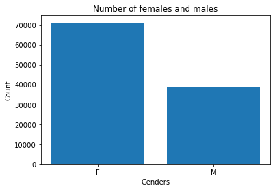
    


- It seems that the majority of patients are females.

### 2.How many patients have diabetes?


```python
# count the number of patients that have diabetes and who don't
count_diabetic = df.Diabetes.value_counts()
print(count_diabetic)
labels = df.Diabetes.value_counts().index
pie_plot(count_diabetic, labels=labels, autopct = '%.2f', title= 'Number of Diabetic Patients')
```

    0    101841
    1      7850
    Name: Diabetes, dtype: int64
    


    

    


- The minority of patients had diabetes since 92.84 % of the patients didn't have diabetes. 

### 3.How many patients have alcoholism?


```python
count_alcoholic = df.Alcoholism.value_counts()
print(count_alcoholic)
labels = df.Alcoholism.value_counts().index
pie_plot(count_alcoholic, labels, '%.2f', title='Number of Patients Had Alcoholism')
```

    0    106353
    1      3338
    Name: Alcoholism, dtype: int64
    


    

    


- The minority of patients had alcoholism since 96.96 % of the patients didn't have alcoholism.

### 4.How many patients take the scholarhsip?


```python
count_num= df.Scholarship.value_counts()
print(count_num)
locations = ['0', '1']
bar_plot(x= locations, height = count_num, title = 'Number of patients took the scholarship')
```

    0    98908
    1    10783
    Name: Scholarship, dtype: int64
    


    
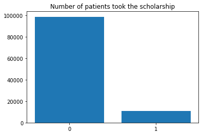
    


- It seems that the majority of patients didn't take the scholarship.

### How many patients have Hypertension?


```python
count_ = df.Hipertension.value_counts()
print(count_)
locations = ['0', '1']
bar_plot(x= locations, height = count_, title= 'Number of Patients Had Hypertension')
```

    0    88100
    1    21591
    Name: Hipertension, dtype: int64
    


    
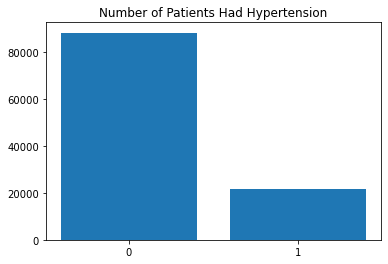
    


- It seems that the majority of patients didn't have hypertension


```python
# function to plot the distribution of categorical variable 
# since the countplot function show the counts of observations in each categorical bin using bars.
def countplot_ratio(x = None, data = None, hue = None, ax = None):
    # plot the variable
    ax = sns.countplot(x, data = data, hue = hue, ax = ax)
    # names of x labels
    ax.set_xticklabels(ax.get_xticklabels())
    # plot title
    ax.set_title(x + " Distribution")
    # total number of data which used to get the proportion
    total = float(len(data))
    # for loop to iterate on the patches
    for patch in ax.patches:
        # get the height of the patch which represents the number of observations.
        height = patch.get_height()
        # Put text on each patch with the proportion of the observations
        ax.text(patch.get_x()+patch.get_width()/2,height+4,'{:.2f}%'.format((height/total)*100),weight = 'bold',
                fontsize = 12,ha = 'center')
```

### How many patients no-show at the appointment, and how many do so?


```python
count_noshow = df['No-show'].value_counts()
print(count_noshow)
countplot_ratio(x = 'No-show', data = df)
```

    No     87639
    Yes    22052
    Name: No-show, dtype: int64
    


    
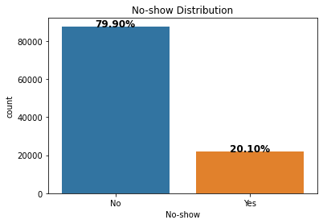
    


- Most patients go on time, representing 79.90% of all patients.


```python
# Let's work on the data associated with the patients that no-show at the appointment.
df_no_show = df.loc[df['No-show'] == 'Yes']
```


```python
df_no_show.head()
```


<div>
<style scoped>
    .dataframe tbody tr th:only-of-type {
        vertical-align: middle;
    }

    .dataframe tbody tr th {
        vertical-align: top;
    }

    .dataframe thead th {
        text-align: right;
    }
</style>
<table border="1" class="dataframe">
  <thead>
    <tr style="text-align: right;">
      <th></th>
      <th>Gender</th>
      <th>ScheduledDay</th>
      <th>AppointmentDay</th>
      <th>Age</th>
      <th>Neighbourhood</th>
      <th>Scholarship</th>
      <th>Hipertension</th>
      <th>Diabetes</th>
      <th>Alcoholism</th>
      <th>Handcap</th>
      <th>SMS_received</th>
      <th>No-show</th>
      <th>waiting_time</th>
    </tr>
  </thead>
  <tbody>
    <tr>
      <th>6</th>
      <td>F</td>
      <td>2016-04-27 15:05:12+00:00</td>
      <td>2016-04-29 00:00:00+00:00</td>
      <td>23</td>
      <td>GOIABEIRAS</td>
      <td>0</td>
      <td>0</td>
      <td>0</td>
      <td>0</td>
      <td>0</td>
      <td>0</td>
      <td>Yes</td>
      <td>2</td>
    </tr>
    <tr>
      <th>7</th>
      <td>F</td>
      <td>2016-04-27 15:39:58+00:00</td>
      <td>2016-04-29 00:00:00+00:00</td>
      <td>39</td>
      <td>GOIABEIRAS</td>
      <td>0</td>
      <td>0</td>
      <td>0</td>
      <td>0</td>
      <td>0</td>
      <td>0</td>
      <td>Yes</td>
      <td>2</td>
    </tr>
    <tr>
      <th>11</th>
      <td>M</td>
      <td>2016-04-26 08:44:12+00:00</td>
      <td>2016-04-29 00:00:00+00:00</td>
      <td>29</td>
      <td>NOVA PALESTINA</td>
      <td>0</td>
      <td>0</td>
      <td>0</td>
      <td>0</td>
      <td>0</td>
      <td>1</td>
      <td>Yes</td>
      <td>3</td>
    </tr>
    <tr>
      <th>17</th>
      <td>F</td>
      <td>2016-04-28 09:28:57+00:00</td>
      <td>2016-04-29 00:00:00+00:00</td>
      <td>40</td>
      <td>CONQUISTA</td>
      <td>1</td>
      <td>0</td>
      <td>0</td>
      <td>0</td>
      <td>0</td>
      <td>0</td>
      <td>Yes</td>
      <td>1</td>
    </tr>
    <tr>
      <th>20</th>
      <td>F</td>
      <td>2016-04-27 07:51:14+00:00</td>
      <td>2016-04-29 00:00:00+00:00</td>
      <td>30</td>
      <td>NOVA PALESTINA</td>
      <td>0</td>
      <td>0</td>
      <td>0</td>
      <td>0</td>
      <td>0</td>
      <td>0</td>
      <td>Yes</td>
      <td>2</td>
    </tr>
  </tbody>
</table>
</div>


```python
# drop 'No-show' column since it's useless now.
df_no_show = df_no_show.drop(columns='No-show')
```


```python
# check that the 'No-show' column is dropped
df_no_show.columns
```


    Index(['Gender', 'ScheduledDay', 'AppointmentDay', 'Age', 'Neighbourhood',
           'Scholarship', 'Hipertension', 'Diabetes', 'Alcoholism', 'Handcap',
           'SMS_received', 'waiting_time'],
          dtype='object')


### Does waiting time affect if people no-show appointments or not?


```python
sns.barplot(data = df, x = 'No-show', y = 'waiting_time')
plt.title('Waiting Time Distribution');
plt.ylabel("Avg. Waiting Time")
df[df['No-show'] == 'Yes']['waiting_time'].mean(), df[df['No-show'] == 'No']['waiting_time'].mean()
```


    (15.814892073281335, 8.73900888873675)


    
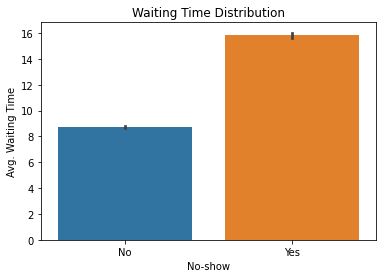
    


- Now, we can see that the average waiting time for people who no-show appointments is bigger than for those who don't do so. This is means that the more the waiting time is, the more people who no-show appointments.

### What gender likely to no-show at the appointment, females or males?


```python
# Gender distribution associated with patients that no-show
countplot_ratio(x= 'Gender', data= df_no_show)
```


    
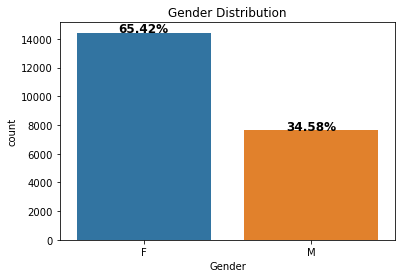
    


- The majority of patients who no-show at the appointment are females where they represent 65.42% of all patients who no-show.


```python
# Gender distribution associated with all patients.
countplot_ratio(x= 'Gender', data= df, hue= 'No-show')
```


    
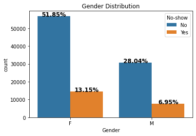
    


- 13.15% of all patients are females and no-show at the appointment.
- 6.95% of all patients are males and no-show at the appointment.

### Do the patients that no-show at the appointment have diabetes?


```python
# Diabetes distribution associated with patients that no-show
countplot_ratio(x = 'Diabetes', data= df_no_show)
```


    
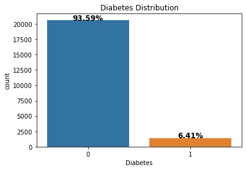
    


- The majority of patients who no-show at the appointment didn't have diabetes, representing 93.59% of all patients who no-show.


```python
# Gender distribution associated with all patients.
countplot_ratio(x = 'Diabetes', data= df, hue= 'No-show')
```


    

    


- 18.81% of all patients didn't have diabetes and no-show at the appointment.
- 1.29% of all patients have diabetes and no-show at the appointment.

### How many patients no-show at the appointment and have alcoholism?


```python
# Alcoholism distribution associated with patients that no-show
countplot_ratio(x= 'Alcoholism', data= df_no_show)
```


    
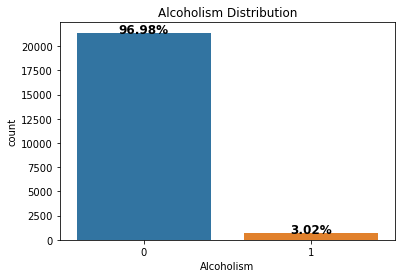
    


- The majority of patients who no-show at the appointment didn't have alcoholism, representing 96.98% of all patients who no-show.


```python
# Alcoholism distribution associated with all patients.
countplot_ratio(x= 'Alcoholism', data= df, hue='No-show')
```


    
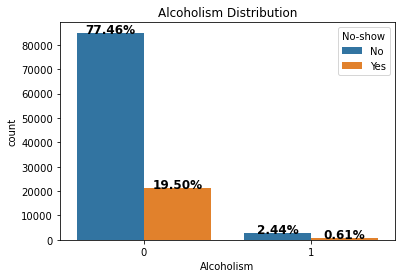
    


- 19.50% of all patients didn't have alcoholism and no-show at the appointment.
- 0.61% of all patients have alcoholism and no-show at the appointment.

### How many patients that no-show and didn't take the scholarship?


```python
# Scholarship distribution associated with patients that no-show
countplot_ratio(x='Scholarship', data=df_no_show)
```


    
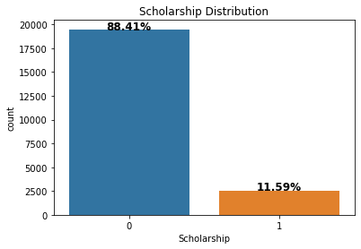
    


- The majority of the patients that didn't no-show at the appointment didn't take the scholarship, representing 88.41% of the patients who no-show.


```python
# Scholarship distribution associated with all patients.
countplot_ratio(x='Scholarship', data=df, hue= 'No-show')
```


    
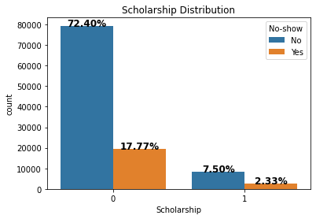
    


- 17.77% of all the patients didn't take the scholarship and didn't no-show at the appointment.
- 2.33% of all the patients took the scholarship, but they didn't no-show at the appointment.

### Do the patients that no-shows have Hypertension?


```python
# Hypertension distribution associated with patients that no-show
countplot_ratio(x='Hipertension', data=df_no_show)
```


    
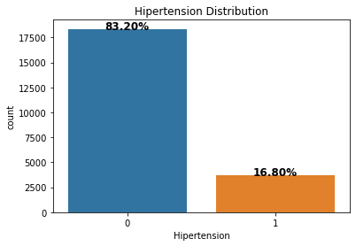
    


- The majority of patients who no-show at the appointment didn't have hypertension, representing 83.20% of all patients who no-show.


```python
# Hypertension distribution associated with all patients.
countplot_ratio(x='Hipertension', data=df, hue= 'No-show')
```


    
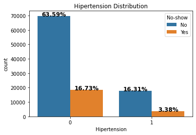
    


- 16.73% of all patients didn't have hypertension and no-show at the appointment.
- 3.38% of all patients have hypertension and no-show at the appointment.

### Do the patients that no-show at the appointment handicapped?


```python
# Handcap distribution associated with patients that no-show
countplot_ratio(x='Handcap', data=df_no_show)
```


    
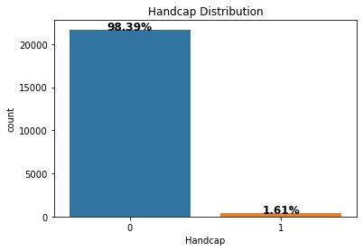
    


- The majority of patients who no-show at the appointment weren't handicapped , representing 98.39% of all patients who no-show.


```python
# Handcap distribution associated with all patients.
countplot_ratio(x='Handcap', data=df, hue= 'No-show')
```


    
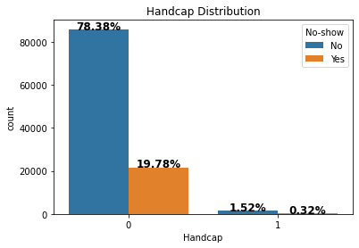
    


- 19.78% of all patients weren't handicapped and no-show at the appointment.
- 0.32% of all patients were handicapped and no-show at the appointment.

### Does the appointment place affect whether the patient no-show or doesn't?


```python
# Neighborhood distribution associated with patients that no-show
neightborhood_count_noshow = df_no_show.Neighbourhood.value_counts()
print(neightborhood_count_noshow)
neightborhood_count_noshow.plot(kind='barh', figsize=(5, 20));
```

    JARDIM CAMBURI                 1429
    MARIA ORTIZ                    1219
    ITARARÉ                         900
    RESISTÊNCIA                     881
    JESUS DE NAZARETH               695
                                   ... 
    PONTAL DE CAMBURI                12
    ILHA DO BOI                       3
    ILHA DO FRADE                     2
    ILHAS OCEÂNICAS DE TRINDADE       2
    AEROPORTO                         1
    Name: Neighbourhood, Length: 80, dtype: int64
    


    
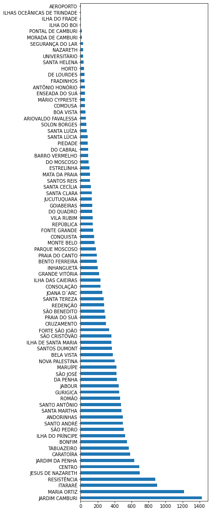
    


for the patients that no-show at the appointment:
- Most of the appointment was in JARDIM CAMBURI neighborhood.


```python
# neighborhood distribution associated with all patients.
neightborhood_count = df.Neighbourhood.value_counts()
print(neightborhood_count)
neightborhood_count.plot(kind='barh', figsize=(5, 20))
```

    JARDIM CAMBURI                 7616
    MARIA ORTIZ                    5804
    RESISTÊNCIA                    4375
    JARDIM DA PENHA                3868
    ITARARÉ                        3463
                                   ... 
    ILHA DO BOI                      35
    ILHA DO FRADE                    10
    AEROPORTO                         8
    ILHAS OCEÂNICAS DE TRINDADE       2
    PARQUE INDUSTRIAL                 1
    Name: Neighbourhood, Length: 81, dtype: int64
    


    <AxesSubplot:>


    
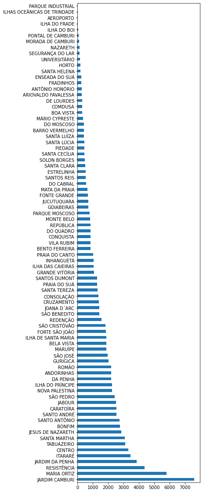
    


for all patients:
- Most of the appointment was in JARDIM CAMBURI neighborhood.

### Does the patients that no-show received SMSs?


```python
# SMS_received distribution associated with patients that no-show
countplot_ratio(x='SMS_received', data=df_no_show)
```


    
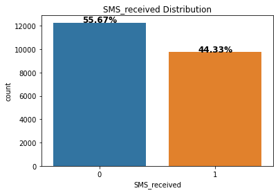
    


- In general, the majority of patients who no-show at the appointment didn't receive SMSs, representing 55.67% of all patients who no-show.


```python
# SMS_received distribution associated with all patients.
countplot_ratio(x='SMS_received', data=df, hue= 'No-show')
```


    
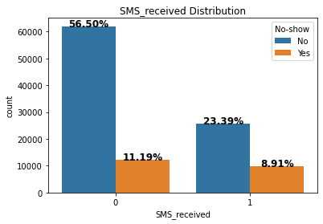
    


- 11.19% of all patients didn't receive SMSs and no-show at the appointment.
- 8.91% of all patients receive SMSs and no-show at the appointment.

### What age group that most likely to no-show at the appointment?


```python
age_levels = df.Age.describe()[3:]
bin_edges = age_levels.tolist()
bin_edges = [int(age) for age in bin_edges]
bin_edges
```


    [-1, 18, 37, 55, 115]


```python
# Labels for the four age groups 
bin_names = ['-1:18', '18:37', '37:55', '55:115']
```


```python
df_no_show['age_groups'] = pd.cut(df_no_show['Age'], bins=bin_edges, labels=bin_names)
```


```python
countplot_ratio(x= 'age_groups', data= df_no_show)
```


    
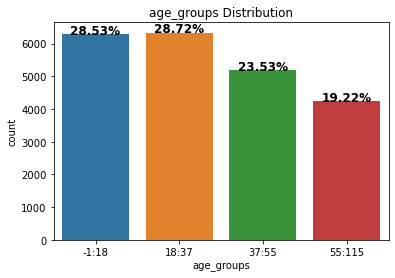
    


- In general, the patients in the age group -1:18 and 18:37 are most likely to no-show at the appointment, representing 28.53% and 28.72% respectively.

<a id='conclusions'></a>
## Conclusions

After digging deep into this dataset, Here are the insights that I got:


1. It seems that the majority of patients are females.
2. The minority of patients had diabetes since 92.84 % of the patients didn't have diabetes. 
3. The minority of patients had alcoholism since 96.96 % of the patients didn't have alcoholism.
4. The majority of patients didn't take the scholarship.
5. The majority of patients didn't have hypertension
6. Most patients go on time, representing 79.90% of all patients.
7. 13.15% of all patients are females and no-show at the appointment 
8. 6.95% of all patients are males and no-show at the appointment.
9. 18.81% of all patients didn't have diabetes and no-show at the appointment.
10. 1.29% of all patients have diabetes and no-show at the appointment.
11. 19.50% of all patients didn't have alcoholism and no-show at the appointment.
12. 0.61% of all patients have alcoholism and no-show at the appointment.
13. 17.77% of all the patients didn't take the scholarship and didn't no-show at the appointment.
14. 2.33% of all the patients took the scholarship, but they didn't no-show at the appointment.
15. 16.73% of all patients didn't have hypertension and no-show at the appointment.
16. 3.38% of all patients have hypertension and no-show at the appointment.
17. 19.78% of all patients weren't handicapped and no-show at the appointment.
18. 0.32% of all patients were handicapped and no-show at the appointment.
19. Most of the appointment was in JARDIM CAMBURI neighborhood.
20. 11.19% of all patients didn't receive SMSs and no-show at the appointment.
21. 8.91% of all patients receive SMSs and no-show at the appointment.
22. The average waiting time for people who no-show appointments is bigger than for those who don't do so. This is means that the more the waiting time is, the more people who no-show appointments.
23. **The characteristics of patients that no-show at the appointment:**
    - The majority of patients who no-show at the appointment are females where they represent 65.42% of all patients who no-show.
    - The majority of patients who no-show at the appointment didn't have diabetes, representing 93.59% of all patients who no-show.
    - The majority of patients who no-show at the appointment didn't have alcoholism, representing 96.98% of all patients who no-show.
    - The majority of the patients that didn't no-show at the appointment didn't take the scholarship, representing 88.41% of the patients who no-show.
    - The majority of patients who no-show at the appointment didn't have hypertension, representing 83.20% of all patients who no-show.
    - The majority of patients who no-show at the appointment weren't handicapped , representing 98.39% of all patients who no-show.
    - Most of the appointment was in JARDIM CAMBURI neighborhood.
    - In general, the majority of patients who no-show at the appointment didn't receive SMSs, representing 55.67% of all patients who no-show.
    - In general, the patients in the age group -1:18 and 18:37 are most likely to no-show at the appointment, representing 28.53% and 28.72% respectively.

**Limitations:**
- I think there are missing features. For instance, If we have a column that indicates whether the patient is employed or not, it will help us get a better conclusion.
- I had some difficulty understand the data. I was confused between the 'AppointmentDay' column and the 'ScheduledDay' column. I do some search to know what they mean. Also, the 'age' column and the 'handicap' column have confusing values.

***Some Charts that demonstrate some of the insights above:***

**Related to all patients:**

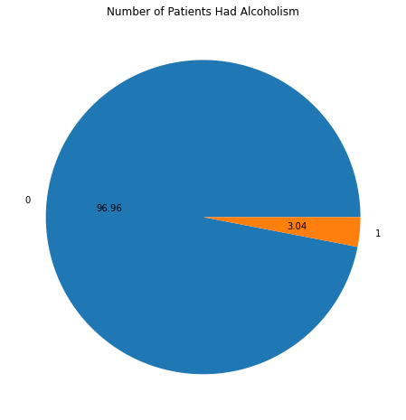
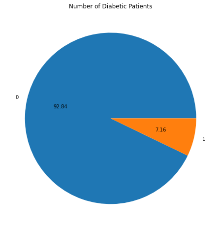


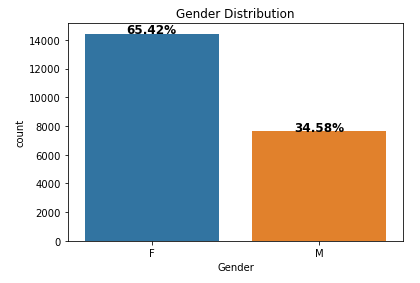
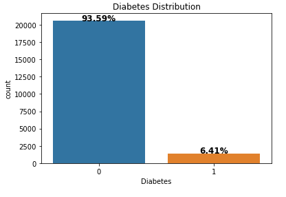

**Related to the patients that no-show at the appointment**


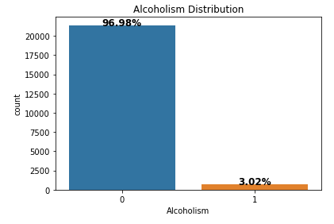
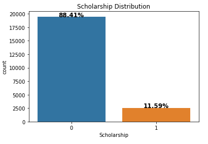
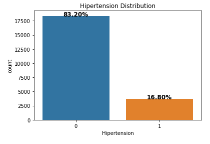
