# Telco Customer Churn Data Exploration

#### Data Source: [Telco Customer Churn](https://www.kaggle.com/blastchar/telco-customer-churn)
## Preliminary Wrangling

> This data contains 7043 rows (customers) and 21 columns (features).


```python
# import all packages and set plots to be embedded inline
import numpy as np
import pandas as pd
import matplotlib.pyplot as plt
import seaborn as sb

%matplotlib inline
# show all columns 
pd.set_option("display.max_columns", None)
```


```python
df = pd.read_csv('WA_Fn-UseC_-Telco-Customer-Churn.csv')
df.head()
```


<div>
<style scoped>
    .dataframe tbody tr th:only-of-type {
        vertical-align: middle;
    }

    .dataframe tbody tr th {
        vertical-align: top;
    }

    .dataframe thead th {
        text-align: right;
    }
</style>
<table border="1" class="dataframe">
  <thead>
    <tr style="text-align: right;">
      <th></th>
      <th>customerID</th>
      <th>gender</th>
      <th>SeniorCitizen</th>
      <th>Partner</th>
      <th>Dependents</th>
      <th>tenure</th>
      <th>PhoneService</th>
      <th>MultipleLines</th>
      <th>InternetService</th>
      <th>OnlineSecurity</th>
      <th>OnlineBackup</th>
      <th>DeviceProtection</th>
      <th>TechSupport</th>
      <th>StreamingTV</th>
      <th>StreamingMovies</th>
      <th>Contract</th>
      <th>PaperlessBilling</th>
      <th>PaymentMethod</th>
      <th>MonthlyCharges</th>
      <th>TotalCharges</th>
      <th>Churn</th>
    </tr>
  </thead>
  <tbody>
    <tr>
      <th>0</th>
      <td>7590-VHVEG</td>
      <td>Female</td>
      <td>0</td>
      <td>Yes</td>
      <td>No</td>
      <td>1</td>
      <td>No</td>
      <td>No phone service</td>
      <td>DSL</td>
      <td>No</td>
      <td>Yes</td>
      <td>No</td>
      <td>No</td>
      <td>No</td>
      <td>No</td>
      <td>Month-to-month</td>
      <td>Yes</td>
      <td>Electronic check</td>
      <td>29.85</td>
      <td>29.85</td>
      <td>No</td>
    </tr>
    <tr>
      <th>1</th>
      <td>5575-GNVDE</td>
      <td>Male</td>
      <td>0</td>
      <td>No</td>
      <td>No</td>
      <td>34</td>
      <td>Yes</td>
      <td>No</td>
      <td>DSL</td>
      <td>Yes</td>
      <td>No</td>
      <td>Yes</td>
      <td>No</td>
      <td>No</td>
      <td>No</td>
      <td>One year</td>
      <td>No</td>
      <td>Mailed check</td>
      <td>56.95</td>
      <td>1889.5</td>
      <td>No</td>
    </tr>
    <tr>
      <th>2</th>
      <td>3668-QPYBK</td>
      <td>Male</td>
      <td>0</td>
      <td>No</td>
      <td>No</td>
      <td>2</td>
      <td>Yes</td>
      <td>No</td>
      <td>DSL</td>
      <td>Yes</td>
      <td>Yes</td>
      <td>No</td>
      <td>No</td>
      <td>No</td>
      <td>No</td>
      <td>Month-to-month</td>
      <td>Yes</td>
      <td>Mailed check</td>
      <td>53.85</td>
      <td>108.15</td>
      <td>Yes</td>
    </tr>
    <tr>
      <th>3</th>
      <td>7795-CFOCW</td>
      <td>Male</td>
      <td>0</td>
      <td>No</td>
      <td>No</td>
      <td>45</td>
      <td>No</td>
      <td>No phone service</td>
      <td>DSL</td>
      <td>Yes</td>
      <td>No</td>
      <td>Yes</td>
      <td>Yes</td>
      <td>No</td>
      <td>No</td>
      <td>One year</td>
      <td>No</td>
      <td>Bank transfer (automatic)</td>
      <td>42.30</td>
      <td>1840.75</td>
      <td>No</td>
    </tr>
    <tr>
      <th>4</th>
      <td>9237-HQITU</td>
      <td>Female</td>
      <td>0</td>
      <td>No</td>
      <td>No</td>
      <td>2</td>
      <td>Yes</td>
      <td>No</td>
      <td>Fiber optic</td>
      <td>No</td>
      <td>No</td>
      <td>No</td>
      <td>No</td>
      <td>No</td>
      <td>No</td>
      <td>Month-to-month</td>
      <td>Yes</td>
      <td>Electronic check</td>
      <td>70.70</td>
      <td>151.65</td>
      <td>Yes</td>
    </tr>
  </tbody>
</table>
</div>


```python
df.info()
```

    <class 'pandas.core.frame.DataFrame'>
    RangeIndex: 7043 entries, 0 to 7042
    Data columns (total 21 columns):
     #   Column            Non-Null Count  Dtype  
    ---  ------            --------------  -----  
     0   customerID        7043 non-null   object 
     1   gender            7043 non-null   object 
     2   SeniorCitizen     7043 non-null   int64  
     3   Partner           7043 non-null   object 
     4   Dependents        7043 non-null   object 
     5   tenure            7043 non-null   int64  
     6   PhoneService      7043 non-null   object 
     7   MultipleLines     7043 non-null   object 
     8   InternetService   7043 non-null   object 
     9   OnlineSecurity    7043 non-null   object 
     10  OnlineBackup      7043 non-null   object 
     11  DeviceProtection  7043 non-null   object 
     12  TechSupport       7043 non-null   object 
     13  StreamingTV       7043 non-null   object 
     14  StreamingMovies   7043 non-null   object 
     15  Contract          7043 non-null   object 
     16  PaperlessBilling  7043 non-null   object 
     17  PaymentMethod     7043 non-null   object 
     18  MonthlyCharges    7043 non-null   float64
     19  TotalCharges      7043 non-null   object 
     20  Churn             7043 non-null   object 
    dtypes: float64(1), int64(2), object(18)
    memory usage: 1.1+ MB
    

- The data type format of the column "TotalCharges" needs to be changed since it must be a float type.

## Cleaning Data

- Change the data type format of the "TotalCharges" column.
- Drop useless column


```python
df.columns
```


    Index(['customerID', 'gender', 'SeniorCitizen', 'Partner', 'Dependents',
           'tenure', 'PhoneService', 'MultipleLines', 'InternetService',
           'OnlineSecurity', 'OnlineBackup', 'DeviceProtection', 'TechSupport',
           'StreamingTV', 'StreamingMovies', 'Contract', 'PaperlessBilling',
           'PaymentMethod', 'MonthlyCharges', 'TotalCharges', 'Churn'],
          dtype='object')


```python
df['TotalCharges'] = pd.to_numeric(df.TotalCharges, errors = 'coerce')
```


```python
# check if there is missing-values
df.isnull().sum()
```


    customerID           0
    gender               0
    SeniorCitizen        0
    Partner              0
    Dependents           0
    tenure               0
    PhoneService         0
    MultipleLines        0
    InternetService      0
    OnlineSecurity       0
    OnlineBackup         0
    DeviceProtection     0
    TechSupport          0
    StreamingTV          0
    StreamingMovies      0
    Contract             0
    PaperlessBilling     0
    PaymentMethod        0
    MonthlyCharges       0
    TotalCharges        11
    Churn                0
    dtype: int64


```python
# drop the missing values
df.dropna(inplace=True)
df.isnull().sum().sum()
```


    0


```python
# drop customerID
df.drop(columns = ['customerID'], inplace=True)
'customerID' in df.columns
```


    False


```python
# check if there are duplicate rows
df.duplicated().sum()
```


    22


```python
# drop duplicate rows
df.drop_duplicates(inplace=True)
df.duplicated().sum()
```


    0


```python
df.info()
```

    <class 'pandas.core.frame.DataFrame'>
    Int64Index: 7010 entries, 0 to 7042
    Data columns (total 20 columns):
     #   Column            Non-Null Count  Dtype  
    ---  ------            --------------  -----  
     0   gender            7010 non-null   object 
     1   SeniorCitizen     7010 non-null   int64  
     2   Partner           7010 non-null   object 
     3   Dependents        7010 non-null   object 
     4   tenure            7010 non-null   int64  
     5   PhoneService      7010 non-null   object 
     6   MultipleLines     7010 non-null   object 
     7   InternetService   7010 non-null   object 
     8   OnlineSecurity    7010 non-null   object 
     9   OnlineBackup      7010 non-null   object 
     10  DeviceProtection  7010 non-null   object 
     11  TechSupport       7010 non-null   object 
     12  StreamingTV       7010 non-null   object 
     13  StreamingMovies   7010 non-null   object 
     14  Contract          7010 non-null   object 
     15  PaperlessBilling  7010 non-null   object 
     16  PaymentMethod     7010 non-null   object 
     17  MonthlyCharges    7010 non-null   float64
     18  TotalCharges      7010 non-null   float64
     19  Churn             7010 non-null   object 
    dtypes: float64(2), int64(2), object(16)
    memory usage: 1.1+ MB
    

### What is the structure of your dataset?

> Now, the data contains 7010 and 20 columns.

The data set includes information about:
- Customers who left within the last month – the column is called Churn
- Services that each customer has signed up for – phone, multiple lines, internet, online security, online backup, device protection, tech support, and streaming TV and movies
- Customer account information – how long they’ve been a customer, contract, payment method, paperless billing, monthly charges, and total charges
- Demographic info about customers – gender, age range, and if they have partners and dependents
### What is/are the main feature(s) of interest in your dataset?

> The main feature of interest is the Churn column

### What features in the dataset do you think will help support your investigation into your feature(s) of interest?

> I will choose only these columns to work with:

1. gender
2. SeniorCitizen
3. Partner
4. Dependents
5. tenure
6. PhoneService
7. InternetService
8. TechSupport
9. Contract
10. PaymentMethod
11. MonthlyCharges
12. TotalCharges


```python
data = df[['gender', 'SeniorCitizen', 'Partner', 'Dependents', 'tenure', 'PhoneService', 'InternetService', 'TechSupport',
           'Contract', 'PaymentMethod', 'MonthlyCharges', 'TotalCharges', 'Churn']]
data.head()
```


<div>
<style scoped>
    .dataframe tbody tr th:only-of-type {
        vertical-align: middle;
    }

    .dataframe tbody tr th {
        vertical-align: top;
    }

    .dataframe thead th {
        text-align: right;
    }
</style>
<table border="1" class="dataframe">
  <thead>
    <tr style="text-align: right;">
      <th></th>
      <th>gender</th>
      <th>SeniorCitizen</th>
      <th>Partner</th>
      <th>Dependents</th>
      <th>tenure</th>
      <th>PhoneService</th>
      <th>InternetService</th>
      <th>TechSupport</th>
      <th>Contract</th>
      <th>PaymentMethod</th>
      <th>MonthlyCharges</th>
      <th>TotalCharges</th>
      <th>Churn</th>
    </tr>
  </thead>
  <tbody>
    <tr>
      <th>0</th>
      <td>Female</td>
      <td>0</td>
      <td>Yes</td>
      <td>No</td>
      <td>1</td>
      <td>No</td>
      <td>DSL</td>
      <td>No</td>
      <td>Month-to-month</td>
      <td>Electronic check</td>
      <td>29.85</td>
      <td>29.85</td>
      <td>No</td>
    </tr>
    <tr>
      <th>1</th>
      <td>Male</td>
      <td>0</td>
      <td>No</td>
      <td>No</td>
      <td>34</td>
      <td>Yes</td>
      <td>DSL</td>
      <td>No</td>
      <td>One year</td>
      <td>Mailed check</td>
      <td>56.95</td>
      <td>1889.50</td>
      <td>No</td>
    </tr>
    <tr>
      <th>2</th>
      <td>Male</td>
      <td>0</td>
      <td>No</td>
      <td>No</td>
      <td>2</td>
      <td>Yes</td>
      <td>DSL</td>
      <td>No</td>
      <td>Month-to-month</td>
      <td>Mailed check</td>
      <td>53.85</td>
      <td>108.15</td>
      <td>Yes</td>
    </tr>
    <tr>
      <th>3</th>
      <td>Male</td>
      <td>0</td>
      <td>No</td>
      <td>No</td>
      <td>45</td>
      <td>No</td>
      <td>DSL</td>
      <td>Yes</td>
      <td>One year</td>
      <td>Bank transfer (automatic)</td>
      <td>42.30</td>
      <td>1840.75</td>
      <td>No</td>
    </tr>
    <tr>
      <th>4</th>
      <td>Female</td>
      <td>0</td>
      <td>No</td>
      <td>No</td>
      <td>2</td>
      <td>Yes</td>
      <td>Fiber optic</td>
      <td>No</td>
      <td>Month-to-month</td>
      <td>Electronic check</td>
      <td>70.70</td>
      <td>151.65</td>
      <td>Yes</td>
    </tr>
  </tbody>
</table>
</div>


## Univariate Exploration

I will start by looking at the distribution of the main variable of interest.


```python
# function to plot the distribution of categorical variable 
# since the countplot function show the counts of observations in each categorical bin using bars.
def countplot_ratio(x = None, data = None, hue = None, ax = None, order = None, autopct = None, color = None):
    plt.figure(figsize=(10, 6))
    # plot the variable
    ax = sb.countplot(x = x, data = data, hue = hue, ax = ax, color = color, order = order)
    # names of x labels
    ax.set_xticklabels(ax.get_xticklabels())
    # plot title
    ax.set_title(x + " Distribution")
    # total number of data which used to get the proportion
    total = float(len(data))
    # if autopct equal to True, It will show the proportions of the data
    if autopct == True:
        # for loop to iterate on the patches
        for patch in ax.patches:
            # get the height of the patch which represents the number of observations.
            height = patch.get_height()
            # Put text on each patch with the proportion of the observations
            ax.text(patch.get_x()+patch.get_width()/2,height+4,'{:.2f}%'.format((height/total)*100),weight = 'bold',
                fontsize = 12,ha = 'center')
```


```python
base_color = sb.color_palette()[0]
```


```python
data.head()
```


<div>
<style scoped>
    .dataframe tbody tr th:only-of-type {
        vertical-align: middle;
    }

    .dataframe tbody tr th {
        vertical-align: top;
    }

    .dataframe thead th {
        text-align: right;
    }
</style>
<table border="1" class="dataframe">
  <thead>
    <tr style="text-align: right;">
      <th></th>
      <th>gender</th>
      <th>SeniorCitizen</th>
      <th>Partner</th>
      <th>Dependents</th>
      <th>tenure</th>
      <th>PhoneService</th>
      <th>InternetService</th>
      <th>TechSupport</th>
      <th>Contract</th>
      <th>PaymentMethod</th>
      <th>MonthlyCharges</th>
      <th>TotalCharges</th>
      <th>Churn</th>
    </tr>
  </thead>
  <tbody>
    <tr>
      <th>0</th>
      <td>Female</td>
      <td>0</td>
      <td>Yes</td>
      <td>No</td>
      <td>1</td>
      <td>No</td>
      <td>DSL</td>
      <td>No</td>
      <td>Month-to-month</td>
      <td>Electronic check</td>
      <td>29.85</td>
      <td>29.85</td>
      <td>No</td>
    </tr>
    <tr>
      <th>1</th>
      <td>Male</td>
      <td>0</td>
      <td>No</td>
      <td>No</td>
      <td>34</td>
      <td>Yes</td>
      <td>DSL</td>
      <td>No</td>
      <td>One year</td>
      <td>Mailed check</td>
      <td>56.95</td>
      <td>1889.50</td>
      <td>No</td>
    </tr>
    <tr>
      <th>2</th>
      <td>Male</td>
      <td>0</td>
      <td>No</td>
      <td>No</td>
      <td>2</td>
      <td>Yes</td>
      <td>DSL</td>
      <td>No</td>
      <td>Month-to-month</td>
      <td>Mailed check</td>
      <td>53.85</td>
      <td>108.15</td>
      <td>Yes</td>
    </tr>
    <tr>
      <th>3</th>
      <td>Male</td>
      <td>0</td>
      <td>No</td>
      <td>No</td>
      <td>45</td>
      <td>No</td>
      <td>DSL</td>
      <td>Yes</td>
      <td>One year</td>
      <td>Bank transfer (automatic)</td>
      <td>42.30</td>
      <td>1840.75</td>
      <td>No</td>
    </tr>
    <tr>
      <th>4</th>
      <td>Female</td>
      <td>0</td>
      <td>No</td>
      <td>No</td>
      <td>2</td>
      <td>Yes</td>
      <td>Fiber optic</td>
      <td>No</td>
      <td>Month-to-month</td>
      <td>Electronic check</td>
      <td>70.70</td>
      <td>151.65</td>
      <td>Yes</td>
    </tr>
  </tbody>
</table>
</div>


```python
countplot_ratio(x = 'Churn', data=data, autopct=True, color = base_color)
```


    
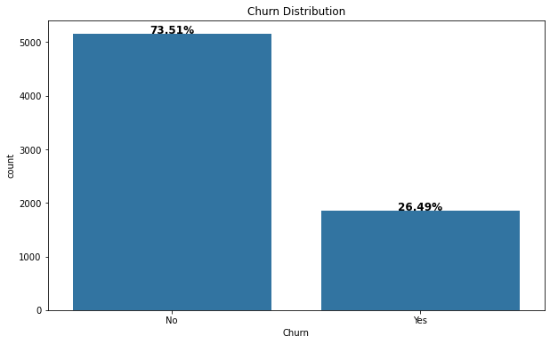
    


Data is imbalanced since customers who didn't leave in the last month represent 73.51%.


```python
countplot_ratio(x = 'gender', data=data, autopct=True, color = base_color)
```


    
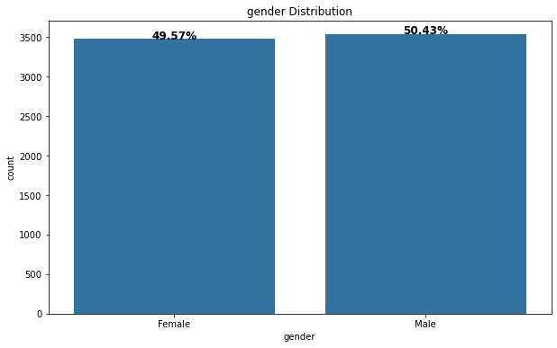
    


There is not a large difference between the number of males and females since the number of males represents 50.43% and the number of females represents 49.57%.


```python
countplot_ratio(x = 'SeniorCitizen', data=data, autopct=True, color = base_color)
```


    
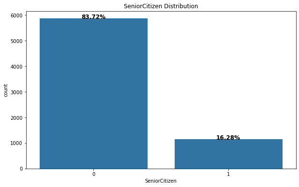
    


Most of the customers are not senior citizens since senior citizen customers only represent 83.72%.


```python
countplot_ratio(x = 'Partner', data=data, autopct=True, color = base_color)
```


    
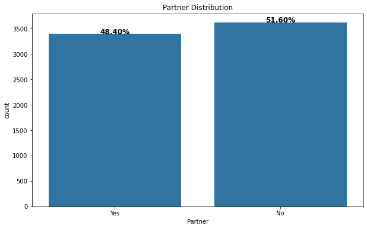
    


There is not a large difference between the number of customers who have a partner and those who are not. Since the number of customers that have a partner represents 48.40%, and those who are not; represent 51.60%


```python
countplot_ratio(x = 'Dependents', data=data, autopct=True, color = base_color)
```


    
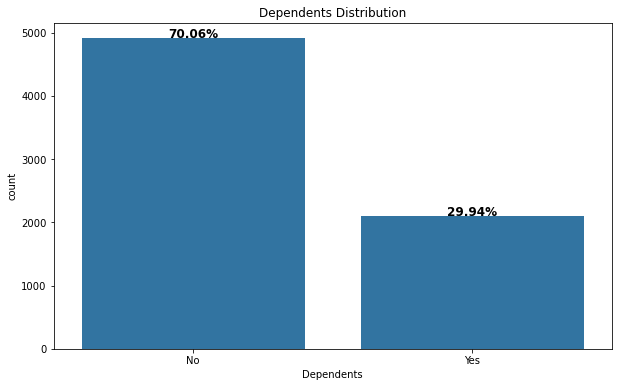
    


Most of the customers don't have dependents since they represent 70.06% of the customers.


```python
bins = np.arange(0, data.tenure.max() + 1, 1)
sb.displot(data=data, x='tenure', height=5.5, aspect=1.5, bins=bins)
plt.title('Tenure Distribution', fontdict={'fontsize': 14});
```


    
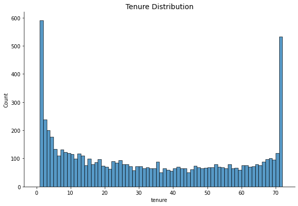
    


There is a large number of customers that only stayed with the company for one month. And there is a large number of customers that stayed with the company for 72 months.


```python
countplot_ratio(x = 'PhoneService', data=data, autopct=True, color = base_color)
```


    
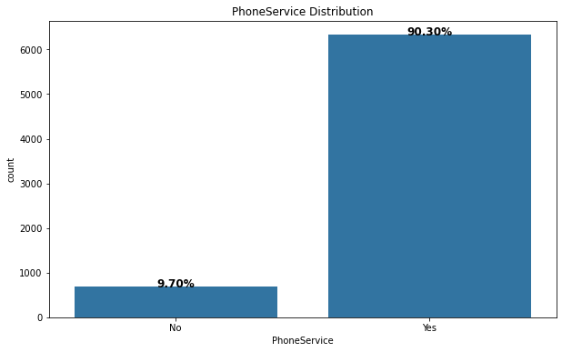
    


Most of the customers have a phone service since they represent 90.30% of the customers.


```python
countplot_ratio(x = 'InternetService', data=data, autopct=True, color = base_color)
```


    
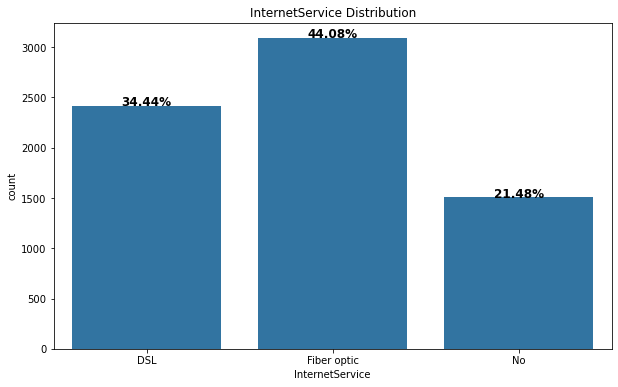
    


- 34.44% of the customers have an internet service provider of type DSL.
- 44.08% of the customers have an internet service provider of type fiber optic.
- 21.48% of the customers don't have an internet service provider.


```python
countplot_ratio(x = 'TechSupport', data=data, autopct=True, color = base_color)
```


    
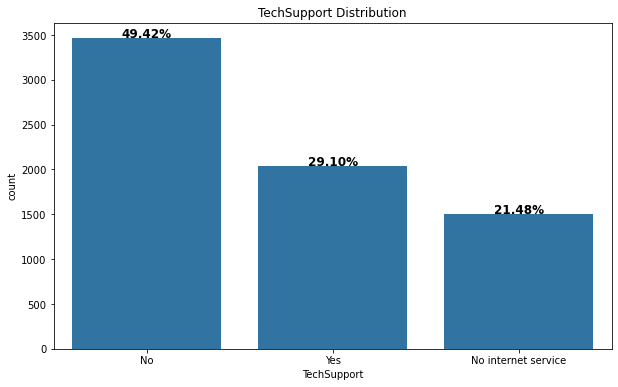
    


- Half of the customers don't have tech support since they represent 49.42% of the customers.
- 29.10% of the customers have tech support. 
- 21.48% of the customers don't have internet service.


```python
countplot_ratio(x = 'Contract', data=data, autopct=True, color = base_color)
```


    
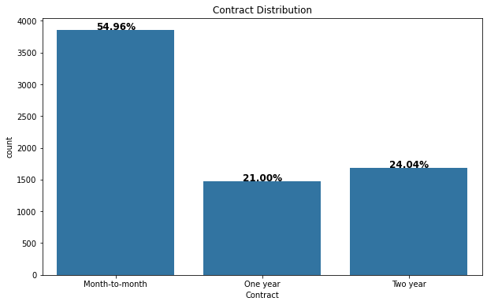
    


- Most of the customers have a month-to-month contract term since they represent 54.96% of the customers.
- 21% of the customers have a one-year contract term.
- 24.04% of the customers have a two-year contract term.


```python
countplot_ratio(x = 'PaymentMethod', data=data, autopct=True, color = base_color)
```


    
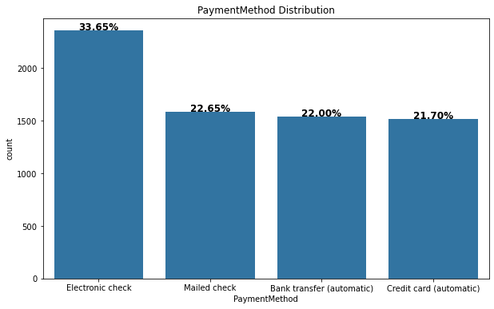
    


- 33.65% of customers use electronic checks as their payment method.
- 22.65% of the customers use mailed checks.
- 22% of the customers use bank transfers.
- 21.70% of the customers use credit cards.


```python
bins = np.arange(0, data.MonthlyCharges.max() + 1, 1)
sb.displot(data=data, x='MonthlyCharges', bins=bins, height=5.5, aspect=1.5)
plt.title('MonthlyCharges Distribution', fontdict={'fontsize': 14});
```


    
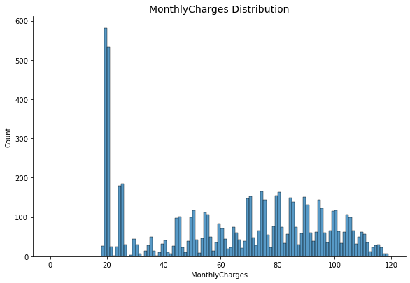
    


- The distribution of the MonthlyCharges column is right-skewed.
- There is a large number of customers that the amount charged to them monthly is less than 30.


```python
bins = np.arange(0, data.TotalCharges.max() + 1, 50)
sb.displot(data=data, x='TotalCharges', bins=bins, height=5.5, aspect=1.5)
plt.title('TotalCharges Distribution', fontdict={'fontsize': 14});
```


    
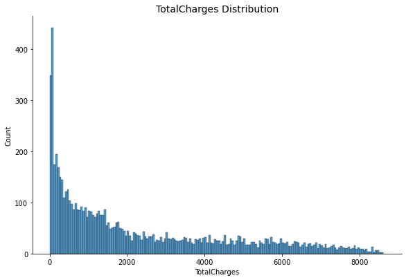
    


- The distribution of the TotalCharges column is right-skewed.
- Most of the customers have a total amount charged less than 2000.


```python
df['Churn'] = pd.to_numeric(df.Churn.str.replace('No', '0').replace('Yes', '1'), errors='coerce')
df.isnull().sum().sum()
```


    0


```python
plt.figure(figsize=(10, 7))
sb.heatmap(df.corr(), annot=True);
```


    
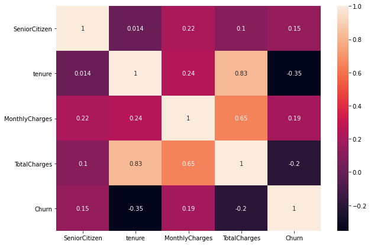
    


- There is no correlation between Churn and these columns.
- There is a high positive correlation between TotalCharges and tenure.
- There is a moderate correlation between TotalCharges and MonthlyCharges.

##### Univariate Exploration Conclusions
- Data is imbalanced since customers who didn't leave in the last month represent 73.51%.
- There is not a large difference between the number of males and females since the number of males represents 50.43% and the number of females represents 49.57%.
- Most of the customers are not senior citizens since senior citizen customers only represent 83.72%.
- There is not a large difference between the number of customers who have a partner and those who are not. Since the number of customers that have a partner represents 48.40%, and those who are not; represent 51.60%.
- Most of the customers have dependents since they represent 70.06% of the customers.
- There is a large number of customers that only stayed with the company for one month.
- Most of the customers have a phone service since they represent 90.30% of the customers.
- 34.44% of the customers have an internet service provider of type DSL.
- 44.08% of the customers have an internet service provider of type fiber optic.
- 21.48% of the customers don't have an internet service provider.
- Most of the customers don't have tech support since they represent 49.42% of the customers.
- 29.10% of the customers have tech support. 
- 21.48% of the customers don't have internet service.
- Most of the customers have a month-to-month contract term since they represent 54.96% of the customers.
- 21% of the customers have a one-year contract term.
- 24.04% of the customers have a two-year contract term.
- 33.65% of customers use electronic checks as their payment method.
- 22.65% of the customers use mailed checks.
- 22% of the customers use bank transfers.
- 21.70% of the customers use credit cards.
- The distribution of the MonthlyCharges column is right-skewed.
- There is a large number of customers that the amount charged to them monthly is less than 30.
- The distribution of the TotalCharges column is right-skewed.
- Most of the customers have a total amount charged less than 2000.

### Discuss the distribution(s) of your variable(s) of interest. Were there any unusual points? Did you need to perform any transformations?
- The "Churn" column is imbalanced since customers who don't leave; represent 73.51% of the customers. 

### Of the features you investigated, were there any unusual distributions? Did you perform any operations on the data to tidy, adjust, or change the form of the data? If so, why did you do this?

- Most of the customers are not senior citizens since senior citizen customers only represent 16.28%.
- Most of the customers don't have dependents since they represent 70.06% of the customers.
- The two insights above prove that most of the customers are young.
- Most of the customers have a phone service since they represent 90.30% of the customers.
- Most of the customers don't have tech support since they represent 49.42% of the customers.
- Most of the customers have a month-to-month contract term since they represent 54.96% of the customers.
##### Cleaning Data
- I changed the column "TotalCharges" data type since it must be a float type.
- I removed missing values that appeared after I changed the TotalCharges column datatype.
- I removed duplicates of rows that appeared after I removed the customerID column.

## Bivariate Exploration


```python
countplot_ratio(x = 'gender', data = data, hue = 'Churn', autopct=True)
data.query('Churn == "Yes"')['gender'].value_counts()
```


    Female    934
    Male      923
    Name: gender, dtype: int64


    
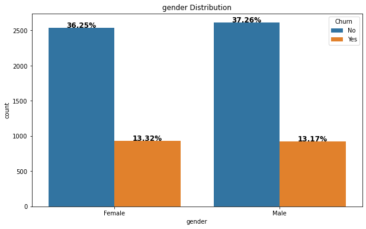
    


The proportions of males and females who leave the company are approximately the same. And it's the same for those who don't leave. This didn't give us any useful information that could help us know what affects the Churn.


```python
countplot_ratio(x = 'SeniorCitizen', data = data, hue = 'Churn', autopct=True)
data.query('Churn == "Yes"')['SeniorCitizen'].value_counts()
```


    0    1382
    1     475
    Name: SeniorCitizen, dtype: int64


    
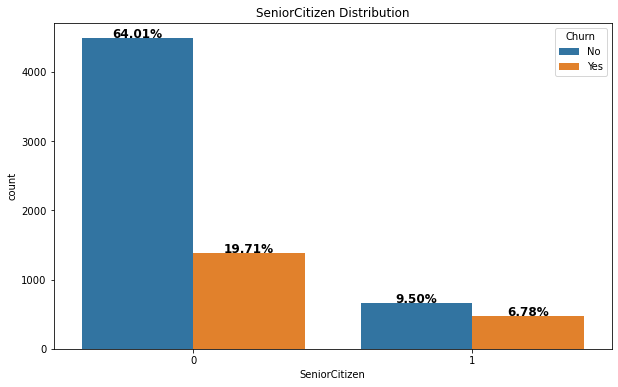
    


- 64.01 % of customers are young and don't leave the company.
- 19.71 % of customers are young and leave the company.
- 9.50 % of customers are senior citizens and don't leave the company.
- 6.78% of customers are senior citizens and leave the company.
- More than half of the customers are young and don't leave the company.
- We can't say most of the customers who don't leave the company are young. This is because the data is imbalanced since the number of young customers is greater than senior citizens. If the number of young customers and senior citizens is the same, It will be a fair comparison.


```python
countplot_ratio(x = 'Partner', data = data, hue = 'Churn', autopct=True)
```


    
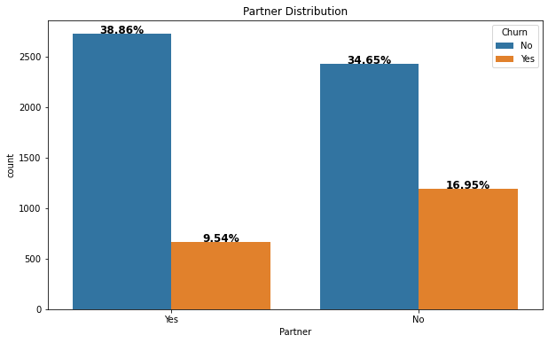
    


- 38.86% of customers have partner and don't leave the company.
- 9.54% of customers  have partner and leave the company.
- 34.65% of customers don't have partner and don't leave the company.
- 16.95% of customers don't have partner and leave the company.


```python
countplot_ratio(x = 'Dependents', data = data, hue = 'Churn', autopct=True)
```


    
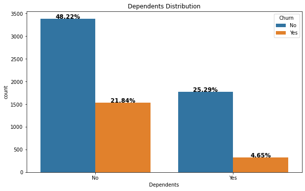
    


- 48.22% of customers don't have dependents and don't leave the company.
- 21.84% of customers don't have dependents and leave the company.
- 25.29% of customers have dependents and don't leave the company.
- 4.65% of customers have dependents and leave the company.
- About half of the customers don't have dependents and don't leave the company. And this is because most of the customers are young, and young people usually don't have dependents.


```python
plt.figure(figsize = [15, 5])
plt.subplot(1, 2, 1)
sb.violinplot(data = data, x = 'Churn', y = 'tenure', inner = None, color = base_color)
plt.title('Distribution of tenure by Churn')
plt.subplot(1, 2, 2)
sb.boxplot(data = data, x = 'Churn', y = 'tenure', color = base_color)
plt.title('Distribution of tenure by Churn');

data.query('Churn == "No"')['tenure'].median(), data.query('Churn == "Yes"')['tenure'].median()
```


    (38.0, 10.0)


    
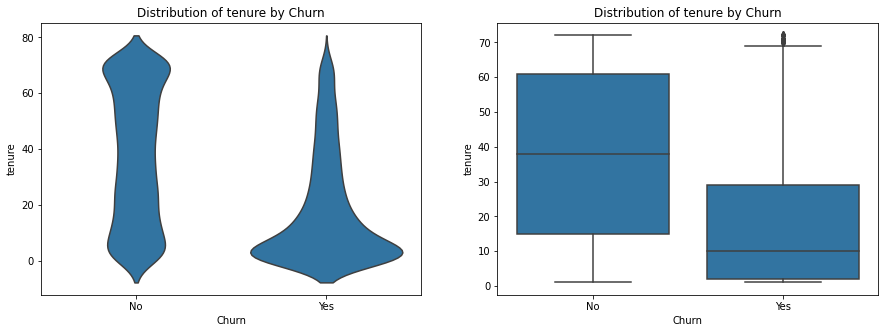
    


- Most of the customers who leave the company don't stay more than 20 months with the company.
- The customers who don't leave the company stay with the company for 38 months in the median.


```python
countplot_ratio(x = 'PhoneService', data = data, hue = 'Churn', autopct=True)
```


    
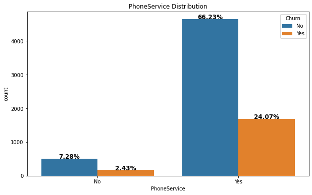
    


- 7.28% of customers don't have phone service and don't leave the company.
- 2.43% of customers don't have phone service and leave the company.
- 66.23% of customers have phone service and don't leave the company.
- 24.07% of customers have phone service and leave the company.
- More than half of the customers have phone service and don't leave the company.


```python
countplot_ratio(x = 'InternetService', data = data, hue = 'Churn', autopct=True)
data.query('Churn == "Yes"')['InternetService'].value_counts()
```


    Fiber optic    1291
    DSL             457
    No              109
    Name: InternetService, dtype: int64


    
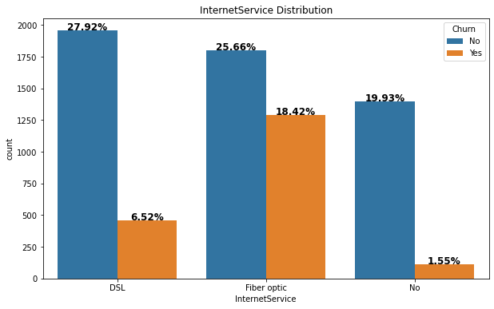
    


- 27.92% of the customers have an internet service provider of type DSL and don't leave the company.
- 6.52% of the customers have an internet service provider of type DSL and leave the company.
- 25.66% of the customers have an internet service provider of type fiber optic and don't leave the company.
- 18.42% of the customers have an internet service provider of type fiber optic and leave the company.
- 19.93% of the customers don't have an internet service and don't leave the company.
- 1.55% of the customers don't have an internet service and leave the company.
- Most of the customers that leave the company have internet service providers of type fiber optic.


```python
countplot_ratio(x = 'TechSupport', data = data, hue = 'Churn', autopct=True)
```


    
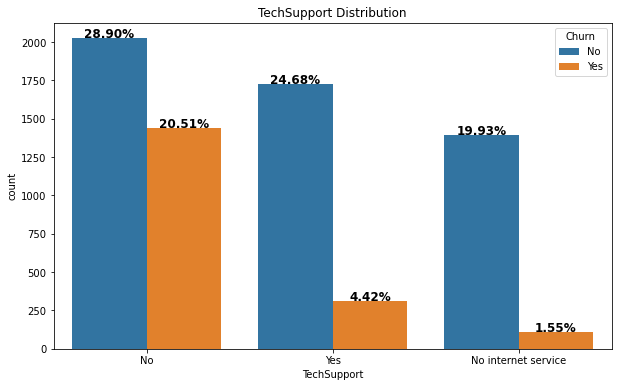
    


- 28.90% of the customers don't have tech support and don't leave the company.
- 20.51% of the customers don't have tech support and leave the company.
- 24.68% of the customers have tech support and don't leave the company. 
- 4.42% of the customers have tech support and leave the company. 
- Most of the customers that leave the company don't have tech support.


```python
countplot_ratio(x = 'Contract', data = data, hue = 'Churn', autopct=True)
```


    
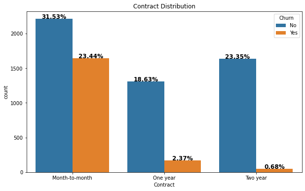
    


- 31.53% of the customers have a month-to-month contract term and don't leave the company.
- 23.44% of the customers have a month-to-month contract term and leave the company.

- 18.63% of the customers have a one-year contract term and don't leave the company.
- 2.37% of the customers have a one-year contract term and leave the company.

- 23.35% of the customers have a two-year contract term and don't leave the company.
- 0.68% of the customers have a two-year contract term and leave the company.

- Most customers that leave the company have a month-to-month contract term.


```python
countplot_ratio(x = 'PaymentMethod', data = data, hue = 'Churn', autopct=True)
```


    
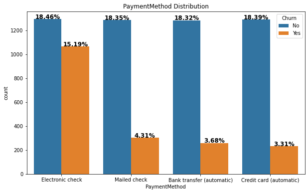
    


- 18.46% of customers use electronic checks as their payment method and don't leave the company.
- 15.19% of customers use electronic checks as their payment method and leave the company.

- 18.35% of the customers use mailed checks and don't leave the company.
- 4.31% of the customers use mailed checks and leave the company.

- 18.32% of the customers use bank transfers and don't leave the company.
- 3.68% of the customers use bank transfers and leave the company.

- 18.39% of the customers use credit cards and don't leave the company.
- 3.31% of the customers use credit cards and leave the company.

- Most customers that leave the company use electronic checks.


```python
plt.figure(figsize = [15, 5])
plt.subplot(1, 2, 1)
sb.violinplot(data = data, x = 'Churn', y = 'MonthlyCharges', inner = None, color = base_color)
plt.title('Distribution of MonthlyCharges by Churn')
plt.subplot(1, 2, 2)
sb.boxplot(data = data, x = 'Churn', y = 'MonthlyCharges', color = base_color)
plt.title('Distribution of MonthlyCharges by Churn');

data.query('Churn == "No"')['MonthlyCharges'].median(), data.query('Churn == "Yes"')['MonthlyCharges'].median()
```


    (64.55, 79.7)


    
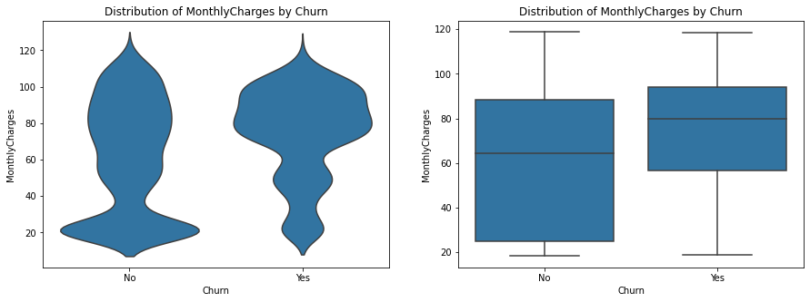
    


- The median amount charged monthly to the customers who leave the company is 79.7.
- The median amount charged monthly to the customers who don't leave the company is 64.55.
- For most customers who don't leave the company, the amount charged to them monthly is less than or equal to 20.
- For most customers who leave the company, the amount charged to them monthly is approximately between 80 and 100.


```python
plt.figure(figsize = [15, 5])
plt.subplot(1, 2, 1)
sb.violinplot(data = data, x = 'Churn', y = 'TotalCharges', inner = None, color = base_color)
plt.title('Distribution of TotalCharges by Churn')
plt.subplot(1, 2, 2)
sb.boxplot(data = data, x = 'Churn', y = 'TotalCharges', color = base_color)
plt.title('Distribution of TotalCharges by Churn');

data.query('Churn == "No"')['TotalCharges'].median(), data.query('Churn == "Yes"')['TotalCharges'].median()
```


    (1688.9, 713.1)


    
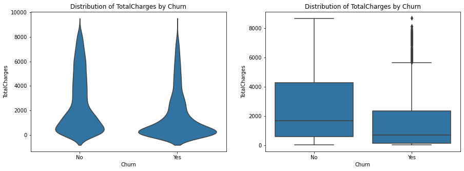
    


- The median total amount charged to the customers who leave the company is 713.1.
- The median total amount charged to the customers who don't leave the company is 1688.9.
- For most customers who don't leave the company, the total amount charged to them is approximately between 19 and 2000.
- For most customers who don't leave the company, the total amount charged to them is approximately between 20 and 800.

##### Bivariate Exploration Conclusions
- The proportions of males and females who leave the company are approximately the same. And it's the same for those who don't leave. This didn't give us any useful information that could help us know what affects the Churn.
- 64.01 % of customers are young and don't leave the company.
- 19.71 % of customers are young and leave the company.
- 9.50 % of customers are senior citizens and don't leave the company.
- 6.78% of customers are senior citizens and leave the company.
- More than half of the customers are young and don't leave the company.
- We can't say most of the customers who leave the company are young. This is because the data is imbalanced since the number of young customers is greater than senior citizens. If the number of young customers and senior citizens is the same, It will be a fair comparison.
- 38.86% of customers have partner and don't leave the company.
- 9.54% of customers  have partner and leave the company.
- 34.65% of customers don't have partner and don't leave the company.
- 16.95% of customers don't have partner and leave the company.
- 48.22% of customers don't have dependents and don't leave the company.
- 21.84% of customers don't have dependents and leave the company.
- 25.29% of customers have dependents and don't leave the company.
- 4.65% of customers have dependents and leave the company.
- About half of the customers don't have dependents and don't leave the company. And this is because most of the customers are young, and young people usually don't have dependents.
- Most of the customers who leave the company don't stay more than 20 months with the company.
- The customers who don't leave the company stay with the company for 38 months in the median.
- 7.28% of customers don't have phone service and don't leave the company.
- 2.43% of customers don't have phone service and leave the company.
- 66.23% of customers have phone service and don't leave the company.
- 24.07% of customers have phone service and leave the company.
- More than half of the customers have phone service and don't leave the company.
- 27.92% of the customers have an internet service provider of type DSL and don't leave the company.
- 6.52% of the customers have an internet service provider of type DSL and leave the company.
- 25.66% of the customers have an internet service provider of type fiber optic and don't leave the company.
- 18.42% of the customers have an internet service provider of type fiber optic and leave the company.
- 19.93% of the customers don't have an internet service and don't leave the company.
- 1.55% of the customers don't have an internet service and leave the company.
- Most of the customers that leave the company have internet service providers of type fiber optic.
- 28.90% of the customers don't have tech support and don't leave the company.
- 20.51% of the customers don't have tech support and leave the company.
- 24.68% of the customers have tech support and don't leave the company. 
- 4.42% of the customers have tech support and leave the company. 
- Most of the customers that leave the company don't have tech support.
- 31.53% of the customers have a month-to-month contract term and don't leave the company.
- 23.44% of the customers have a month-to-month contract term and leave the company.

- 18.63% of the customers have a one-year contract term and don't leave the company.
- 2.37% of the customers have a one-year contract term and leave the company.

- 23.35% of the customers have a two-year contract term and don't leave the company.
- 0.68% of the customers have a two-year contract term and leave the company.

- Most customers that leave the company have a month-to-month contract term.
- 18.46% of customers use electronic checks as their payment method and don't leave the company.
- 15.19% of customers use electronic checks as their payment method and leave the company.

- 18.35% of the customers use mailed checks and don't leave the company.
- 4.31% of the customers use mailed checks and leave the company.

- 18.32% of the customers use bank transfers and don't leave the company.
- 3.68% of the customers use bank transfers and leave the company.

- 18.39% of the customers use credit cards and don't leave the company.
- 3.31% of the customers use credit cards and leave the company.

- Most customers that leave the company use electronic checks.
- The median amount charged monthly to the customers who leave the company is 79.7.
- The median amount charged monthly to the customers who don't leave the company is 64.55.
- For most customers who don't leave the company, the amount charged to them monthly is less than or equal to 20.
- For most customers who leave the company, the amount charged to them monthly is approximately between 80 and 100.
- The median total amount charged to the customers who leave the company is 713.1.
- The median total amount charged to the customers who don't leave the company is 1688.9.
- For most customers who don't leave the company, the total amount charged to them is approximately between 19 and 2000.
- For most customers who don't leave the company, the total amount charged to them is approximately between 20 and 800.

### Talk about some of the relationships you observed in this part of the investigation. How did the feature(s) of interest vary with other features in the dataset?

- The proportions of males and females who leave the company are approximately the same. And it's the same for those who don't leave. This didn't give us any useful information that could help us know what affects the Churn.
- More than half of the customers are young and don't leave the company.
- More than half of the customers have phone service and don't leave the company.
- Most of the customers that leave the company have internet service providers of type fiber optic.
- Most of the customers that leave the company don't have tech support.
- Most customers that leave the company have a month-to-month contract term.
- Most customers that leave the company use electronic checks.
### Did you observe any interesting relationships between the other features (not the main feature(s) of interest)?

- About half of the customers don't have dependents and don't leave the company. And this is because most of the customers are young, and young people usually don't have dependents.

## Multivariate Exploration


```python
# Distribution of tenure vs SeniorCitizen and Churn
plt.figure(figsize = [18, 6])
plt.subplot(1, 2, 1)
sb.violinplot(data = data, x = 'SeniorCitizen', y = 'tenure', hue = 'Churn')
plt.ylabel('tenure', fontdict={'fontsize': 14})
plt.xlabel('SeniorCitizen', fontdict={'fontsize': 14})
plt.legend( loc='center')
plt.title('Distribution of tenure vs SeniorCitizen and Churn', fontdict={'fontsize': 18})

plt.subplot(1, 2, 2)
sb.boxplot(data = data, x = 'SeniorCitizen', y = 'tenure', hue = 'Churn')
plt.ylabel('tenure', fontdict={'fontsize': 14})
plt.xlabel('SeniorCitizen', fontdict={'fontsize': 14})
plt.legend(bbox_to_anchor=(1, 1), loc='best')
plt.title('Distribution of tenure vs SeniorCitizen and Churn', fontdict={'fontsize': 18});
```


    
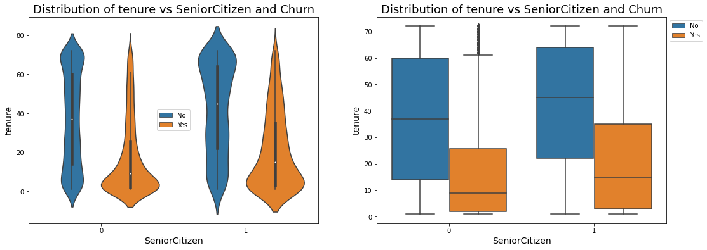
    


- Most young customers who leave the company don't stay more than 20 months with the company. It's the same for senior citizen customers.
- Regardless of was the customer is a young or senior citizen, the customers who stayed a few months are more likely to leave the company. And the customers who stayed for more than 35 months are more likely to stay with the company.


```python
# Distribution of tenure vs Partner and Churn
plt.figure(figsize = [18, 6])
plt.subplot(1, 2, 1)
sb.violinplot(data = data, x = 'Partner', y = 'tenure', hue = 'Churn')
plt.ylabel('tenure', fontdict={'fontsize': 14})
plt.xlabel('Partner', fontdict={'fontsize': 14})
plt.legend( loc='center')
plt.title('Distribution of tenure vs Partner and Churn', fontdict={'fontsize': 18})

plt.subplot(1, 2, 2)
sb.boxplot(data = data, x = 'Partner', y = 'tenure', hue = 'Churn')
plt.ylabel('tenure', fontdict={'fontsize': 14})
plt.xlabel('Partner', fontdict={'fontsize': 14})
plt.legend(bbox_to_anchor=(1, 1), loc='best')
plt.title('Distribution of tenure vs Partner and Churn', fontdict={'fontsize': 18});
```


    
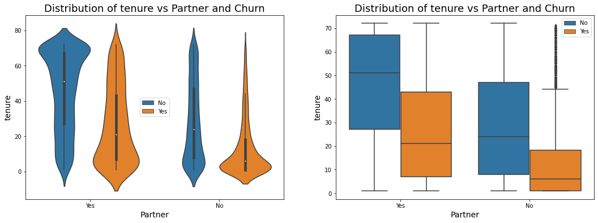
    


- Customers who had a partner are most likely to stay if they stayed with the company for more than 60 months, and they are more likely to leave if they stayed with the company for less than 20 months.


```python
# Distribution of tenure vs Dependents and Churn
plt.figure(figsize = [18, 6])
plt.subplot(1, 2, 1)
sb.violinplot(data = data, x = 'Dependents', y = 'tenure', hue = 'Churn')
plt.ylabel('tenure', fontdict={'fontsize': 14})
plt.xlabel('Dependents', fontdict={'fontsize': 14})
plt.legend( loc='center')
plt.title('Distribution of tenure vs Dependents and Churn', fontdict={'fontsize': 18})

plt.subplot(1, 2, 2)
sb.boxplot(data = data, x = 'Dependents', y = 'tenure', hue = 'Churn')
plt.ylabel('tenure', fontdict={'fontsize': 14})
plt.xlabel('Dependents', fontdict={'fontsize': 14})
plt.legend(bbox_to_anchor=(1, 1), loc='best')
plt.title('Distribution of tenure vs Dependents and Churn', fontdict={'fontsize': 18});
```


    
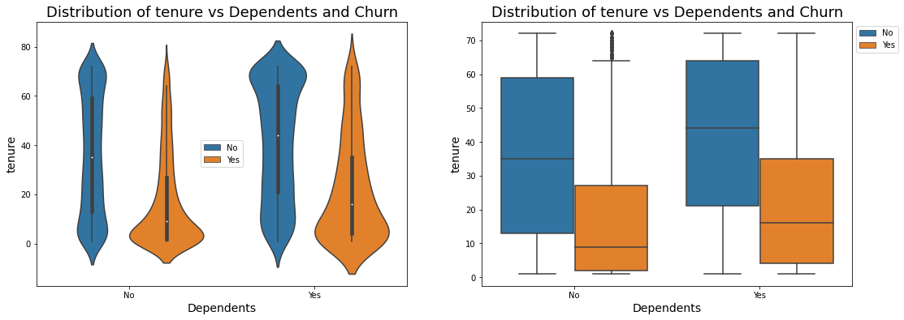
    


- Customers who didn't have dependents are most likely to leave if they stayed with the company for less than 20 months. This distribution is very similar to the distribution of senior citizens by tenure and churn. This is because young customers didn't have dependents, and senior citizens had dependents. 


```python
# Distribution of tenure vs InternetService and Churn
plt.figure(figsize=(10, 8))
sb.barplot(data = data, x = 'InternetService', y = 'tenure', hue = 'Churn')
plt.ylabel('Avg. tenure', fontdict={'fontsize': 14})
plt.xlabel('InternetService', fontdict={'fontsize': 14})
plt.title('Distribution of tenure vs InternetService and Churn', fontdict={'fontsize': 18});
```


    
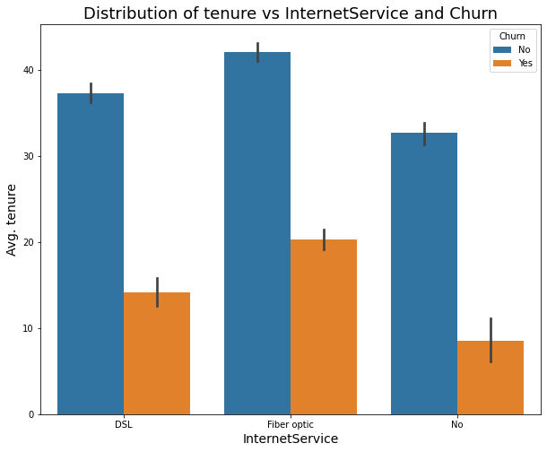
    


- The customers who stayed for about 45 months on average with the company and had an internet service provider of type fiber optic are more likely to stay with the company.
- The customers who stayed for about 20 months on average with the company and had an internet service provider of type fiber optic are more likely to leave the company.

- The customers who stayed for about 15 months on average with the company and had an internet service provider of type DSL are more likely to leave the company.


```python
# Distribution of tenure vs TechSupport and Churn
plt.figure(figsize=(10, 8))
sb.barplot(data = data, x = 'TechSupport', y = 'tenure', hue = 'Churn')
plt.ylabel('Avg. tenure', fontdict={'fontsize': 14})
plt.xlabel('TechSupport', fontdict={'fontsize': 14})
plt.title('Distribution of tenure vs TechSupport and Churn', fontdict={'fontsize': 18});
```


    
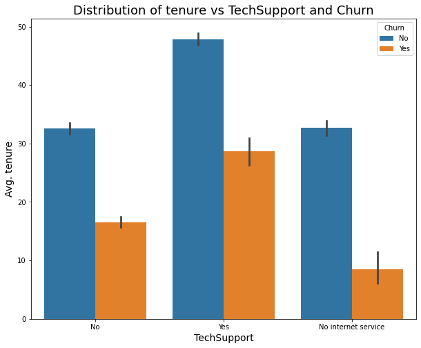
    


- This distribution is quite similar to the one above.
- The customers who stayed for more than 40 months on average with the company and had tech support are more likely to stay with the company.
- The customers who stayed for less than 18 months on average with the company and didn't have tech support are more likely to leave the company.

##### Bivariate Exploration Conclusions
- Most young customers who leave the company don't stay more than 20 months with the company. It's the same for senior citizen customers.
- Regardless of was the customer is a young or senior citizen, the customers who stayed a few months are more likely to leave the company. And the customers who stayed for more than 35 months are more likely to stay with the company.
- Customers who had a partner are most likely to stay if they stayed with the company for more than 60 months, and they are more likely to leave if they stayed with the company for less than 20 months.
- Customers who didn't have dependents are most likely to leave if they stayed with the company for less than 20 months. This distribution is very similar to the distribution of senior citizens by tenure and churn. This is because young customers didn't have dependents, and senior citizens had dependents.
- The customers who stayed for about 45 months on average with the company and had an internet service provider of type fiber optic are more likely to stay with the company.
- The customers who stayed for about 20 months on average with the company and had an internet service provider of type fiber optic are more likely to leave the company.

- The customers who stayed for about 15 months on average with the company and had an internet service provider of type DSL are more likely to leave the company.
- The customers who stayed for more than 40 months on average with the company and had tech support are more likely to stay with the company.
- The customers who stayed for less than 18 months on average with the company and didn't have tech support are more likely to leave the company.

### Talk about some of the relationships you observed in this part of the investigation. Were there features that strengthened each other in terms of looking at your feature(s) of interest?

- Most young customers who leave the company don't stay more than 20 months with the company. It's the same for senior citizen customers.
- Customers who had a partner are most likely to stay if they stayed with the company for more than 60 months, and they are more likely to leave if they stayed with the company for less than 20 months.
- Customers who didn't have dependents are most likely to leave if they stayed with the company for less than 20 months. This distribution is very similar to the distribution of senior citizens by tenure and churn. This is because young customers didn't have dependents, and senior citizens had dependents.

### Were there any interesting or surprising interactions between features?

- There are interactions between dependents feature and senior citizen feature. The young are usually don't have dependents, unlike senior citizens.

## Conclusions

- Data is imbalanced since customers who didn't leave in the last month represent 73.51%.
- There is not a large difference between the number of males and females since the number of males represents 50.43% and the number of females represents 49.57%.
- Most of the customers are not senior citizens since senior citizen customers only represent 83.72%.
- There is not a large difference between the number of customers who have a partner and those who are not. Since the number of customers that have a partner represents 48.40%, and those who are not; represent 51.60%.
- Most of the customers have dependents since they represent 70.06% of the customers.
- There is a large number of customers that only stayed with the company for one month.
- Most of the customers have a phone service since they represent 90.30% of the customers.
- 34.44% of the customers have an internet service provider of type DSL.
- 44.08% of the customers have an internet service provider of type fiber optic.
- 21.48% of the customers don't have an internet service provider.
- Most of the customers don't have tech support since they represent 49.42% of the customers.
- 29.10% of the customers have tech support. 
- 21.48% of the customers don't have internet service.
- Most of the customers have a month-to-month contract term since they represent 54.96% of the customers.
- 21% of the customers have a one-year contract term.
- 24.04% of the customers have a two-year contract term.
- 33.65% of customers use electronic checks as their payment method.
- 22.65% of the customers use mailed checks.
- 22% of the customers use bank transfers.
- 21.70% of the customers use credit cards.
- The distribution of the MonthlyCharges column is right-skewed.
- There is a large number of customers that the amount charged to them monthly is less than 30.
- The distribution of the TotalCharges column is right-skewed.
- Most of the customers have a total amount charged less than 2000.

- The proportions of males and females who leave the company are approximately the same. And it's the same for those who don't leave. This didn't give us any useful information that could help us know what affects the Churn.
- 64.01 % of customers are young and don't leave the company.
- 19.71 % of customers are young and leave the company.
- 9.50 % of customers are senior citizens and don't leave the company.
- 6.78% of customers are senior citizens and leave the company.
- More than half of the customers are young and don't leave the company.
- We can't say most of the customers who leave the company are young. This is because the data is imbalanced since the number of young customers is greater than senior citizens. If the number of young customers and senior citizens is the same, It will be a fair comparison.
- 38.86% of customers have partner and don't leave the company.
- 9.54% of customers  have partner and leave the company.
- 34.65% of customers don't have partner and don't leave the company.
- 16.95% of customers don't have partner and leave the company.
- 48.22% of customers don't have dependents and don't leave the company.
- 21.84% of customers don't have dependents and leave the company.
- 25.29% of customers have dependents and don't leave the company.
- 4.65% of customers have dependents and leave the company.
- About half of the customers don't have dependents and don't leave the company. And this is because most of the customers are young, and young people usually don't have dependents.
- Most of the customers who leave the company don't stay more than 20 months with the company.
- The customers who don't leave the company stay with the company for 38 months in the median.
- 7.28% of customers don't have phone service and don't leave the company.
- 2.43% of customers don't have phone service and leave the company.
- 66.23% of customers have phone service and don't leave the company.
- 24.07% of customers have phone service and leave the company.
- More than half of the customers have phone service and don't leave the company.
- 27.92% of the customers have an internet service provider of type DSL and don't leave the company.
- 6.52% of the customers have an internet service provider of type DSL and leave the company.
- 25.66% of the customers have an internet service provider of type fiber optic and don't leave the company.
- 18.42% of the customers have an internet service provider of type fiber optic and leave the company.
- 19.93% of the customers don't have an internet service and don't leave the company.
- 1.55% of the customers don't have an internet service and leave the company.
- Most of the customers that leave the company have internet service providers of type fiber optic.
- 28.90% of the customers don't have tech support and don't leave the company.
- 20.51% of the customers don't have tech support and leave the company.
- 24.68% of the customers have tech support and don't leave the company. 
- 4.42% of the customers have tech support and leave the company. 
- Most of the customers that leave the company don't have tech support.
- 31.53% of the customers have a month-to-month contract term and don't leave the company.
- 23.44% of the customers have a month-to-month contract term and leave the company.

- 18.63% of the customers have a one-year contract term and don't leave the company.
- 2.37% of the customers have a one-year contract term and leave the company.

- 23.35% of the customers have a two-year contract term and don't leave the company.
- 0.68% of the customers have a two-year contract term and leave the company.

- Most customers that leave the company have a month-to-month contract term.
- 18.46% of customers use electronic checks as their payment method and don't leave the company.
- 15.19% of customers use electronic checks as their payment method and leave the company.

- 18.35% of the customers use mailed checks and don't leave the company.
- 4.31% of the customers use mailed checks and leave the company.

- 18.32% of the customers use bank transfers and don't leave the company.
- 3.68% of the customers use bank transfers and leave the company.

- 18.39% of the customers use credit cards and don't leave the company.
- 3.31% of the customers use credit cards and leave the company.

- Most customers that leave the company use electronic checks.
- The median amount charged monthly to the customers who leave the company is 79.7.
- The median amount charged monthly to the customers who don't leave the company is 64.55.
- For most customers who don't leave the company, the amount charged to them monthly is less than or equal to 20.
- For most customers who leave the company, the amount charged to them monthly is approximately between 80 and 100.
- The median total amount charged to the customers who leave the company is 713.1.
- The median total amount charged to the customers who don't leave the company is 1688.9.
- For most customers who don't leave the company, the total amount charged to them is approximately between 19 and 2000.
- For most customers who don't leave the company, the total amount charged to them is approximately between 20 and 800.
- Most young customers who leave the company don't stay more than 20 months with the company. It's the same for senior citizen customers.
- Regardless of was the customer is a young or senior citizen, the customers who stayed a few months are more likely to leave the company. And the customers who stayed for more than 35 months are more likely to stay with the company.
- Customers who had a partner are most likely to stay if they stayed with the company for more than 60 months, and they are more likely to leave if they stayed with the company for less than 20 months.
- Customers who didn't have dependents are most likely to leave if they stayed with the company for less than 20 months. This distribution is very similar to the distribution of senior citizens by tenure and churn. This is because young customers didn't have dependents, and senior citizens had dependents.
- The customers who stayed for about 45 months on average with the company and had an internet service provider of type fiber optic are more likely to stay with the company.
- The customers who stayed for about 20 months on average with the company and had an internet service provider of type fiber optic are more likely to leave the company.

- The customers who stayed for about 15 months on average with the company and had an internet service provider of type DSL are more likely to leave the company.
- The customers who stayed for more than 40 months on average with the company and had tech support are more likely to stay with the company.
- The customers who stayed for less than 18 months on average with the company and didn't have tech support are more likely to leave the company.
