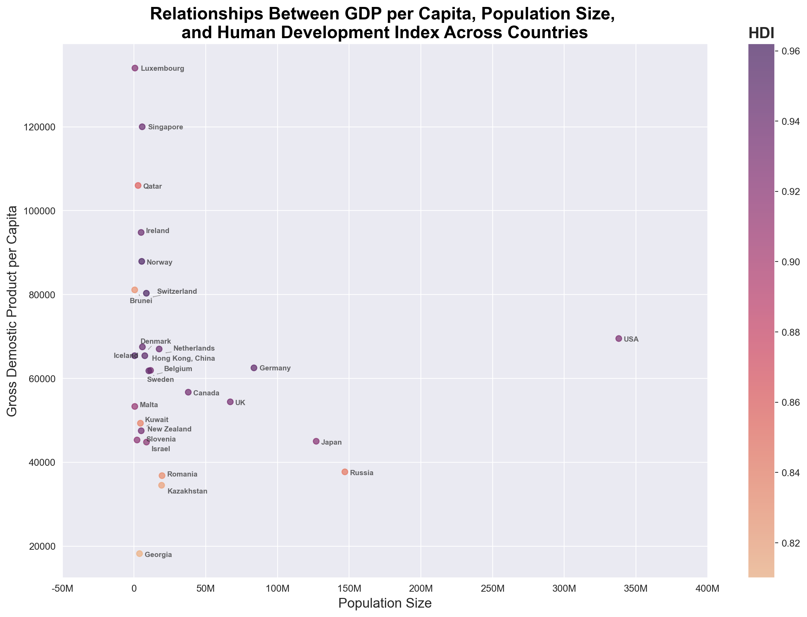

# Top Countries for Business Expansion
## Overview
[Gapminder](https://www.gapminder.org/data/) has collected a lot of information about how people live their lives in different countries, tracked across the years, and on a number of different indicators.

### Business Goal
We will assist stakeholders in identifying the best countries for opening a new business by analyzing the following key metrics:

1. **GDP per capita (Price and inflation-adjusted, in PPP$2021):** Gross domestic product per person adjusted for differences in purchasing power (in international dollars, fixed 2021 prices, PPP based on 2021 ICP). We will use this to determine which countries have high purchasing power and market potential.
    - File: `gdp_pcap_21.csv`
2. **Population Size:** Total population counts the number of inhabitants in the territory. We will use this to identify which countries have a big customer base.
    - File: `pop.csv` 
4. **Population Growth (annual %):** Annual population growth rate for year t is the exponential rate of growth of midyear population from year t-1 to t, expressed as a percentage. The population is based on the de facto definition of population, which counts all residents regardless of legal status or citizenship. We will use this metric to identify which countries will have a growing market.
    - File: `population_growth_annual_percent.csv`
5. **Urban population (% of total):** Urban population refers to people living in urban areas as defined by national statistical offices. The data are collected and smoothed by United Nations Population Division. It will help determine the countries that are more likely to have better infrastructure and also urban areas are easy to target marketing and distribution.
    - File: `urban_population_percent_of_total.csv`
6. **Human Development Index (HDI):** Human Development Index is an index used to rank countries by level of "human development". It contains three dimensions: health level, educational level, and living standard. We are going to use this to identify countries that may have skilled laborers.
    - File: `hdi_human_development_index.csv`
7. **Ease of doing business score (0 = lowest performance to 100 = best performance):** It evaluates the regulatory environment and ease of starting and operating a business in a country.
    - File: `ic_bus_dfrn_xq.csv`
8. **Cost of Business Start-Up Procedures:** Cost to register a business is normalized by presenting it as a percentage of gross national income (GNI) per capita. It will help identify the countries with low-start costs.
    - File: `ic_reg_cost_pc_zs`

### Questions to Answer:

1. Which countries had the highest GDP per capita in 2019? List the top 10.  
2. Which countries had the largest population sizes in 2019? List the top 10.  
3. Which countries had the highest population growth rates in 2019? List the top 10.  
4. Which countries had the highest Human Development Index (HDI) in 2019? List the top 10.  
5. Which countries had the best Ease of Doing Business scores in 2019? List the top 10.  
6. Which countries had the lowest costs for business start-up procedures in 2019? List the top 10.  
7. Which countries had the highest urban population rates in 2019? List the top 10.  
8. What are the relationships between the Ease of Doing Business score, the cost of business start-up procedures, and the Human Development Index by country?
9. What are the relationships between GDP per capita, population size, and the Human Development Index by country?
10. How did the Human Development Index (HDI) change over time for the top 10 countries in 2019?  
11. How did the Ease of Doing Business score change over time for the top 10 countries in 2019?  
12. How did the costs for business start-up procedures change over time for the 10 lowest-cost countries in 2019?  

### Communicating Results

- In 2019, Luxembourge has the highest domestic gross product per captia which imply that its citizens may have high purchasing power and market potential.

- China and India have significantly larger populations compared to other countries, which indicates a substantial potential customer base for businesses.
- The USA is one of the top 10 countries with both a high GDP per capita and a large population size, making it a potentially lucrative market with strong purchasing power and a substantial customer base.

- Malta, Syria, and Niger have the highest population growth percentages, making them strong candidates for businesses that target products for children. These countries are expected to have growing markets due to their increasing population size. Since Syria do not have political or economic stability, I don't think it will be a good canditate to invest in.

- Switzerland, Norway, and Iceland have the highest Human Development Index (HDI), suggesting a higher likelihood of a skilled and educated workforce. This is crucial for businesses that require specialized skills to thrive.

- New Zealand, Singapore, and Hong Kong, China have the highest Ease of Doing Business scores, reflecting favorable regulatory environments and the ease of starting and operating a business. Additionally, some countries excel in both Ease of Doing Business and Human Development Index (HDI), indicating the presence of skilled labor and a business-friendly environment, such as Singapore and Hong Kong, China

- United Kingdom, Slovenia, and Rwanda have no costs associated with business start-up procedures, making them attractive for new businesses. Additionally, countries with high ease of doing business scores generally tend to have lower costs for business start-up procedures, creating a favorable environment for entrepreneurs.

- Hong Kong, China, Singapore, and Kuwait have 100% urban populations, which suggests they are likely to have better infrastructure. Urban areas also offer advantages for businesses due to easier targeting of marketing and distribution efforts, making these countries attractive for investment.

New Zealand, Singapore, the USA, Hong Kong, China, Denmark, and the United Kingdom have high Ease of Doing Business scores and Human Development Index (HDI) values and low costs for business start-up procedures. 
- These countries have streamlined regulatory environments, making starting and operating businesses easier.
- They also have well-educated and healthy workforces, making them ideal for industries that require skilled labor.
- Additionally, They have low financial barriers to entry, reducing the initial investment required to establish a business.

To narrow down the scope of target countries for potential investment, we will focus on countries meeting the following criteria:  

1. **Ease of Doing Business Score**: Greater than the median.  
2. **Human Development Index (HDI)**: Greater than the median.  
3. **Cost of Start-Up Procedures**: Below the median.  

This approach will help identify countries with favorable business environments, skilled workforces, and minimal financial barriers to entry. Let's analyze the data and keep track of these countries.

- China has a very high population size but a relatively low Human Development Index (HDI) and GDP per capita compared to other countries. In contrast, Hong Kong, China, has a higher GDP per capita and HDI, indicating better economic and developmental conditions.  
- I will exclude China from my top countries list to focus on the population sizes of other countries in the chart above.
- The USA has a large population size compared to other countries, and it also has a strong GDP per capita and Human Development Index (HDI). This combination makes the USA an ideal candidate for businesses targeting a large customer base, consumers with disposable income and high purchasing power, and industries that require skilled labor.

- Japan, Russia, the UK, and Germany come next, with populations exceeding 50 million. They also have good GDP per capita and HDI, making them solid candidates for businesses targeting skilled labor, high purchasing power, and moderate customer base with market potential.

- Luxembourg, Singapore, and Qatar, despite their small population sizes, boast high GDP per capita and HDI, making them great candidates for businesses targeting high purchasing power and skilled labor.

- In general, the Human Development Index (HDI) has been increasing over time for the top 10 countries, indicating overall improvements in education, healthcare, and income levels.
- For the United Kingdom, the HDI slightly decreased in 2018 before increasing again in 2019, showing some fluctuations in its human development indicators.
- All these countries are excellent candidates for businesses that require skilled labor, as they have well-educated and healthy workforces, making them ideal markets for industries that depend on specialized talent.

- Ease of Doing Business scores have remained stable over time for countries such as the USA, the United Kingdom, Sweden, Canada, and Germany, indicating consistent regulatory environments that support business operations.
- On the other hand, Ease of Doing Business scores have been increasing over time for countries such as Kazakhstan, Russia, and Belgium, suggesting improvements in their regulatory frameworks and business environments.

- The costs of start-up procedures are very low for countries such as the United Kingdom, Kazakhstan, Canada, and Sweden, making these countries favorable for new business ventures.
- In Romania, the costs of start-up procedures decreased in 2017 and then stabilized, indicating a positive shift in the business environment during that period.
- Overall, while there are slight differences in the cost structures, all these countries are generally suitable for starting a business, depending on the specific business type, location, and other factors.

### Limitations
- This analysis covers the time from 2015 to 2019, and no analysis has been performed for data before or after this period. Therefore, decisions based on this data are valid for that time frame, but caution should be exercised when applying it to future projections.
- While this data is useful for making initial or primary business decisions, collecting additional and more specific data related to the business type will enable us to make more informed and precise decisions moving forward. This data serves as a starting point for decision-making, but further research and data collection are necessary for long-term strategic planning.
